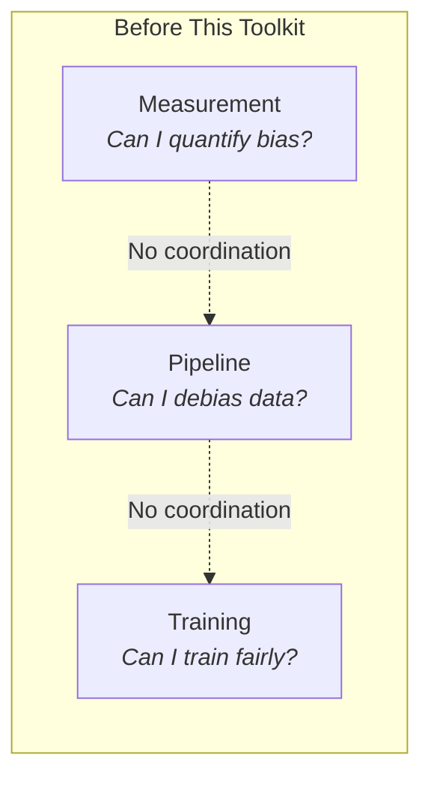
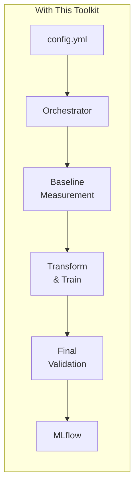
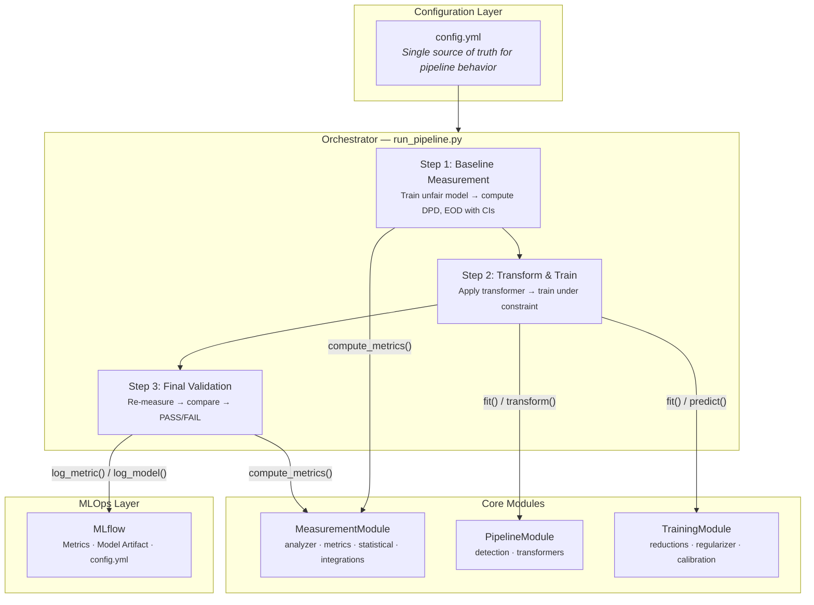
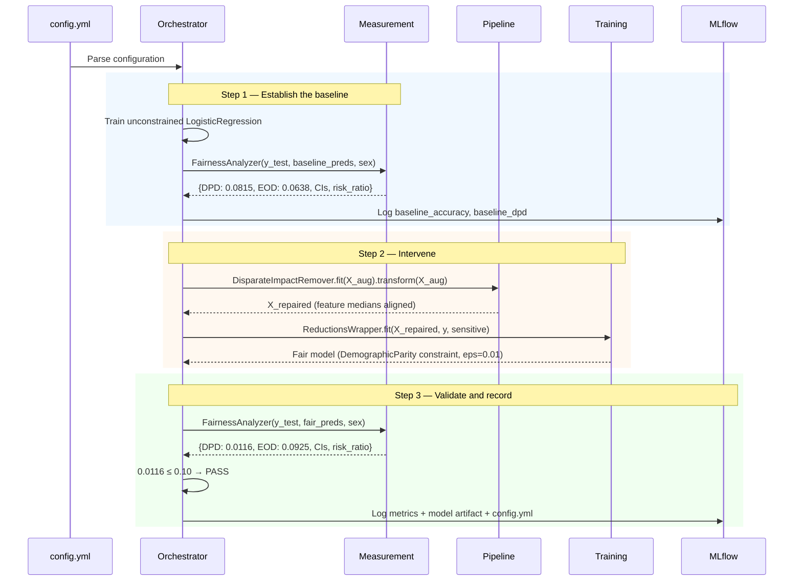
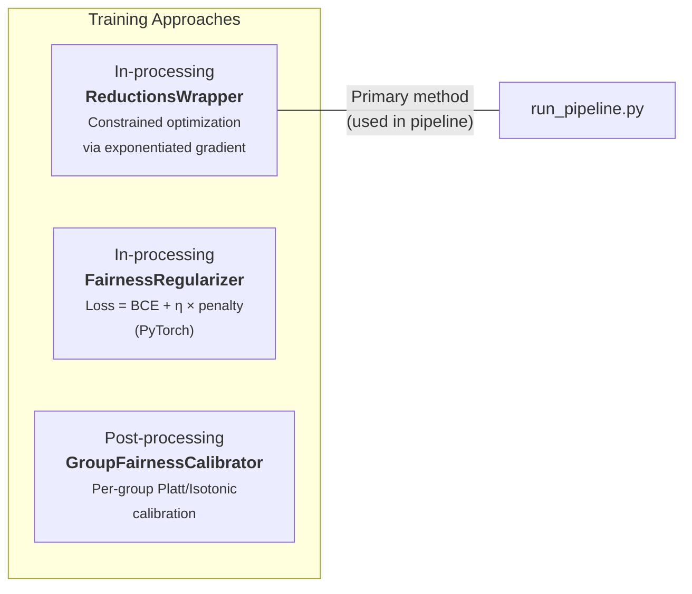
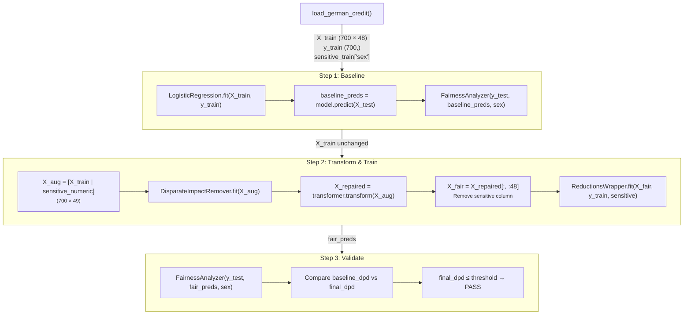

# Architecture — Fairness Pipeline Development Toolkit

> Technical deep-dive into the system design, module internals, and integration logic.

[README.md](README.md) | **ARCHITECTURE.md** | [REPORT.md](REPORT.md) | [demo.ipynb](demo.ipynb)

---

## Why an Orchestration Layer

The first three modules of this specialization produced capable but isolated components. Each addressed one phase of the fairness lifecycle:



This created three operational risks:

1. **Inconsistent measurement** — teams computed metrics differently across projects, making cross-project comparisons meaningless.
2. **Broken data contracts** — the output of the pre-processing step wasn't guaranteed to match the input expectations of the training step.
3. **No validation loop** — without a baseline-to-final comparison, teams couldn't verify that interventions actually improved fairness.

The orchestration layer eliminates these risks by enforcing a single, deterministic execution path:



Every run uses the same metrics, the same data flow, and the same validation gate — regardless of who executes it.

---

## System Architecture



---

## Design Decisions

### 1. Configuration-as-Contract

The `config.yml` file serves a dual purpose: it controls pipeline behavior **and** acts as a contract between stakeholders.

| Stakeholder | What they read in config.yml |
|-------------|------------------------------|
| **Data Engineer** | Which transformer to apply, with what parameters |
| **ML Engineer** | Which training constraint, base estimator, tolerance |
| **Compliance Officer** | Which metric is used for the PASS/FAIL gate, what threshold |
| **Auditor** | Full run specification — logged alongside the model in MLflow |

This is why the config is logged as an MLflow artifact: it provides full reproducibility and auditability for any pipeline run.

### 2. Three-Step Sequential Execution

The pipeline deliberately enforces sequential execution rather than allowing parallel or arbitrary module composition. This is a design choice rooted in the specialization's key learning: **fairness interventions must be validated against a baseline to have any meaning**.



### 3. Dependency Inversion Between Modules

Modules do not import each other. They communicate through the orchestrator, which passes plain NumPy arrays and Python dicts between them. This means:

- The MeasurementModule doesn't know whether it's evaluating a baseline or a fair model
- The PipelineModule doesn't know what training method will follow
- The TrainingModule doesn't know what pre-processing was applied

This decoupling is what makes the toolkit extensible: swapping a transformer or a training method requires changing only `config.yml`.

### 4. Statistical Rigor by Default

Every metric computation includes a bootstrap confidence interval and an effect size (risk ratio). This was a deliberate decision from Module 1's key insight: **point estimates without uncertainty bounds are misleading in fairness contexts**, where small sample sizes per group can produce high-variance metrics.

### 5. Two Layers of Fairness Assessment

The toolkit provides two distinct but complementary mechanisms for evaluating fairness. Understanding the difference is important:

**Layer 1 — Report Interpretation Scale** (informational, in `generate_report()`):

The human-readable report assigns a qualitative label to each metric value. This helps non-technical stakeholders interpret what a number like "DPD = 0.08" actually means. The scale is hardcoded in the `FairnessAnalyzer`:

| DPD Value | Label | Meaning |
|-----------|-------|---------|
| ≤ 0.05 | PASS | Negligible disparity |
| 0.05 – 0.10 | MARGINAL | Small disparity detected |
| 0.10 – 0.20 | WARN | Moderate disparity — investigate |
| > 0.20 | FAIL | Substantial disparity — action required |

This scale is applied in both Step 1 (baseline) and Step 3 (final validation) reports, providing a consistent vocabulary for discussing fairness across the pipeline.

**Layer 2 — Pipeline Validation Gate** (enforceable, in `run_pipeline.py`):

The pipeline's PASS/FAIL outcome is determined by a separate, configurable mechanism. At the end of Step 3, the orchestrator compares the primary fairness metric's final value against the `validation.threshold` from `config.yml`:

```
PASS  if  metric_value  ≤  threshold       (e.g., 0.0116 ≤ 0.10)
FAIL  if  metric_value  >  threshold       (e.g., 0.15  > 0.10)
```

This gate is what gets logged to MLflow as `validation_passed` (1 or 0) and what determines the script's exit code (0 for PASS, 1 for FAIL). In a CI/CD context, a FAIL exit code blocks the deployment.

The threshold is a **policy decision** set by the team or compliance officer — it defines the organization's tolerance for residual bias. For a detailed discussion of how to choose this value, see [REPORT.md — Validation Gate Decision](REPORT.md#validation-gate-decision).

---

## Module Internals

### Module 1: MeasurementModule

**Purpose**: Quantify how fair a model is, with statistical rigor.

This module was built in Module 1 of the specialization, where we established that fairness measurement requires more than a single number. The `FairnessAnalyzer` class computes:

| Output | Method | What it tells you |
|--------|--------|-------------------|
| Point estimate | `demographic_parity_difference()` | How large is the selection rate gap? |
| Confidence interval | `bootstrap_confidence_interval()` | How stable is that estimate? |
| Effect size | `compute_effect_size()` | What's the risk ratio (disparate impact)? |
| Intersectional breakdown | `compute_intersectional()` | Does bias compound across attributes? |

**Integration hooks**: `log_to_mlflow()` persists results to an active MLflow run. `assert_fairness()` provides a pytest-compatible gate for CI/CD pipelines — if the metric exceeds the threshold, the test fails.

### Module 2: PipelineModule

**Purpose**: Detect bias in raw data and apply pre-processing interventions.

Built in Module 2 of the specialization, this module operates on data **before** any model is trained. The key insight: if the training data encodes structural bias, even a "fair" algorithm will learn biased patterns.

**BiasDetectionEngine** runs three complementary audits:

| Audit | Statistical Test | What it detects |
|-------|-----------------|-----------------|
| Representation bias | Chi-squared goodness-of-fit | Are groups proportionally represented? |
| Statistical disparity | KS-test (numeric) / Chi-squared (categorical) | Do feature distributions differ across groups? |
| Proxy detection | Pearson correlation / Cramer's V | Do features encode protected attributes indirectly? |

**Transformers** implement sklearn's `TransformerMixin` interface, making them compatible with any sklearn pipeline:

- `DisparateImpactRemover`: Shifts per-group feature medians toward the overall median. The `repair_level` parameter (0.0–1.0) controls the trade-off between fidelity and fairness.
- `InstanceReweighter`: Computes per-sample weights that equalize outcome rates across groups without modifying feature values.

### Module 3: TrainingModule

**Purpose**: Train models under fairness constraints.

Built in Module 3 of the specialization, this module provides three approaches that operate at different points in the training process:



**ReductionsWrapper** is the primary method used by the orchestrator. It wraps Fairlearn's `ExponentiatedGradient`, which solves:

> minimize *loss(h)* subject to *constraint_violation(h) ≤ eps*

The `eps` parameter directly controls how tight the fairness constraint is. Lower values produce fairer models at a potential accuracy cost — this is the fundamental trade-off analyzed in [REPORT.md](REPORT.md#the-fairness-accuracy-trade-off).

---

## Data Flow Detail

The orchestrator manages a critical data transformation chain. Understanding this chain is essential for debugging or extending the toolkit.



**Key detail**: The sensitive attribute is appended as the last column of the feature matrix for the transformer, then removed before training. This ensures the transformer can identify group membership during repair, but the model never sees the protected attribute directly.

---

## MLflow Integration

Every pipeline run logs the following to MLflow:

| What is logged | MLflow method | Purpose |
|---------------|---------------|---------|
| `baseline_accuracy` | `log_metric` | Performance before intervention |
| `baseline_dpd`, `baseline_eod` | `log_metric` | Fairness before intervention |
| `final_accuracy` | `log_metric` | Performance after intervention |
| `final_dpd`, `final_eod` | `log_metric` | Fairness after intervention |
| `validation_passed` | `log_metric` | 1 if PASS, 0 if FAIL |
| Fair model object | `log_model` | Serialized sklearn model artifact |
| `config.yml` | `log_artifact` | Exact configuration used for the run |

This creates a complete audit trail: for any deployed model, you can retrieve the exact configuration, metrics, and model artifact that produced it.

---

## Testing Strategy

| Test File | Scope | Tests | What it validates |
|-----------|-------|-------|-------------------|
| `test_measurement.py` | Unit | 14 | Metrics, CIs, effect sizes, reports, assertions |
| `test_pipeline.py` | Unit | 9 | Bias detection, transformer shapes, correlation reduction |
| `test_training.py` | Unit | 8 | Reductions, regularizer loss, calibration |
| `test_integration.py` | End-to-end | 5 | Full pipeline from data loading to fairness improvement |
| **Total** | | **35** | |

The integration test `test_full_pipeline_improves_fairness` is the most critical: it verifies that the fair model's DPD is lower than or comparable to the baseline's, using real German Credit data.

---

**Previous**: [README.md](README.md) | **Next**: [REPORT.md](REPORT.md)
