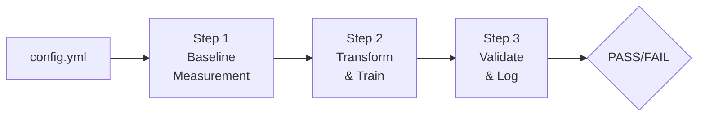
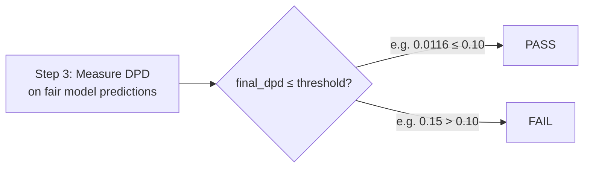

# Fairness Pipeline Development Toolkit

> An integrated, configuration-driven system that orchestrates fairness measurement, data debiasing, and constrained model training into a single, reproducible pre-deployment pipeline.

**AI Ethics Specialization** | Module 4 | FairML Consulting

| Document | Purpose |
|----------|---------|
| **[README.md](README.md)** | Entry point — installation, quick start, configuration reference |
| **[ARCHITECTURE.md](ARCHITECTURE.md)** | Technical deep-dive — design decisions, module internals, data flow |
| **[REPORT.md](REPORT.md)** | Findings report — pipeline results, fairness-accuracy analysis, key insights |
| **[demo.ipynb](demo.ipynb)** | Interactive demonstration — live execution of all modules and the full pipeline |

---

## Context

Across the first three modules of this specialization, we built individual fairness components in isolation:

- **Module 1** established the measurement foundation — how to quantify bias through demographic parity, equalized odds, and intersectional analysis with statistical rigor (bootstrap CIs, effect sizes).
- **Module 2** introduced data-level interventions — detecting representation bias, identifying proxy variables, and applying pre-processing transformers to mitigate structural disparities before training.
- **Module 3** moved into model-level interventions — constrained optimization via Fairlearn's exponentiated gradient, PyTorch fairness regularization, and post-processing calibration.

Each module solved a specific problem well. But as our client's data science lead put it:

> *"We have great modules, but they aren't enough to ensure consistency at scale. We need a unified blueprint — an orchestration layer that guarantees standardization."*

**This toolkit is that orchestration layer.** It integrates the three modules into a declarative, three-step pipeline controlled by a single YAML configuration file, with full MLflow traceability.

---

## Installation

```bash
cd Fairness_Toolkit

# Create and activate virtual environment
python3 -m venv venv
source venv/bin/activate    # macOS/Linux
# venv\Scripts\activate     # Windows

# Install dependencies
pip install -r requirements.txt
```

**Requirements**: Python 3.10+ | See [requirements.txt](requirements.txt) for full dependency list.

---

## Quick Start

**Run the complete pipeline:**

```bash
python run_pipeline.py --config config.yml
```

**What happens:**



1. Loads the German Credit dataset (1,000 credit applications, protected attribute: `sex`)
2. Trains an unconstrained baseline model and measures fairness metrics with 95% CIs
3. Applies `DisparateImpactRemover` to reduce feature-level bias, then trains a fair model via `ReductionsWrapper` under a demographic parity constraint
4. Compares baseline vs. final metrics, issues a PASS/FAIL verdict, and logs everything to MLflow

**View experiment results:**

```bash
mlflow ui
# Navigate to http://127.0.0.1:5000
```

For a detailed walkthrough of each step, see [demo.ipynb](demo.ipynb). For results interpretation, see [REPORT.md](REPORT.md).

---

## Configuration Reference

The `config.yml` file is the single point of control for the entire pipeline. Every parameter that affects behavior — from the dataset split to the fairness threshold — is declared here.

> For the rationale behind each design choice, see [ARCHITECTURE.md — Design Decisions](ARCHITECTURE.md#design-decisions).

### Dataset & Sensitive Attribute

| Key | Type | Default | Description |
|-----|------|---------|-------------|
| `dataset.name` | string | `"german_credit"` | Dataset identifier |
| `dataset.test_size` | float | `0.3` | Hold-out fraction for evaluation |
| `dataset.random_state` | int | `42` | Seed for reproducible splits |
| `sensitive_attribute` | string | `"sex"` | Protected attribute: `"sex"` or `"age_group"` |

### Step 1 — Baseline Measurement

| Key | Type | Default | Description |
|-----|------|---------|-------------|
| `baseline.metrics` | list | `["demographic_parity_difference"]` | Metrics to compute (see below) |
| `baseline.bootstrap_samples` | int | `500` | Resamples for confidence intervals |
| `baseline.confidence_level` | float | `0.95` | CI coverage |

**Available metrics:**

| Metric | Formula | Interpretation |
|--------|---------|----------------|
| `demographic_parity_difference` | max\|P(Y=1\|G=g) - P(Y=1\|G=g')\| | 0 = perfect parity. Measures selection rate gap. |
| `equalized_odds_difference` | max(TPR disparity, FPR disparity) | 0 = equal error rates across groups. |

### Step 2a — Pre-processing

| Key | Type | Default | Description |
|-----|------|---------|-------------|
| `preprocessing.transformer` | string | `"DisparateImpactRemover"` | Transformer to apply |
| `preprocessing.params.repair_level` | float | `0.8` | Repair intensity (0.0 = none, 1.0 = full) |

| Transformer | Strategy | Mechanism |
|-------------|----------|-----------|
| `DisparateImpactRemover` | Feature repair | Shifts per-group feature medians toward the overall median |
| `InstanceReweighter` | Sample reweighting | Assigns weights via w(g,l) = (n_g * n_l) / (N * n_{g,l}) |

### Step 2b — Fair Training

| Key | Type | Default | Description |
|-----|------|---------|-------------|
| `training.method` | string | `"ReductionsWrapper"` | Training method |
| `training.base_estimator` | string | `"LogisticRegression"` | Base sklearn classifier |
| `training.params.constraint` | string | `"demographic_parity"` | Fairness constraint |
| `training.params.eps` | float | `0.01` | Maximum allowed constraint violation |

### Step 3 — Validation Gate & MLflow

| Key | Type | Default | Description |
|-----|------|---------|-------------|
| `validation.primary_fairness_metric` | string | `"demographic_parity_difference"` | Metric used for the PASS/FAIL decision |
| `validation.threshold` | float | `0.10` | Maximum acceptable value for that metric |
| `validation.primary_performance_metric` | string | `"accuracy"` | Performance metric logged to MLflow |
| `mlflow.experiment_name` | string | `"fairness_pipeline_run"` | MLflow experiment name |
| `mlflow.tracking_uri` | string | `"mlruns"` | MLflow tracking directory |

#### How the PASS/FAIL Gate Works

After the fair model is trained (Step 2), the orchestrator re-measures the primary fairness metric on the test set and compares it against the configured threshold:



The decision logic is a single comparison:

```
PASS  if  primary_fairness_metric(fair_model)  ≤  validation.threshold
FAIL  if  primary_fairness_metric(fair_model)  >  validation.threshold
```

**What the threshold means**: A threshold of `0.10` means the pipeline accepts a maximum 10-percentage-point gap in approval rates between demographic groups. This value is a **policy decision** — it should be set by the team or compliance officer based on regulatory requirements, industry norms, and organizational risk tolerance. The EEOC's four-fifths rule, for reference, flags disparities corresponding roughly to a DPD of ~0.20.

**What gets logged to MLflow**:

| Artifact | MLflow Method | Purpose |
|----------|---------------|---------|
| Baseline accuracy + fairness metrics | `log_metric` | "Before" snapshot |
| Final accuracy + fairness metrics | `log_metric` | "After" snapshot |
| `validation_passed` (1 or 0) | `log_metric` | Binary PASS/FAIL outcome |
| Trained fair model | `log_model` | Deployable model artifact |
| `config.yml` | `log_artifact` | Full configuration for reproducibility |

---

## Testing

```bash
# Full suite (35 tests)
python -m pytest tests/ -v

# By module
python -m pytest tests/test_measurement.py -v   # 14 tests
python -m pytest tests/test_pipeline.py -v       #  9 tests
python -m pytest tests/test_training.py -v       #  8 tests
python -m pytest tests/test_integration.py -v    #  5 tests (end-to-end)
```

CI/CD: `.github/workflows/fairness_check.yml` runs the full test suite and pipeline validation on every push to `main`.

---

## Project Structure

```
Fairness_Toolkit/
├── README.md                  ← You are here
├── ARCHITECTURE.md            ← Technical deep-dive
├── REPORT.md                  ← Findings & insights
├── config.yml                 ← Pipeline configuration
├── run_pipeline.py            ← 3-step orchestrator
├── demo.ipynb                 ← Interactive demonstration
├── requirements.txt
├── fairness_toolkit/          ← Core library
│   ├── data/loader.py
│   ├── measurement/           ← Metrics, CIs, reports, MLflow
│   ├── pipeline/              ← Bias detection, transformers
│   └── training/              ← Constrained training, calibration
├── tests/                     ← 35 unit + integration tests
└── .github/workflows/         ← CI/CD fairness gate
```

---

**Next**: [ARCHITECTURE.md](ARCHITECTURE.md) for the technical deep-dive, or [REPORT.md](REPORT.md) for results and insights.
