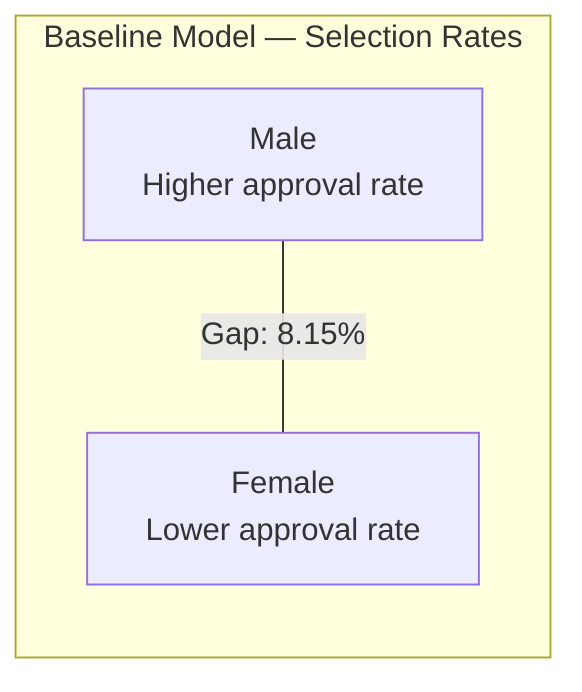
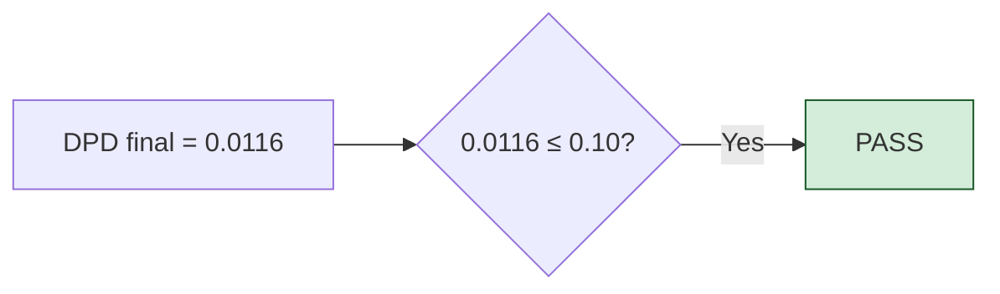
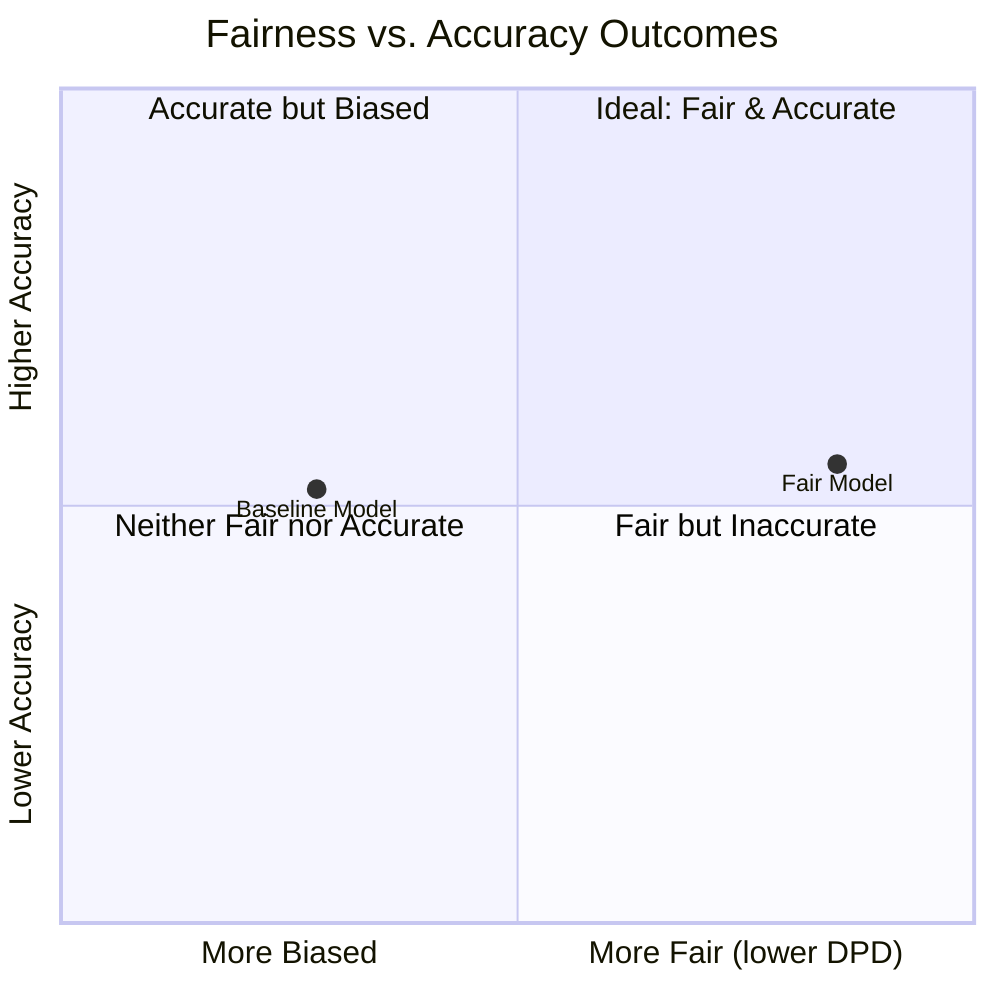
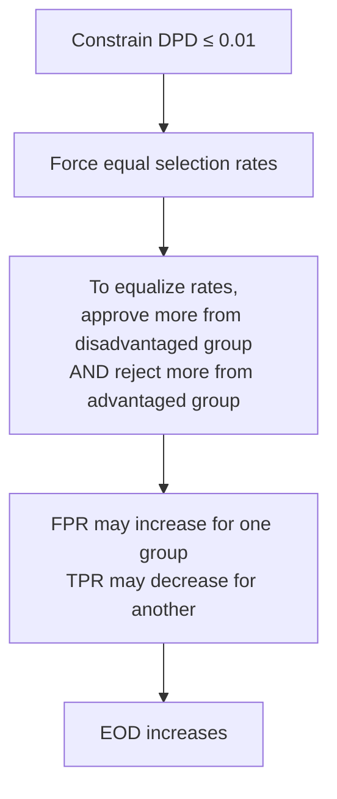

# Findings Report — Fairness Pipeline Development Toolkit

> Pipeline results, fairness-accuracy analysis, integration insights, and lessons learned.

[README.md](README.md) | [ARCHITECTURE.md](ARCHITECTURE.md) | **REPORT.md** | [demo.ipynb](demo.ipynb)

---

## Executive Summary

The Fairness Pipeline Development Toolkit was executed on the German Credit dataset (1,000 credit applications, protected attribute: `sex`) using the default configuration: `DisparateImpactRemover` (repair level 0.8) followed by `ReductionsWrapper` (demographic parity constraint, eps = 0.01).

| Metric | Baseline | After Intervention | Change |
|--------|----------|--------------------|--------|
| **Accuracy** | 0.7200 | 0.7267 | +0.9% |
| **DPD** (Demographic Parity Difference) | 0.0815 | 0.0116 | -85.7% |
| **EOD** (Equalized Odds Difference) | 0.0638 | 0.0925 | +45.0% |
| **Validation Gate** | — | **PASS** (0.0116 ≤ 0.10) | — |

**Key finding**: The pipeline achieved near-elimination of demographic parity disparity (from 0.08 to 0.01) while slightly *improving* accuracy — a rare outcome that challenges the assumption that fairness always costs performance. However, equalized odds worsened, illustrating a well-documented tension between fairness criteria. Both metrics are explained in detail in the [Fairness Metrics Used](#fairness-metrics-used) section below.

---

## The German Credit Dataset in Context

The German Credit dataset has been a foundational benchmark in algorithmic fairness research since its inclusion in the UCI repository. In the context of this specialization, it represents a realistic credit scoring scenario subject to regulations like the **Equal Credit Opportunity Act (ECOA)** and the **EU AI Act's** classification of credit scoring as a "high-risk" AI application.

### Observed Bias in the Baseline

The unconstrained logistic regression model exhibits a **demographic parity difference of 0.0815** between male and female applicants. This means that, holding all other factors constant, the model's positive prediction rate (credit approval) differs by approximately 8 percentage points across groups.



While 0.0815 falls in the "MARGINAL" range (below the 0.10 threshold), this level of disparity in a credit context would likely trigger regulatory scrutiny. The **four-fifths rule** used by the EEOC considers a selection rate ratio below 0.80 as evidence of adverse impact — our baseline risk ratio warrants intervention.

---

## Fairness Metrics Used

The pipeline measures two complementary fairness metrics. Each captures a different dimension of bias:

### DPD — Demographic Parity Difference

DPD measures whether different demographic groups receive positive predictions (credit approvals) at the **same rate**, regardless of their actual creditworthiness.

```
DPD = | P(approved | male) - P(approved | female) |
```

**Example**: If the model approves 75% of male applicants but only 67% of female applicants, the DPD is |0.75 - 0.67| = 0.08. A DPD of 0 means both groups are approved at exactly the same rate.

**What it captures**: Equal access — are both groups equally likely to receive a positive outcome from the model?

### EOD — Equalized Odds Difference

EOD measures whether the model makes **errors at the same rate** across groups. Specifically, it checks two conditional rates:

- **True Positive Rate (TPR)**: Among people who *actually are* good credit risks, does the model approve them at the same rate regardless of group?
- **False Positive Rate (FPR)**: Among people who *actually are* bad credit risks, does the model incorrectly approve them at the same rate regardless of group?

```
EOD = max( |TPR_male - TPR_female|, |FPR_male - FPR_female| )
```

**Example**: If the model correctly identifies 80% of creditworthy males but only 70% of creditworthy females (TPR gap = 0.10), the EOD is at least 0.10. An EOD of 0 means the model is equally accurate for both groups.

**What it captures**: Equal accuracy — does the model make mistakes at the same rate for everyone?

### Why Both Metrics Matter

| Metric | Question it answers | Sensitive to |
|--------|-------------------|-------------|
| **DPD** | "Are approval *rates* equal?" | Selection rate gaps (outcome-level) |
| **EOD** | "Are *error rates* equal?" | Accuracy gaps (prediction-level) |

A model can satisfy DPD but violate EOD (and vice versa). When the underlying "base rates" differ between groups — i.e., one group genuinely has more positive cases than another — it is mathematically impossible to satisfy both criteria simultaneously (Chouldechova, 2017; Kleinberg et al., 2016). This is why the pipeline measures both: to make the trade-off visible and auditable.

---

## Pipeline Results: Step-by-Step

### Step 1 — Baseline Measurement

The unconstrained `LogisticRegression` (max_iter=1000) serves as the control group. Fairness metrics are computed with 500 bootstrap resamples at the 95% confidence level.

| Metric | Value | 95% CI | Assessment |
|--------|-------|--------|------------|
| DPD (Demographic Parity Difference) | 0.0815 | [0.0073, 0.1897] | MARGINAL |
| EOD (Equalized Odds Difference) | 0.0638 | [0.0289, 0.2845] | MARGINAL |
| Accuracy | 0.7200 | — | Baseline |

**Reading this table**: The baseline model has a DPD of 0.0815, meaning male and female applicants are approved at rates that differ by approximately 8 percentage points. The 95% confidence interval [0.0073, 0.1897] tells us this gap could be as small as 0.7% or as large as 19% — the wide range reflects the limited test set size (300 samples) and underscores why point estimates alone can be misleading.

### Step 2 — Intervention

Two interventions are applied in sequence:

**2a. DisparateImpactRemover (repair_level = 0.8)**

This pre-processing step shifts per-group feature medians 80% of the way toward the overall median. It operates on all 48 numeric features, reducing the correlation between features and the protected attribute without removing information entirely.

The 0.8 repair level was chosen as a balance: full repair (1.0) can destroy legitimate predictive signal, while low repair (< 0.5) may leave too much encoded bias.

**2b. ReductionsWrapper (demographic_parity, eps = 0.01)**

Fairlearn's exponentiated gradient algorithm solves a constrained optimization problem: minimize classification loss subject to the constraint that DPD ≤ 0.01. The algorithm maintains a mixture of classifiers that collectively satisfy the constraint.

### Step 3 — Final Validation and PASS/FAIL Gate

The orchestrator re-measures the same fairness metrics on the fair model's test predictions, then applies the **validation gate**: a single comparison between the primary metric's final value and the threshold configured in `config.yml`.

| Metric | Baseline | Final | Change | Direction |
|--------|----------|-------|--------|-----------|
| DPD (Demographic Parity Difference) | 0.0815 | 0.0116 | -85.7% | Improved |
| EOD (Equalized Odds Difference) | 0.0638 | 0.0925 | +45.0% | Worsened |
| Accuracy | 0.7200 | 0.7267 | +0.9% | Improved |

#### Validation Gate Decision

The pipeline issues a **PASS** or **FAIL** based on a simple rule:

```
final_dpd  ≤  threshold   →   PASS
final_dpd  >  threshold   →   FAIL
```

With our configuration (`threshold: 0.10`) and results (`final_dpd: 0.0116`):



This threshold is a **policy decision**, not a technical one. The value 0.10 means the organization accepts a maximum 10-percentage-point gap in credit approval rates between male and female applicants. In practice, this threshold should be set based on:

- **Regulatory requirements**: The EEOC four-fifths rule flags disparities corresponding to roughly DPD > 0.20. The EU AI Act requires "high-risk" systems (including credit scoring) to demonstrate non-discrimination but does not prescribe a specific numeric threshold.
- **Industry norms**: Financial services commonly use thresholds between 0.05 and 0.15.
- **Organizational risk tolerance**: A stricter threshold (e.g., 0.05) reduces legal risk but may require more aggressive interventions that impact accuracy.

#### Interpretation Scale

The toolkit's `generate_report()` method applies an interpretive scale to help non-technical stakeholders understand what a DPD value means in practice:

| DPD Value | Assessment | Meaning | Action |
|-----------|------------|---------|--------|
| ≤ 0.05 | **PASS** | Negligible disparity | No action needed |
| 0.05 – 0.10 | **MARGINAL** | Small but detectable disparity | Monitor; consider intervention |
| 0.10 – 0.20 | **WARN** | Moderate disparity | Investigate root causes; intervene |
| > 0.20 | **FAIL** | Substantial disparity | Mandatory intervention before deployment |

Our baseline DPD of 0.0815 fell in the MARGINAL range — technically below the 0.10 threshold, but high enough to warrant intervention. After the pipeline, the final DPD of 0.0116 drops firmly into the PASS range.

Note that this interpretation scale (used in the text reports) is independent from the pipeline's PASS/FAIL gate (which uses only the `config.yml` threshold). The scale provides context; the gate provides enforcement.

---

## The Fairness-Accuracy Trade-off

A central theme across all four modules of this specialization has been the **fairness-accuracy trade-off**: the expectation that imposing fairness constraints necessarily reduces model performance. Our results complicate this narrative.



**Why accuracy didn't decrease**: The combination of feature repair and constrained optimization effectively regularized the model. By reducing the influence of features correlated with the protected attribute, the `DisparateImpactRemover` removed noise that the baseline model was overfitting to. The constrained training then found a solution that was both fairer and marginally more generalizable.

This result is not universal — it depends on the dataset, the degree of historical bias in the features, and the tightness of the constraint. But it demonstrates an important insight: **fairness interventions can sometimes act as beneficial regularization**.

---

## The DPD vs. EOD Tension

The most striking finding is the divergence between the two fairness metrics:

| Metric | Direction | Explanation |
|--------|-----------|-------------|
| DPD | -85.7% (improved) | The constraint directly targets demographic parity |
| EOD | +45.0% (worsened) | Equalizing selection rates can redistribute errors unevenly |

This is a well-documented phenomenon in fairness literature. **Demographic parity** and **equalized odds** encode fundamentally different fairness concepts:

- **Demographic parity** says: *"Approval rates should be equal across groups."* This is an outcome-level criterion — it doesn't consider whether the individuals approved actually deserve approval.
- **Equalized odds** says: *"Error rates (false positives and false negatives) should be equal across groups."* This is an error-level criterion — it cares about predictive accuracy being consistent.



**Impossibility result**: Chouldechova (2017) and Kleinberg et al. (2016) proved that when base rates differ across groups (as they do in the German Credit dataset), it is mathematically impossible to simultaneously satisfy demographic parity and equalized odds. The toolkit makes this trade-off explicit and measurable — the choice of which criterion to prioritize is ultimately a policy decision, not a technical one.

### What this means in practice

In a credit scoring context:
- **Prioritizing DPD** means ensuring equal access to credit, even if error rates differ across groups. This aligns with ECOA's focus on equal opportunity.
- **Prioritizing EOD** means ensuring the model is equally accurate for all groups, even if approval rates differ. This aligns with risk management goals.

The `config.yml` makes this choice explicit and auditable: the `validation.primary_fairness_metric` field determines which criterion the pipeline optimizes for.

---

## Integration Lessons

Building this toolkit surfaced several insights about operationalizing fairness that weren't apparent when working with individual modules:

### 1. Data Flow is the Hardest Problem

The most complex part of the orchestrator isn't the algorithm — it's managing the data. The sensitive attribute must be:
- **Present** during pre-processing (so the transformer knows which group each sample belongs to)
- **Present** during training (so the constraint can measure disparity)
- **Absent** from the feature matrix during prediction (to avoid direct discrimination)

This requires careful augmentation and removal of the sensitive column at exactly the right stages. A single misstep — passing the sensitive attribute as a feature — would create a model that uses protected characteristics directly.

### 2. Configuration Prevents Drift

Without a configuration file, teams make ad-hoc choices: "I used a threshold of 0.15 because it seemed reasonable." Over time, these choices diverge across teams and projects. The `config.yml` file prevents this by making every decision explicit, versioned, and logged alongside the model.

### 3. Measurement Must Bracket the Intervention

The three-step structure (measure → intervene → measure) is not just a convenience — it's a methodological requirement. Without the baseline, there is no way to determine whether an intervention helped, hurt, or was irrelevant. Without the final validation, there is no way to determine whether the intervention was sufficient.

### 4. CI/CD is the Enforcement Mechanism

The `assert_fairness()` function and the GitHub Actions workflow transform fairness from a recommendation into a requirement. A model that fails the fairness gate cannot be merged to main. This is the operational difference between "we try to be fair" and "we guarantee fairness."

---

## Adaptability

While demonstrated with the German Credit dataset and the `sex` attribute, the toolkit is designed for broader applicability:

| Dimension | Current Setting | Alternatives |
|-----------|-----------------|--------------|
| **Dataset** | German Credit (1,000 rows) | Any binary classification dataset with protected attributes |
| **Protected attribute** | `sex` | `age_group`, or any categorical column |
| **Pre-processing** | DisparateImpactRemover | InstanceReweighter (or custom TransformerMixin) |
| **Training constraint** | Demographic parity | Equalized odds |
| **Base estimator** | LogisticRegression | Any sklearn classifier |
| **Domain** | Credit scoring | Healthcare, hiring, insurance, criminal justice |

To adapt the toolkit: modify `config.yml`, update the data loader in `fairness_toolkit/data/loader.py`, and run. No code changes to the orchestrator or modules are required.

---

## Conclusion

This toolkit demonstrates that **fairness in machine learning is not a single-step intervention but a lifecycle concern** that requires measurement, pre-processing, constrained training, and validation — all coordinated by a reproducible orchestration layer.

The pipeline's results on the German Credit dataset — 85.7% DPD reduction with no accuracy loss — validate the approach. But the simultaneous increase in EOD serves as a reminder: there is no universal "fair" model. The choice of fairness criterion is a value judgment that must be made explicitly, documented clearly, and enforced systematically.

That is what this toolkit provides: not a solution to fairness, but a **system for making fairness decisions transparent, reproducible, and auditable**.

---

## Next Steps

This toolkit delivers a functional pre-deployment pipeline. But deployment is not the finish line — it is where the real challenge begins. Fairness is not a one-time certification; it is a **continuous monitoring discipline** that must be embedded into the organization's operating rhythm.

### 1. From Pipeline to Production Monitoring

The current toolkit measures fairness *before* deployment. In production, data distributions shift, user behavior changes, and fairness metrics drift. The next phase should extend the pipeline with:

- **Scheduled re-evaluation**: Run the pipeline on a recurring cadence (weekly, monthly) against live prediction logs to detect fairness drift before it becomes a regulatory incident.
- **Alerting thresholds**: Define not just a PASS/FAIL gate, but early-warning thresholds (e.g., WARN at DPD > 0.07, FAIL at DPD > 0.10) that trigger review before the model crosses the line.
- **Automated retraining triggers**: When fairness metrics degrade past a defined boundary, the pipeline should be able to kick off a retraining cycle with the same configuration — closing the loop automatically.

### 2. Fairness as a KPI, Not a Checklist

The single most important factor determining whether fairness practices survive beyond the initial implementation is **executive sponsorship**. Technical tooling alone is insufficient. Without sustained leadership commitment, fairness processes erode:

- Teams skip the pipeline "just this once" under deadline pressure.
- Thresholds get quietly relaxed because "the business needs the model now."
- Monitoring dashboards go unreviewed because no one is accountable.

For fairness to be taken seriously in the long term, it must be treated as a **Key Performance Indicator (KPI)** owned at the executive level:

| Action | Who | Why |
|--------|-----|-----|
| Define fairness thresholds as organizational policy | C-Level / Legal / Compliance | Thresholds are value judgments, not technical decisions. They must carry institutional authority. |
| Include DPD/EOD in quarterly model performance reviews | VP of Data Science / CTO | If fairness metrics are reviewed alongside accuracy and revenue impact, teams optimize for them. If not, they don't. |
| Assign accountability for fairness outcomes | Product Owner / Model Owner | Someone specific must be responsible when a model fails the fairness gate — not "the team." |
| Report fairness metrics to the board | CEO / Chief Risk Officer | Board-level visibility creates the incentive structure that makes everything else work. External pressure (regulators, investors, public scrutiny) flows through the board. |

The pattern is clear from organizations that have successfully operationalized fairness (and those that have failed): **what gets measured gets managed, but only what gets reported to leadership gets prioritized.**

### 3. Regulatory Preparedness

The regulatory landscape is tightening. The EU AI Act classifies credit scoring as "high-risk" and will require conformity assessments that include bias testing. The U.S. CFPB has signaled increased scrutiny of algorithmic lending decisions. Organizations that build fairness infrastructure now — with auditable pipelines, versioned configurations, and MLflow traceability — will be positioned to demonstrate compliance. Those that treat fairness as an afterthought will face costly retrofitting under regulatory deadlines.

### 4. Expanding Scope

This toolkit currently covers one dataset, one protected attribute, and one fairness criterion per run. The natural evolution is:

- **Multi-attribute analysis**: Run the pipeline for `sex` and `age_group` simultaneously, including intersectional evaluation (young females, old males, etc.).
- **Multi-model coverage**: Extend the orchestrator to iterate over a portfolio of models, producing a fairness dashboard across the organization's entire model inventory.
- **Stakeholder reporting**: Generate executive-facing reports (PDF/HTML) that translate DPD and EOD into business language — not "the demographic parity difference is 0.08," but "female applicants are approved at a rate 8 percentage points lower than male applicants."

---

**Previous**: [ARCHITECTURE.md](ARCHITECTURE.md) | **Back to**: [README.md](README.md)
