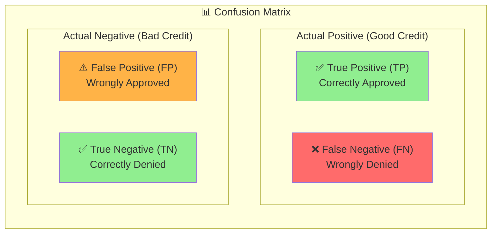
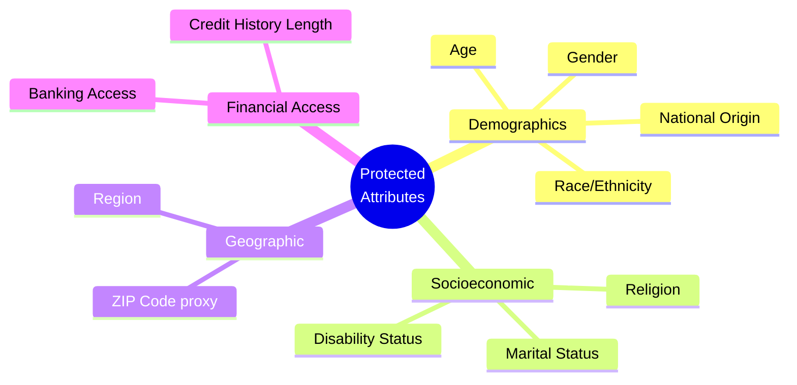
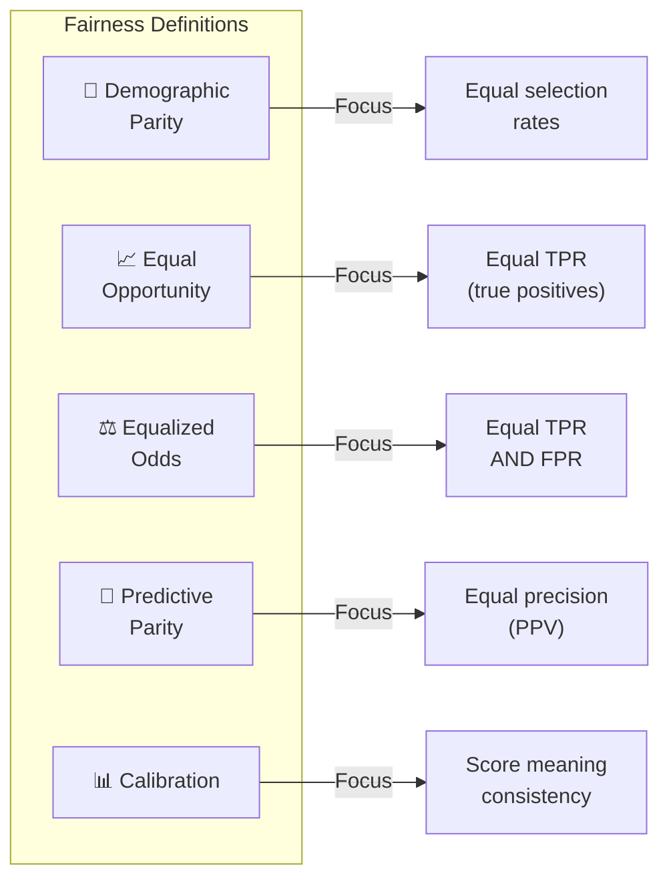
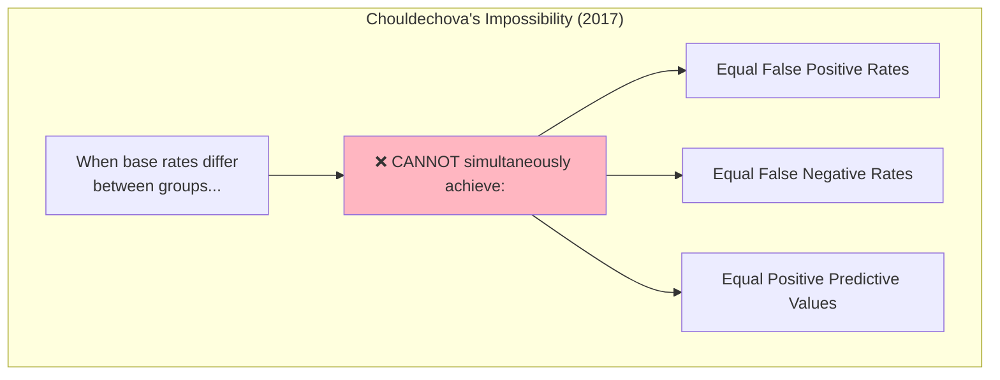
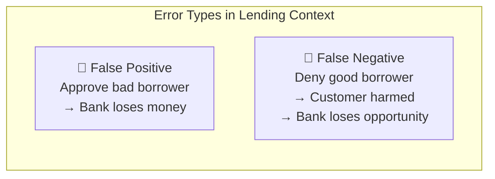
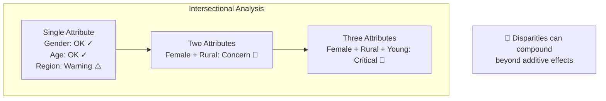
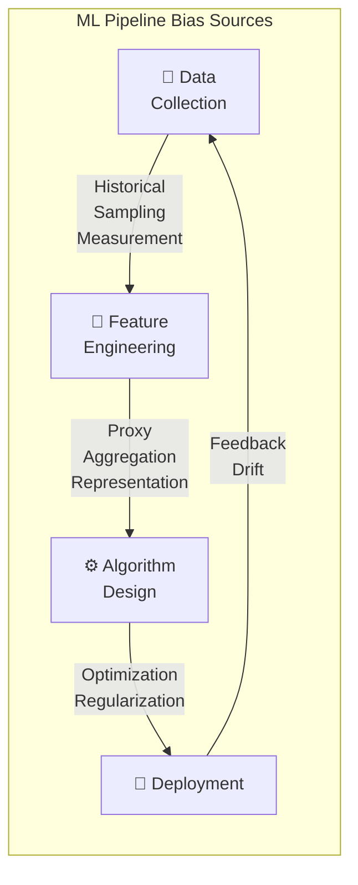
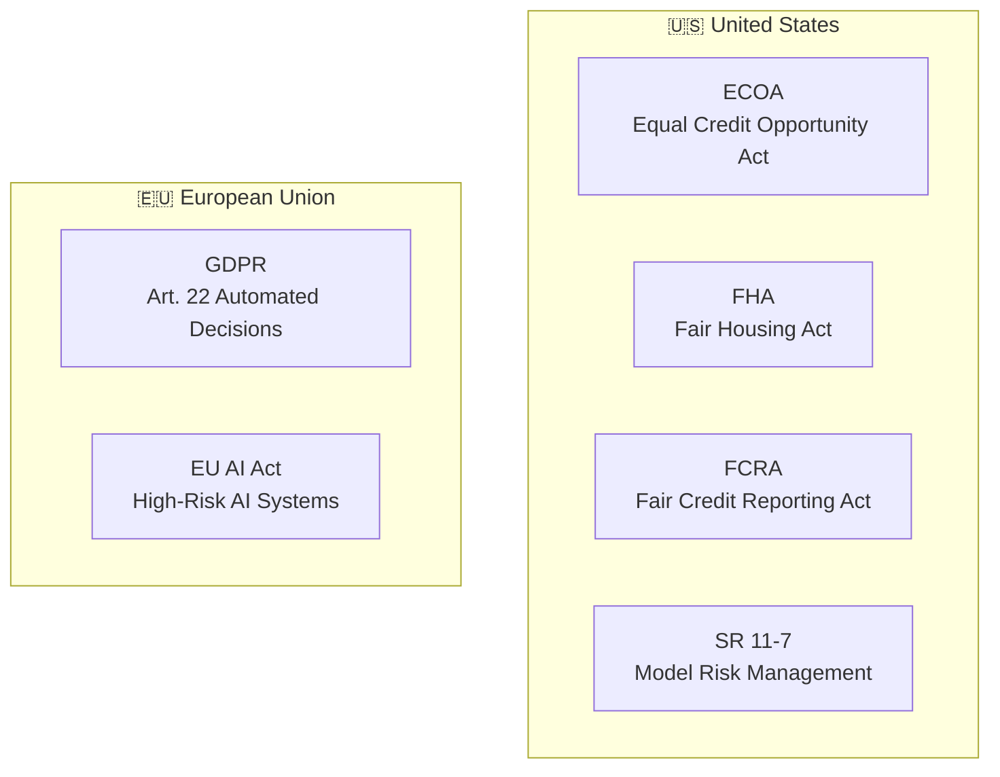
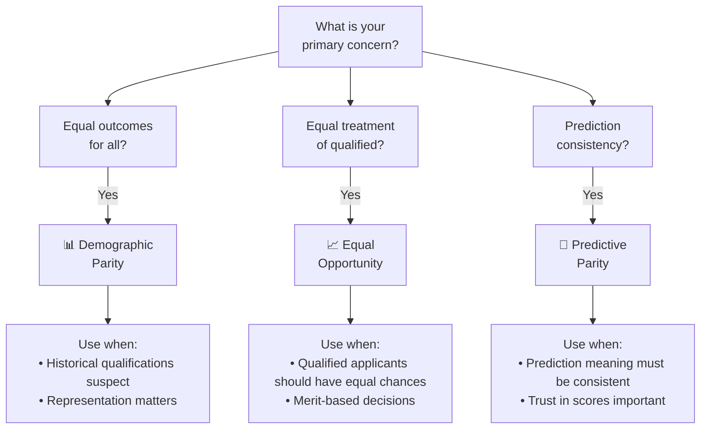

# 📚 Fairness Audit Glossary

**Document Version:** 1.0
**Last Updated:** February 2026
**Purpose:** Reference guide for fairness metrics, concepts, and terminology

---

## 📑 Table of Contents

1. [Core Concepts](#-core-concepts)
2. [Fairness Definitions](#-fairness-definitions)
3. [Performance Metrics](#-performance-metrics)
4. [Fairness Metrics](#-fairness-metrics)
5. [Bias Types](#-bias-types)
6. [Statistical Concepts](#-statistical-concepts)
7. [Regulatory Terms](#-regulatory-terms)
8. [Quick Reference Cards](#-quick-reference-cards)

---

## 🎯 Core Concepts

### The Confusion Matrix

The foundation of all classification metrics. Understanding this is essential for fairness analysis.



| Cell | Meaning | Business Impact |
|------|---------|-----------------|
| **True Positive (TP)** | Model correctly predicts positive outcome | Good customer approved → Revenue |
| **True Negative (TN)** | Model correctly predicts negative outcome | Risky customer denied → Loss prevented |
| **False Positive (FP)** | Model wrongly predicts positive | Risky customer approved → Potential default |
| **False Negative (FN)** | Model wrongly predicts negative | Good customer denied → Lost revenue + Fairness harm |

---

### Protected Attributes

Characteristics legally protected from discrimination in decision-making.



> ⚠️ **Important:** Even when not directly used, models can learn proxies for protected attributes (e.g., ZIP code → race/income correlation).

---

## ⚖️ Fairness Definitions

### Comparison of Main Fairness Criteria



---

### 1️⃣ Demographic Parity (Statistical Parity)

**Definition:** All groups should receive positive outcomes at equal rates, regardless of their qualifications.

$$P(\hat{Y} = 1 | A = a) = P(\hat{Y} = 1 | A = b)$$

| Aspect | Description |
|--------|-------------|
| **What it measures** | Whether approval rates are equal across groups |
| **When to use** | When historical qualifications may reflect past discrimination |
| **Limitation** | Ignores actual qualifications; may approve unqualified or deny qualified |
| **Legal relevance** | Related to 4/5ths rule (EEOC guidelines) |

**Example:**
```
Group A approval rate: 70%
Group B approval rate: 60%
Parity ratio: 60/70 = 0.86 ✓ (Above 0.80 threshold)
```

---

### 2️⃣ Equal Opportunity

**Definition:** Qualified individuals should have equal chances of receiving positive outcomes, regardless of group membership.

$$P(\hat{Y} = 1 | Y = 1, A = a) = P(\hat{Y} = 1 | Y = 1, A = b)$$

| Aspect | Description |
|--------|-------------|
| **What it measures** | Whether True Positive Rates are equal across groups |
| **When to use** | When you want to ensure qualified applicants are treated fairly |
| **Limitation** | Doesn't address false positives (approving unqualified) |
| **Best for** | Scenarios where the "positive" outcome is a benefit (loans, jobs) |

**Example:**
```
Of 1000 qualified applicants in Group A: 850 approved (TPR = 85%)
Of 1000 qualified applicants in Group B: 770 approved (TPR = 77%)
TPR Gap: 8 percentage points ⚠️
```

---

### 3️⃣ Equalized Odds

**Definition:** Both True Positive Rates AND False Positive Rates should be equal across groups.

$$P(\hat{Y} = 1 | Y = y, A = a) = P(\hat{Y} = 1 | Y = y, A = b) \quad \forall y \in \{0, 1\}$$

| Aspect | Description |
|--------|-------------|
| **What it measures** | Equality of both types of correct predictions |
| **When to use** | When both types of errors have significant consequences |
| **Limitation** | Very strict; often impossible to achieve perfectly |
| **Trade-off** | May require sacrificing some accuracy |

---

### 4️⃣ Predictive Parity (Outcome Test)

**Definition:** Among those receiving positive predictions, the actual success rate should be equal across groups.

$$P(Y = 1 | \hat{Y} = 1, A = a) = P(Y = 1 | \hat{Y} = 1, A = b)$$

| Aspect | Description |
|--------|-------------|
| **What it measures** | Whether positive predictions mean the same thing across groups |
| **When to use** | When the meaning of a prediction matters for trust |
| **Limitation** | May conflict with equal opportunity |
| **Also called** | Precision parity |

---

### 5️⃣ Calibration

**Definition:** Predicted probabilities should reflect actual outcomes across all groups.

$$P(Y = 1 | \hat{P} = p, A = a) = p \quad \forall p, a$$

| Aspect | Description |
|--------|-------------|
| **What it measures** | Whether a 70% prediction means 70% chance for all groups |
| **When to use** | When decision thresholds vary or when probabilities are used directly |
| **Limitation** | Doesn't guarantee equal outcomes |
| **Visualization** | Calibration curves by group |

---

### ⚠️ The Impossibility Theorem



> 🎯 **Implication:** Organizations must CHOOSE which fairness criterion to prioritize based on their context and values.

---

## 📈 Performance Metrics

### Model Performance Metrics

| Metric | Formula | Interpretation | Target Range |
|--------|---------|----------------|--------------|
| **Accuracy** | (TP+TN)/(TP+TN+FP+FN) | Overall correctness | >80% |
| **Precision (PPV)** | TP/(TP+FP) | Positive predictions that are correct | >75% |
| **Recall (TPR)** | TP/(TP+FN) | Actual positives correctly identified | >75% |
| **Specificity (TNR)** | TN/(TN+FP) | Actual negatives correctly identified | >75% |
| **F1-Score** | 2×(Precision×Recall)/(Precision+Recall) | Harmonic mean of precision and recall | >75% |
| **AUC-ROC** | Area under ROC curve | Discrimination ability across thresholds | >0.85 |

---

### Error Metrics

| Metric | Formula | What it Means | Who it Harms |
|--------|---------|---------------|--------------|
| **False Positive Rate (FPR)** | FP/(FP+TN) | Negatives wrongly classified as positive | Organization (defaults) |
| **False Negative Rate (FNR)** | FN/(FN+TP) | Positives wrongly classified as negative | Individuals (denied) |
| **Type I Error** | = FPR | Rejecting true null hypothesis | — |
| **Type II Error** | = FNR | Failing to reject false null hypothesis | — |



---

## 📊 Fairness Metrics

### Selection Rate

**Definition:** The proportion of a group receiving the positive outcome.

$$\text{Selection Rate}_A = \frac{\text{Positive Outcomes in Group A}}{\text{Total in Group A}}$$

---

### Demographic Parity Ratio (Disparate Impact Ratio)

**Definition:** Ratio of selection rates between groups.

$$\text{DPR} = \frac{\text{Selection Rate}_{minority}}{\text{Selection Rate}_{majority}}$$

| Threshold | Status | Action |
|-----------|--------|--------|
| ≥ 0.85 | 🟢 Acceptable | Monitor |
| 0.80 - 0.85 | 🟡 Warning | Review |
| < 0.80 | 🔴 Violation | Immediate action (4/5ths rule) |

---

### True Positive Rate Gap

**Definition:** Difference in TPR between groups.

$$\text{TPR Gap} = |TPR_A - TPR_B|$$

| Gap Size | Status | Interpretation |
|----------|--------|----------------|
| ≤ 5pp | 🟢 Acceptable | Minimal disparity |
| 5-10pp | 🟡 Moderate | Warrants investigation |
| > 10pp | 🔴 High | Significant disparity |

---

### Intersectionality Score

**Definition:** Fairness metrics calculated for combinations of protected attributes.



---

## 🔍 Bias Types

### Bias Categories Across ML Pipeline



---

### Detailed Bias Definitions

| Bias Type | Stage | Definition | Example |
|-----------|-------|------------|---------|
| **Historical Bias** | Data | Training data reflects past discrimination | Loan data from era of redlining |
| **Sampling Bias** | Data | Non-representative data collection | Undersampling rural applicants |
| **Measurement Bias** | Data | Inconsistent or inaccurate data collection | Different credit scoring methods by region |
| **Label Bias** | Data | Biased ground truth labels | "Default" including medical emergencies |
| **Proxy Discrimination** | Feature | Using features correlated with protected attributes | ZIP code → race correlation |
| **Aggregation Bias** | Feature | Single model for diverse populations | Same features for all age groups |
| **Algorithmic Bias** | Model | Optimization favoring majority groups | Loss function weights majority more |
| **Evaluation Bias** | Model | Unfair model selection criteria | Optimizing only for overall accuracy |
| **Deployment Bias** | Deploy | Model applied differently than intended | Different thresholds by branch |
| **Feedback Loop** | Deploy | Predictions affecting future training data | Denied applicants can't prove creditworthiness |

---

## 📉 Statistical Concepts

### Base Rate

**Definition:** The proportion of a group with the actual positive outcome (ground truth).

$$\text{Base Rate}_A = P(Y=1|A=a)$$

> ⚠️ When base rates differ significantly between groups, achieving multiple fairness criteria simultaneously becomes mathematically impossible (Impossibility Theorem).

---

### Confidence Interval

**Definition:** Range within which the true population parameter lies with specified probability.

$$CI = \hat{p} \pm z \times \sqrt{\frac{\hat{p}(1-\hat{p})}{n}}$$

| Confidence Level | z-value |
|------------------|---------|
| 90% | 1.645 |
| 95% | 1.96 |
| 99% | 2.576 |

---

### Statistical Significance

**Definition:** The probability that observed differences are not due to random chance.

| p-value | Interpretation |
|---------|----------------|
| p < 0.01 | Highly significant |
| p < 0.05 | Significant |
| p < 0.10 | Marginally significant |
| p ≥ 0.10 | Not significant |

---

## 📜 Regulatory Terms

### Key Regulations



---

### Regulatory Definitions

| Term | Definition | Application |
|------|------------|-------------|
| **4/5ths Rule** | Selection rate for any group must be ≥80% of the group with highest rate | EEOC employment discrimination test |
| **Disparate Treatment** | Intentional discrimination based on protected attribute | Explicitly using race in decisions |
| **Disparate Impact** | Neutral practice disproportionately affecting protected group | ZIP code requirements excluding minorities |
| **Business Necessity** | Legitimate business reason for a practice with disparate impact | Credit score requirement with demonstrated validity |
| **Right to Explanation** | Individual's right to understand automated decisions | GDPR Art. 22 requirements |

---

## 🎴 Quick Reference Cards

### Fairness Definition Selection Guide



---

### Alert Thresholds Quick Reference

| Metric | 🟢 OK | 🟡 Warning | 🔴 Critical |
|--------|-------|-----------|-------------|
| Parity Ratio | ≥ 0.85 | 0.80-0.85 | < 0.80 |
| TPR Gap | ≤ 5pp | 5-10pp | > 10pp |
| FNR Gap | ≤ 5pp | 5-10pp | > 10pp |
| Calibration Error | ≤ 5% | 5-10% | > 10% |

---

### Formula Cheat Sheet

```
┌─────────────────────────────────────────────────────────────────────┐
│                    FAIRNESS METRICS FORMULAS                        │
├─────────────────────────────────────────────────────────────────────┤
│                                                                     │
│  Selection Rate = P(Ŷ=1) = (TP + FP) / N                          │
│                                                                     │
│  Demographic Parity Ratio = SR_minority / SR_majority              │
│                                                                     │
│  True Positive Rate (TPR) = TP / (TP + FN)                         │
│                                                                     │
│  False Positive Rate (FPR) = FP / (FP + TN)                        │
│                                                                     │
│  False Negative Rate (FNR) = FN / (FN + TP) = 1 - TPR              │
│                                                                     │
│  Precision (PPV) = TP / (TP + FP)                                  │
│                                                                     │
│  Equal Opportunity Gap = |TPR_A - TPR_B|                           │
│                                                                     │
│  Equalized Odds = TPR parity AND FPR parity                        │
│                                                                     │
└─────────────────────────────────────────────────────────────────────┘
```

---

## 📖 Additional Resources

### Recommended Reading

| Topic | Resource | Type |
|-------|----------|------|
| Fairness Definitions | Verma & Rubin (2018) "Fairness Definitions Explained" | Academic |
| Impossibility Results | Chouldechova (2017) "Fair prediction with disparate impact" | Academic |
| Practical Guide | Fairlearn Documentation | Technical |
| Regulatory | CFPB Fair Lending Guidelines | Legal |
| Industry | NIST AI Risk Management Framework | Standard |

---

**Document Control**

| Version | Date | Changes |
|---------|------|---------|
| 1.0 | Feb 2026 | Initial release |

---

*This glossary is part of the Fairness Audit Framework for the Credit Risk Classification Model.*
