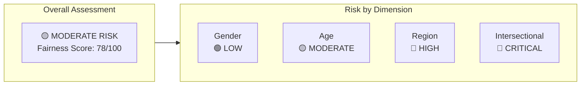
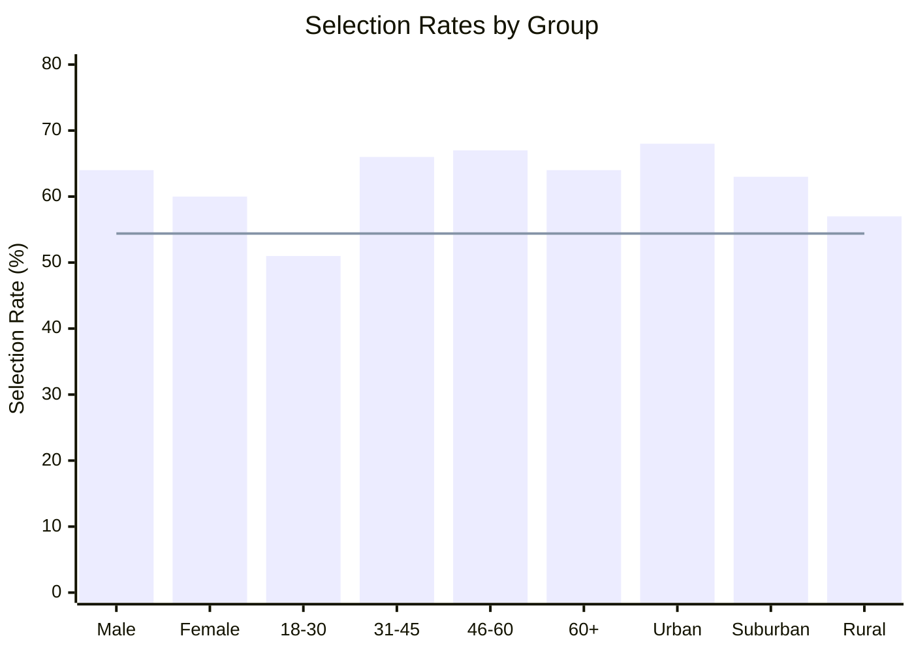
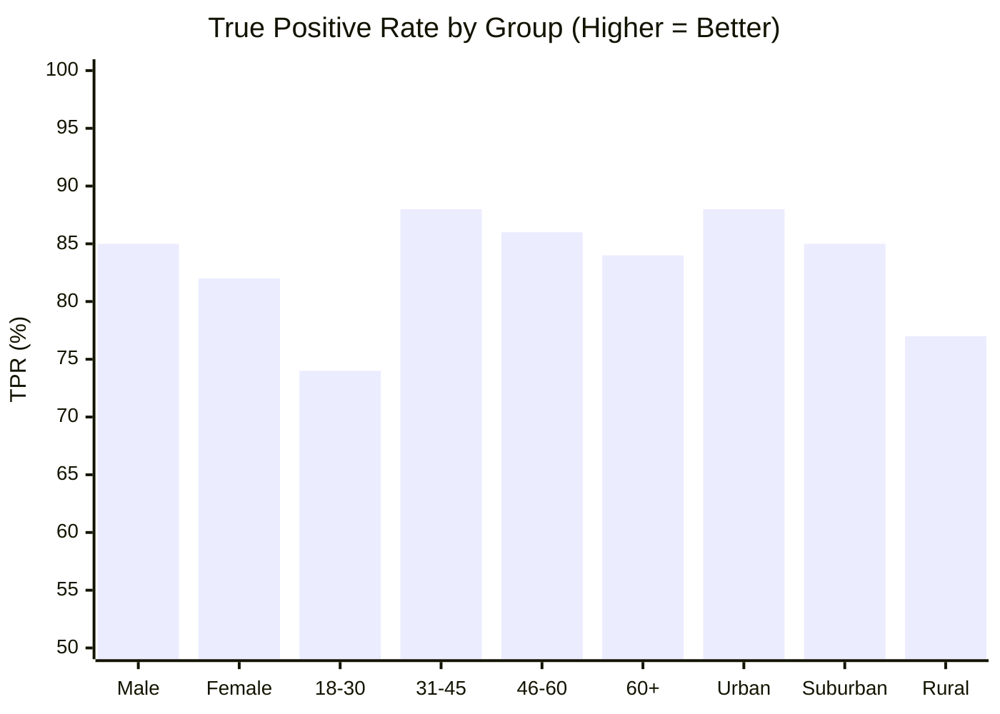
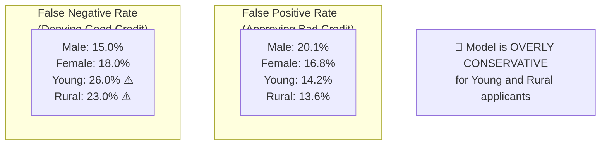
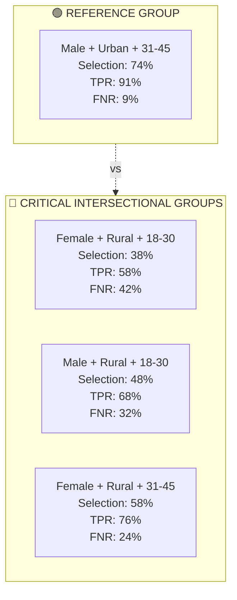
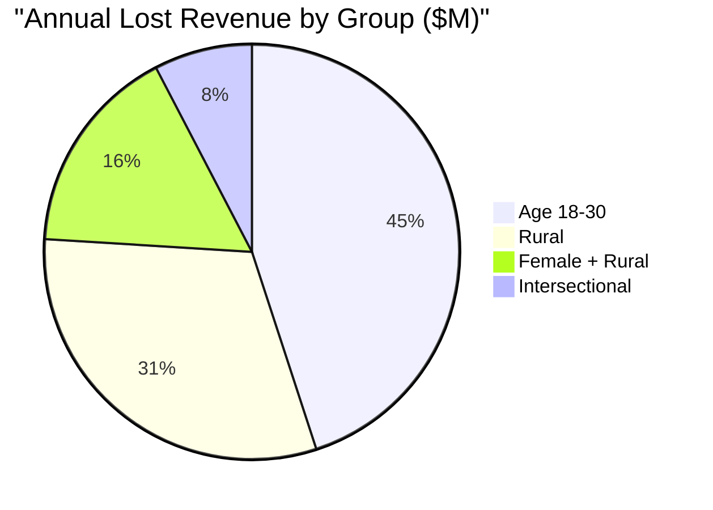
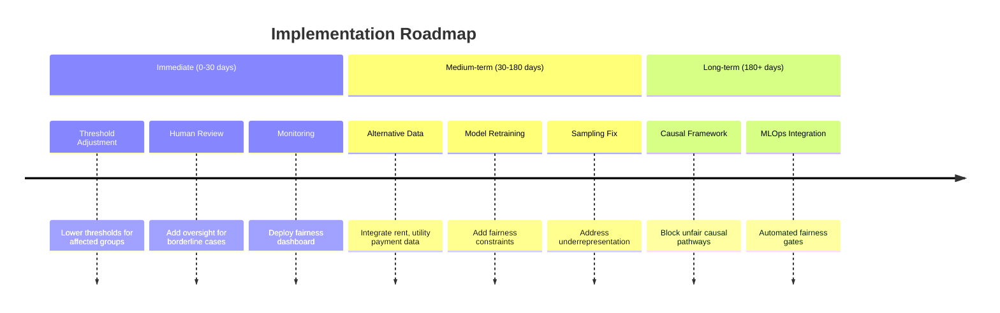

# 📊 Executive Summary: Fairness Audit Results

**Model:** Credit Risk Classification Model (CRM-2026-001)
**Organization:** Banco Nacional
**Audit Date:** February 2026
**Classification:** Internal - Confidential

---

## 🎯 At a Glance

| Overall Model Performance | Value | Status |
|---------------------------|-------|--------|
| Accuracy | 84.2% | ✅ Meets target |
| Precision | 81.7% | ✅ Meets target |
| Recall | 79.3% | ✅ Meets target |
| AUC-ROC | 0.891 | ✅ Meets target |

> 📌 **Bottom Line:** The model performs well technically but has significant fairness issues affecting rural and young populations, requiring immediate remediation.

---

## 📈 Key Fairness Findings

### 1️⃣ Demographic Parity (Selection Rates)

Who gets approved at what rate?

*Note: Red line indicates 4/5ths rule threshold (80% of highest rate = 54.4%)*

| Group | Selection Rate | Parity Ratio | Status |
|-------|----------------|--------------|--------|
| **Gender** | | | |
| Male (ref) | 64.0% | 1.00 | 🟢 Reference |
| Female | 60.0% | 0.94 | 🟢 Acceptable |
| **Age** | | | |
| 31-45 (ref) | 66.0% | 1.00 | 🟢 Reference |
| 18-30 | 51.0% | **0.77** | 🔴 **Violation** |
| 46-60 | 67.0% | 1.02 | 🟢 Acceptable |
| 60+ | 64.0% | 0.97 | 🟢 Acceptable |
| **Region** | | | |
| Urban (ref) | 68.0% | 1.00 | 🟢 Reference |
| Suburban | 63.0% | 0.93 | 🟢 Acceptable |
| Rural | 57.0% | **0.84** | 🔴 **Near Violation** |

### Key Insight
> ⚠️ Young adults (18-30) have 23% lower approval rates than middle-aged adults, and rural applicants have 16% lower rates than urban applicants.

---

### 2️⃣ Equal Opportunity (True Positive Rates)

Are creditworthy applicants approved equally across groups?

| Group | TPR | Gap vs Reference | Status |
|-------|-----|------------------|--------|
| **Gender** | | | |
| Male (ref) | 85.0% | — | 🟢 |
| Female | 82.0% | -3.0pp | 🟢 |
| **Age** | | | |
| 31-45 (ref) | 88.0% | — | 🟢 |
| 18-30 | 74.0% | **-14.0pp** | 🔴 **Critical** |
| 46-60 | 86.0% | -2.0pp | 🟢 |
| 60+ | 84.0% | -4.0pp | 🟢 |
| **Region** | | | |
| Urban (ref) | 88.0% | — | 🟢 |
| Suburban | 85.0% | -3.0pp | 🟢 |
| Rural | 77.0% | **-11.0pp** | 🔴 **High** |

### Key Insight
> ⚠️ 26% of qualified young applicants and 23% of qualified rural applicants are wrongly denied (vs. 12% baseline).

---

### 3️⃣ Error Rate Analysis

Where is the model making mistakes?

| Group | FPR (Bank Risk) | FNR (Customer Harm) | Pattern |
|-------|-----------------|---------------------|---------|
| Male | 20.1% | 15.0% | Balanced |
| Female | 16.8% | 18.0% | Balanced |
| **Age 18-30** | 14.2% | **26.0%** | 🔴 Too conservative |
| Age 31-45 | 21.5% | 12.0% | Slight overconfidence |
| **Rural** | 13.6% | **23.0%** | 🔴 Too conservative |
| Urban | 21.4% | 12.0% | Slight overconfidence |

### Key Insight
> ⚠️ The model protects the bank well from default risk in young/rural groups (low FPR) but at the cost of denying too many qualified applicants (high FNR).

---

### 4️⃣ Intersectional Analysis

Compounded disadvantage when multiple attributes combine:

| Intersectional Group | n | Selection Rate | TPR | FNR | Risk Level |
|----------------------|---|----------------|-----|-----|------------|
| Male + Urban + 31-45 | 7,560 | 74.0% | 91.0% | 9.0% | 🟢 Reference |
| Female + Urban + 31-45 | 5,670 | 70.0% | 88.0% | 12.0% | 🟢 Low |
| Male + Rural + 31-45 | 2,520 | 64.0% | 82.0% | 18.0% | 🟡 Moderate |
| Female + Urban + 18-30 | 3,780 | 52.0% | 72.0% | 28.0% | 🔴 High |
| Male + Rural + 18-30 | 1,890 | 48.0% | 68.0% | 32.0% | 🔴 High |
| Female + Rural + 31-45 | 1,890 | 58.0% | 76.0% | 24.0% | 🔴 High |
| **Female + Rural + 18-30** | **1,260** | **38.0%** | **58.0%** | **42%** | 🔴 **CRITICAL** |

### Key Insight
> 🚨 **Critical Finding:** Young rural women face compounded disadvantage. With 38% approval vs. 74% baseline, nearly half (42%) of creditworthy applicants in this group are wrongly denied.

---

## 💰 Business Impact Summary

### Lost Revenue from Unfair Denials

| Impact Category | Estimated Annual Cost |
|-----------------|----------------------|
| **Lost Revenue (qualified denials)** | |
| Age 18-30 group | $412.1M |
| Rural population | $283.8M |
| Female + Rural | $150.4M |
| **Total Lost Revenue** | **~$650M+** |
| **Regulatory Risk Exposure** | |
| ECOA Age Discrimination | $50-100M |
| Fair Lending (Geography) | $100-200M |
| Disparate Impact Claims | $50-150M |
| **Total Regulatory Risk** | **$200-450M** |

---

## 🎬 Action Summary

### Recommended Interventions

### Priority Actions

| Priority | Action | Timeline | Expected Impact | Cost |
|----------|--------|----------|-----------------|------|
| 🔴 **P1** | Group-specific thresholds | 2 weeks | -10pp FNR for affected groups | $50K |
| 🔴 **P1** | Human review for borderline cases | 3 weeks | +$50M recovered loans | $180K/yr |
| 🟡 **P2** | Fairness monitoring dashboard | 4 weeks | Early detection of drift | $100K |
| 🟡 **P2** | Alternative data integration | 3 months | Better prediction for thin-file | $300K |
| 🟢 **P3** | Model retraining with constraints | 4 months | 5pp max TPR gap | $200K |

---

## 📊 Success Metrics & Targets

| Metric | Current | 3-Month Target | 6-Month Target | 12-Month Target |
|--------|---------|----------------|----------------|-----------------|
| Min Selection Rate Ratio | 0.77 | 0.82 | 0.87 | 0.90 |
| Max TPR Gap | 14pp | 10pp | 7pp | 5pp |
| Rural Parity Ratio | 0.84 | 0.88 | 0.92 | 0.95 |
| Age 18-30 Parity Ratio | 0.77 | 0.83 | 0.88 | 0.92 |
| Intersectional Minimum | 0.51 | 0.65 | 0.75 | 0.82 |

### Guardrails (Must Maintain)
- ✅ AUC-ROC ≥ 0.85
- ✅ Default rate increase ≤ 2pp
- ✅ Processing time increase ≤ 10%

---

## ✅ Conclusions

### What's Working
- ✅ Strong overall model performance (84.2% accuracy, 0.891 AUC)
- ✅ Gender fairness within acceptable bounds
- ✅ Older age groups treated fairly
- ✅ Suburban-urban gap is minimal

### What Needs Attention
- ⚠️ Young adults (18-30) face significant disadvantage
- ⚠️ Rural applicants systematically underserved
- ⚠️ Model is overly conservative for these groups

### What's Critical
- 🔴 Intersectional groups face compounded harm
- 🔴 Female + Rural + Young: 42% qualified applicants denied
- 🔴 Potential 4/5ths rule violation for age groups
- 🔴 Feedback loops may worsen disparities over time

---

## 📝 Sign-Off

**Audit Conclusion:** The Credit Risk Model CRM-2026-001 demonstrates strong predictive performance but exhibits significant fairness disparities requiring remediation before expanded deployment.

| Role | Name | Date | Signature |
|------|------|------|-----------|
| Audit Lead | AI Fairness Team | Feb 2026 | _________________ |
| VP Engineering | | | _________________ |
| Chief Risk Officer | | | _________________ |
| Compliance Officer | | | _________________ |

---

*This executive summary accompanies the full Technical Report. See `03_Technical_Report_FairnessAudit.md` for detailed analysis.*
