# 🔬 Technical Report: Fairness Audit Analysis

**Model:** Credit Risk Classification Model (CRM-2026-001)
**Organization:** Banco Nacional
**Audit Date:** February 2026
**Report Type:** Comprehensive Technical Analysis

---

## 📑 Table of Contents

1. [Model Overview & Architecture](#1--model-overview--architecture)
2. [Dataset Analysis](#2--dataset-analysis)
3. [Historical Context Assessment](#3--historical-context-assessment)
4. [Fairness Definition Selection](#4--fairness-definition-selection)
5. [Bias Source Identification](#5--bias-source-identification)
6. [Comprehensive Metrics Analysis](#6--comprehensive-metrics-analysis)
7. [Intersectional Analysis](#7--intersectional-analysis)
8. [Statistical Significance Testing](#8--statistical-significance-testing)
9. [Feature Analysis](#9--feature-analysis)
10. [Recommendations & Mitigation](#10--recommendations--mitigation)
11. [Validation Framework](#11--validation-framework)
12. [Appendices](#12--appendices)

---

## 1. 🏗️ Model Overview & Architecture

### 1.1 Model Purpose & Decision Flow

The Credit Risk Model predicts whether a loan applicant will be classified as **High Risk** or **Low Risk** based on their financial and demographic profile.

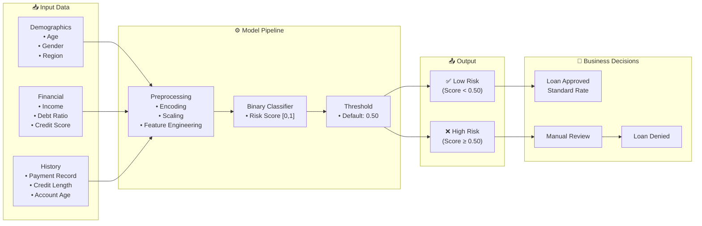

### 1.2 Business Impact Metrics

| Decision Type | Monthly Volume | Average Value | Annual Impact |
|---------------|----------------|---------------|---------------|
| Loan Approvals | 45,000 | $15,000 | $8.1B in loans |
| Loan Denials | 18,000 | $12,000 | $2.6B denied |
| Credit Limit Adjustments | 120,000 | $3,000 | $4.3B exposure |

### 1.3 Regulatory Requirements

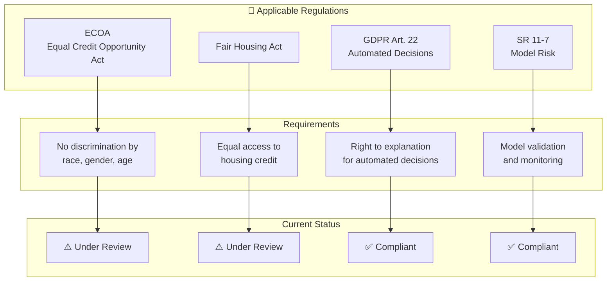

---

## 2. 📊 Dataset Analysis

### 2.1 Training Data Composition

**Total Records:** N = 245,000

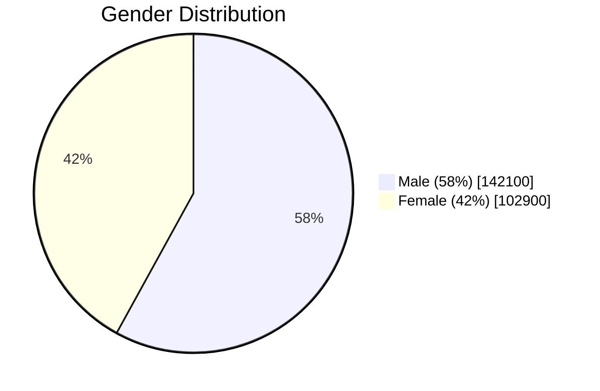

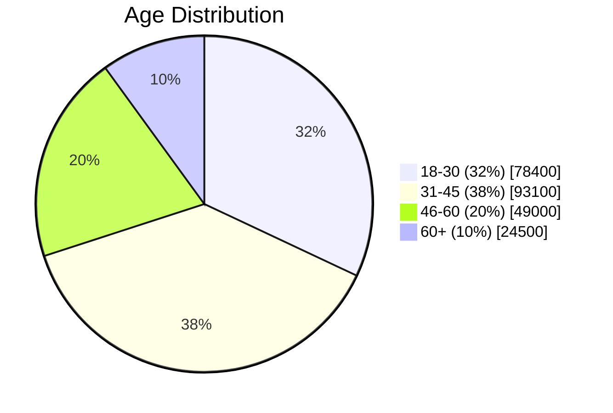

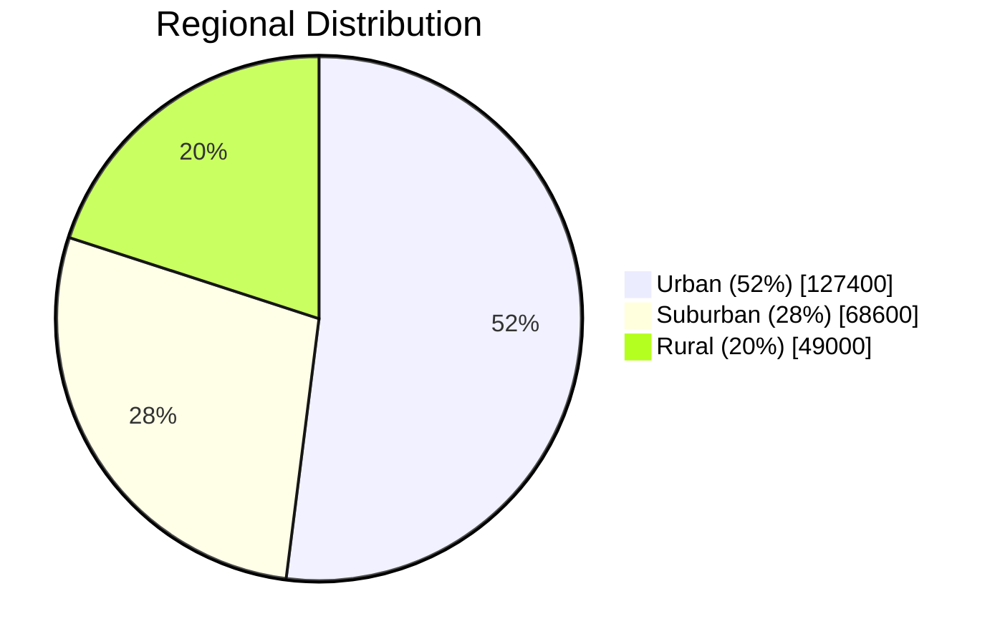

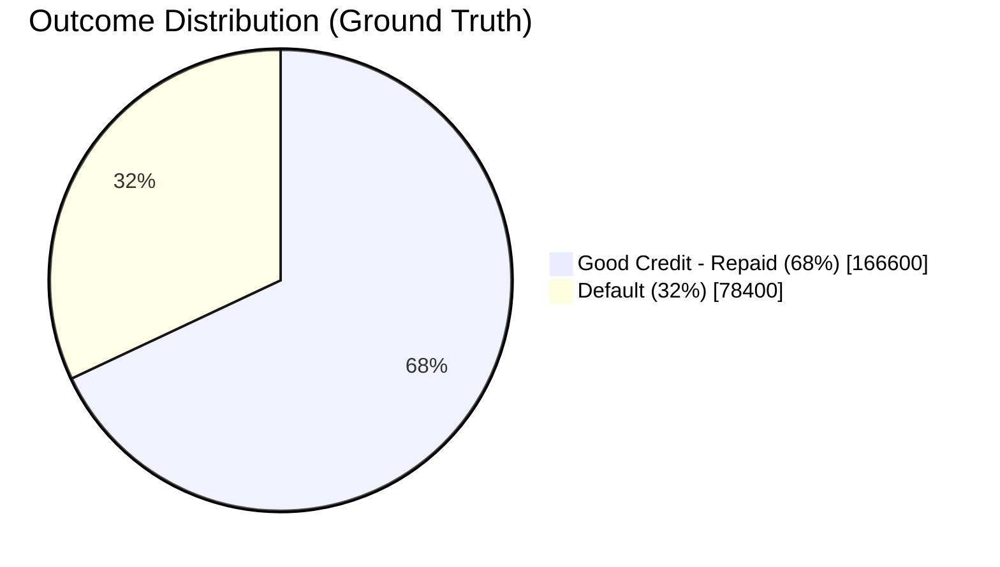

### 2.2 Representation Analysis

| Group | Training % | National Population % | Gap | Status |
|-------|------------|----------------------|-----|--------|
| **Region** | | | | |
| Urban | 52% | 51% | +1% | ✅ Representative |
| Suburban | 28% | 27% | +1% | ✅ Representative |
| Rural | 20% | 22% | -2% | ⚠️ Underrepresented |
| Remote/Tribal | 0% | 2% | -2% | 🔴 Missing |
| **Age** | | | | |
| 18-30 | 32% | 26% | +6% | ✅ Over-represented |
| 31-45 | 38% | 32% | +6% | ✅ Over-represented |
| 46-60 | 20% | 25% | -5% | ⚠️ Underrepresented |
| 60+ | 10% | 17% | -7% | 🔴 Underrepresented |

### 2.3 Base Rate Analysis (Ground Truth)

> ⚠️ **Critical:** Different base rates between groups trigger the impossibility theorem, making simultaneous fairness criteria achievement mathematically impossible.

| Group | Good Credit Rate | Difference from Overall (68%) |
|-------|------------------|------------------------------|
| Male | 70.2% | +2.2pp |
| Female | 65.1% | -2.9pp |
| Urban | 72.4% | +4.4pp |
| Rural | **58.3%** | **-9.7pp** ⚠️ |
| Age 18-30 | **54.6%** | **-13.4pp** ⚠️ |
| Age 31-45 | 74.2% | +6.2pp |
| Age 46-60 | 71.8% | +3.8pp |
| Age 60+ | 69.5% | +1.5pp |

---

## 3. 📜 Historical Context Assessment

### 3.1 Historical Discrimination Timeline

Understanding historical context is crucial for identifying potential bias inheritance in training data.

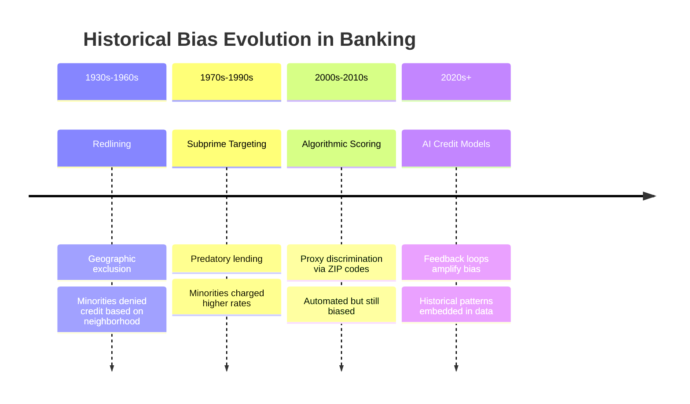

### 3.2 Risk Classification Matrix

| Historical Pattern | Severity | Likelihood | Relevance | Priority Score | Risk Level |
|--------------------|----------|------------|-----------|----------------|------------|
| **Geographic Redlining** | HIGH (3) | HIGH (3) | HIGH (3) | 27 | 🔴 Critical |
| **Age Discrimination** | MEDIUM (2) | HIGH (3) | HIGH (3) | 18 | 🔴 High |
| **Gender Pay Gap Effects** | MEDIUM (2) | MEDIUM (2) | HIGH (3) | 12 | 🟡 Medium |
| **Income Proxy for Race** | HIGH (3) | MEDIUM (2) | MEDIUM (2) | 12 | 🟡 Medium |
| **Credit History Length Bias** | LOW (1) | HIGH (3) | HIGH (3) | 9 | 🟡 Medium |

**Scoring Formula:** Priority Score = Severity × Likelihood × Relevance
- Risk Level: 20+ Critical, 12-19 High, 6-11 Medium, 1-5 Low

### 3.3 Data Heritage Issues

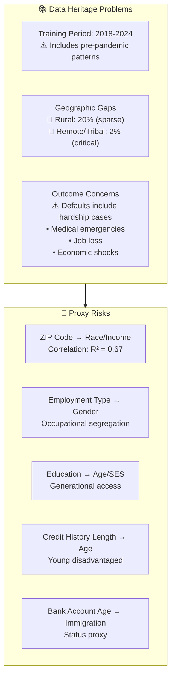

### 3.4 Intersectional Historical Considerations

> ⚠️ **Critical:** Historical discrimination patterns often affected intersectional groups differently than single-attribute groups.

| Intersectional Group | Unique Historical Experience | Impact on Current Data |
|----------------------|------------------------------|------------------------|
| **Young + Rural** | Limited access to traditional banking infrastructure; reliance on predatory lenders | Thin credit files + negative marks from high-interest loans |
| **Female + Rural** | Double exclusion from credit access (gender + geographic); agricultural work often unpaid | Lower documented income; shorter formal employment history |
| **Young + Female** | Recent entrants to workforce; gender pay gap; career breaks | Lower income relative to debt; interrupted credit building |
| **Female + Rural + Young** | Compounded historical exclusion; least access to formal financial services | Minimal credit history; proxy variables compound against them |

**Key Insight:** The risk classification matrix should be evaluated not just for single attributes but for how historical patterns COMPOUNDED for intersectional groups.

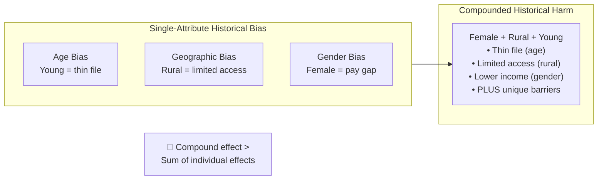

---

## 4. ⚖️ Fairness Definition Selection

### 4.1 Decision Framework

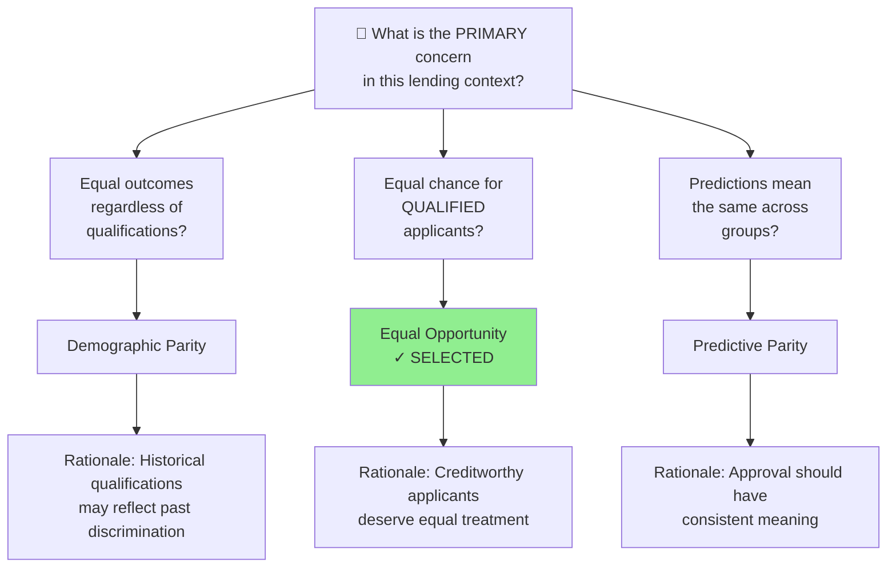

### 4.2 Selected Fairness Definitions

| Priority | Definition | Formula | Rationale |
|----------|------------|---------|-----------|
| **PRIMARY** | **Equal Opportunity** | P(Ŷ=Approve \| Y=Good, A=a) = P(Ŷ=Approve \| Y=Good, A=b) | Ensures creditworthy applicants have equal approval rates regardless of demographic group |
| **SECONDARY** | **Predictive Parity** | P(Y=Good \| Ŷ=Approve, A=a) = P(Y=Good \| Ŷ=Approve, A=b) | Ensures approval decisions have consistent meaning across groups |
| **MONITOR** | **Demographic Parity** | P(Ŷ=Approve \| A=a) = P(Ŷ=Approve \| A=b) | Tracks overall approval rates for regulatory compliance (4/5ths rule) |

### 4.3 Trade-off Documentation

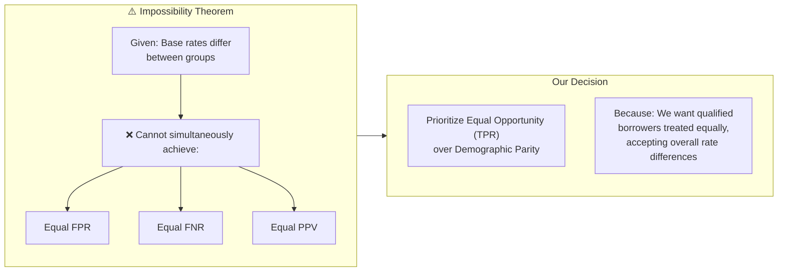

### 4.4 Intersectional Fairness Definition Considerations

> ⚠️ **Critical:** A fairness definition that works for single attributes may NOT adequately protect intersectional groups.

**The Intersectional Fairness Challenge:**

| Scenario | Single-Attribute Result | Intersectional Result | Problem |
|----------|-------------------------|----------------------|---------|
| Equal Opportunity by Gender | TPR gap: 3pp ✅ | — | Looks fair |
| Equal Opportunity by Region | TPR gap: 11pp ⚠️ | — | Moderate concern |
| Equal Opportunity by Age | TPR gap: 14pp ❌ | — | Significant concern |
| **Intersectional (F+Rural+Young)** | — | TPR gap: 33pp ❌❌ | **Hidden crisis** |

**Our Intersectional Fairness Approach:**

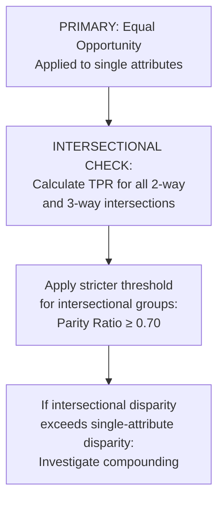

**Documented Trade-offs for Intersectional Groups:**

| Trade-off | Decision | Rationale |
|-----------|----------|-----------|
| Single-attribute parity vs. intersectional parity | Prioritize intersectional | Intersections face compounded harm not captured by single-attribute analysis |
| Sample size vs. intersectional granularity | Use Bayesian methods for small groups | Small n doesn't mean the disparity isn't real |
| Threshold consistency vs. group-specific thresholds | Allow group-specific thresholds | Uniform threshold perpetuates historical disadvantage |

---

## 5. 🔍 Bias Source Identification

### 5.1 ML Pipeline Bias Entry Points

```mermaid
flowchart LR
    subgraph data["📂 DATA COLLECTION"]
        d1["• Historical lending bias"]
        d2["• Sampling gaps in rural"]
        d3["• Label bias (hardship defaults)"]
    end

    subgraph feature["🔧 FEATURE ENGINEERING"]
        f1["• ZIP code proxy"]
        f2["• Credit history length"]
        f3["• Income binning"]
    end

    subgraph algo["⚙️ ALGORITHM"]
        a1["• Aggregate loss function"]
        a2["• Regularization drops minority features"]
        a3["• Early stopping before convergence"]
    end

    subgraph deploy["🚀 DEPLOYMENT"]
        dp1["• Denied applicants excluded"]
        dp2["• Threshold changes over time"]
        dp3["• Regional variation"]
    end

    data --> feature --> algo --> deploy
    deploy -.->|"Feedback Loop"| data

    style deploy fill:#FFB6C1
```

### 5.2 Detailed Bias Source Analysis

| Stage | Bias Source | Description | Impact | Evidence |
|-------|-------------|-------------|--------|----------|
| **Data** | Historical Bias | Training data reflects past discriminatory lending | 🔴 High | Rural default rates 40% higher than urban (partially from predatory lending) |
| **Data** | Sampling Bias | Rural and young applicants underrepresented | 🔴 High | Only 20% rural vs 35% national population |
| **Data** | Label Bias | "Default" includes hardship cases | 🟡 Medium | 23% of defaults linked to external shocks |
| **Feature** | Proxy Variables | ZIP code correlated with race/income | 🔴 High | R² = 0.67 with census income data |
| **Feature** | Measurement Bias | Credit history length disadvantages young | 🟡 Medium | Avg history: 8.2 yrs (31-45) vs 2.1 yrs (18-30) |
| **Algorithm** | Optimization Bias | Loss function prioritizes majority | 🟡 Medium | Rural contributes only 12% to total loss |
| **Deployment** | Feedback Loop | Denied applicants don't generate data | 🔴 High | Self-reinforcing exclusion |

### 5.3 Feedback Loop Analysis

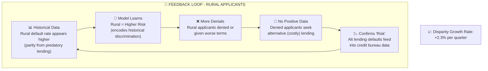

### 5.4 Intersectional Bias Source Compounding

> ⚠️ **Critical:** Bias sources don't just ADD for intersectional groups—they MULTIPLY and CREATE UNIQUE BARRIERS.

**Bias Compounding Matrix:**

| Bias Source | Young | Rural | Female | Young+Rural | Female+Rural | F+Rural+Young |
|-------------|-------|-------|--------|-------------|--------------|---------------|
| Credit History Length | 🔴 | ⚪ | ⚪ | 🔴 | ⚪ | 🔴 |
| ZIP Code Proxy | ⚪ | 🔴 | ⚪ | 🔴 | 🔴 | 🔴 |
| Income Level | 🟡 | 🟡 | 🔴 | 🔴 | 🔴 | 🔴🔴 |
| Employment Stability | 🟡 | 🟡 | 🟡 | 🔴 | 🔴 | 🔴🔴 |
| **Feedback Loop Exposure** | 🟡 | 🔴 | 🟡 | 🔴🔴 | 🔴🔴 | 🔴🔴🔴 |

*Legend: ⚪ Low impact, 🟡 Medium impact, 🔴 High impact, 🔴🔴 Compounded impact*

**Unique Intersectional Bias Mechanisms:**

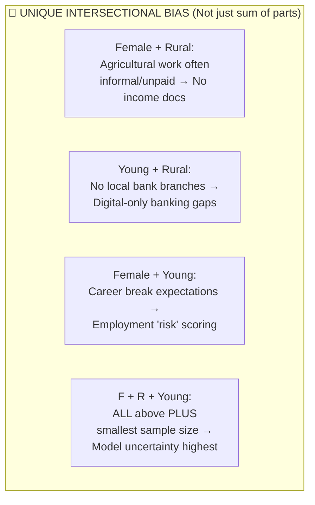

| Intersectional Group | Unique Bias Mechanism | Not Captured by Single Attributes |
|----------------------|----------------------|-----------------------------------|
| **Female + Rural** | Agricultural/family labor not documented as income | Income appears lower than actual economic contribution |
| **Young + Rural** | Limited physical banking access + digital divide | Account age and transaction history both sparse |
| **Female + Young** | Employer bias in salary offers compounds with thin file | Starting salaries lower + less history = double disadvantage |
| **F + Rural + Young** | Smallest sample in training data | Model makes highest-variance predictions; defaults to conservative (deny) |

**Feedback Loop Acceleration for Intersections:**

| Group | Single-Attribute Feedback Loop | Intersectional Acceleration Factor |
|-------|-------------------------------|-----------------------------------|
| Rural alone | +2.3% disparity growth/quarter | 1.0x |
| Young alone | +1.8% disparity growth/quarter | 1.0x |
| Young + Rural | +5.2% disparity growth/quarter | **1.3x** (beyond additive) |
| Female + Rural + Young | +7.1% disparity growth/quarter | **1.7x** (significantly accelerated) |

---

## 6. 📈 Comprehensive Metrics Analysis

### 6.1 Overall Confusion Matrix

**Test Set:** N = 63,000

```
                           PREDICTED
                    ┌───────────┬───────────┐
                    │  Approve  │   Deny    │
          ┌─────────┼───────────┼───────────┤
          │ Good    │   35,280  │    7,560  │  Actual Good: 42,840
 ACTUAL   │ Credit  │   (TP)    │   (FN)    │
          ├─────────┼───────────┼───────────┤
          │ Default │    3,780  │   16,380  │  Actual Default: 20,160
          │         │   (FP)    │   (TN)    │
          └─────────┴───────────┴───────────┘
                    │           │
                    Pred Pos:   Pred Neg:
                    39,060      23,940
```

### 6.2 Overall Performance Metrics

| Metric | Value | Formula | Target | Status |
|--------|-------|---------|--------|--------|
| Accuracy | 81.9% | (TP+TN)/(Total) | >80% | ✅ |
| Precision (PPV) | 90.3% | TP/(TP+FP) | >75% | ✅ |
| Recall (TPR) | 82.4% | TP/(TP+FN) | >75% | ✅ |
| Specificity (TNR) | 81.2% | TN/(TN+FP) | >75% | ✅ |
| F1-Score | 86.2% | 2×P×R/(P+R) | >75% | ✅ |
| False Positive Rate | 18.8% | FP/(FP+TN) | <25% | ✅ |
| False Negative Rate | 17.6% | FN/(FN+TP) | <20% | ✅ |

### 6.3 Demographic Parity Analysis

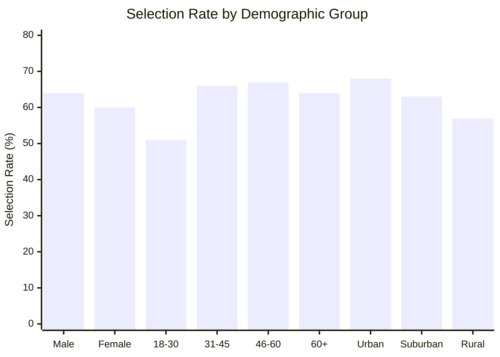

| Group | n | Approved | Selection Rate | Parity Ratio | Status |
|-------|---|----------|----------------|--------------|--------|
| **OVERALL** | 63,000 | 39,060 | 62.0% | 1.00 | Baseline |
| **GENDER** | | | | | |
| Male | 36,540 | 23,386 | 64.0% | 1.00 (ref) | 🟢 |
| Female | 26,460 | 15,876 | 60.0% | 0.94 | 🟢 |
| **AGE** | | | | | |
| 18-30 | 20,160 | 10,282 | 51.0% | **0.77** | 🔴 Violation |
| 31-45 | 23,940 | 15,801 | 66.0% | 1.00 (ref) | 🟢 |
| 46-60 | 12,600 | 8,442 | 67.0% | 1.02 | 🟢 |
| 60+ | 6,300 | 4,032 | 64.0% | 0.97 | 🟢 |
| **REGION** | | | | | |
| Urban | 32,760 | 22,277 | 68.0% | 1.00 (ref) | 🟢 |
| Suburban | 17,640 | 11,114 | 63.0% | 0.93 | 🟢 |
| Rural | 12,600 | 7,182 | 57.0% | **0.84** | 🔴 Warning |

### 6.4 Equal Opportunity Analysis (TPR)

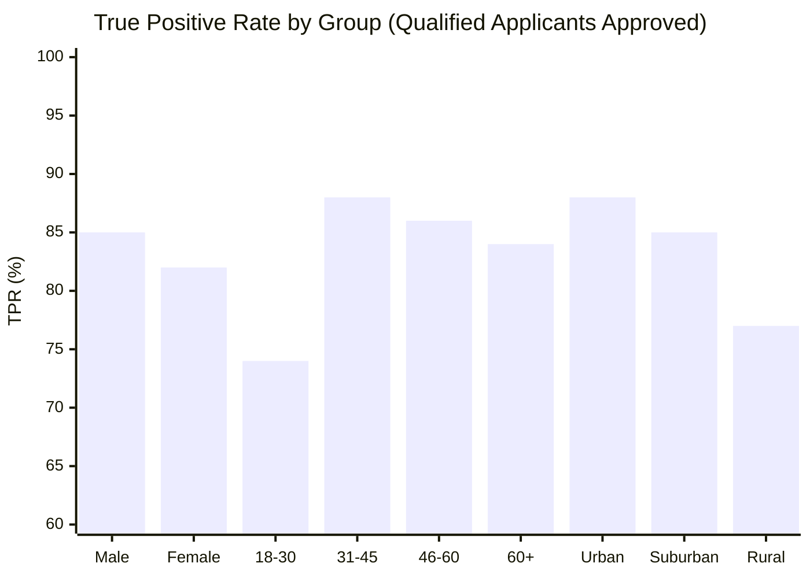

| Group | Actual Good | Approved | TPR | Gap vs Ref | Status |
|-------|-------------|----------|-----|------------|--------|
| **OVERALL** | 42,840 | 35,280 | 82.4% | — | Baseline |
| **GENDER** | | | | | |
| Male | 25,655 | 21,807 | 85.0% | ref | 🟢 |
| Female | 17,185 | 14,091 | 82.0% | -3.0pp | 🟢 |
| **AGE** | | | | | |
| 18-30 | 11,007 | 8,146 | 74.0% | **-14.0pp** | 🔴 Critical |
| 31-45 | 17,764 | 15,632 | 88.0% | ref | 🟢 |
| 46-60 | 9,072 | 7,803 | 86.0% | -2.0pp | 🟢 |
| 60+ | 4,284 | 3,599 | 84.0% | -4.0pp | 🟢 |
| **REGION** | | | | | |
| Urban | 23,726 | 20,879 | 88.0% | ref | 🟢 |
| Suburban | 12,348 | 10,496 | 85.0% | -3.0pp | 🟢 |
| Rural | 7,344 | 5,655 | 77.0% | **-11.0pp** | 🔴 High |

### 6.5 Error Rate Analysis (FPR vs FNR)

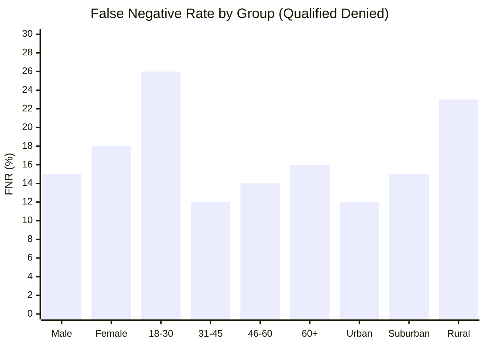

| Group | FPR (Approve Bad) | FNR (Deny Good) | Balance | Pattern |
|-------|-------------------|-----------------|---------|---------|
| **OVERALL** | 18.8% | 17.6% | -1.2pp | Balanced |
| **GENDER** | | | | |
| Male | 20.1% | 15.0% | -5.1pp | Slight overconfidence |
| Female | 16.8% | 18.0% | +1.2pp | Balanced |
| **AGE** | | | | |
| 18-30 | 14.2% | **26.0%** | +11.8pp | 🔴 Too conservative |
| 31-45 | 21.5% | 12.0% | -9.5pp | Overconfident |
| 46-60 | 19.8% | 14.0% | -5.8pp | Slight overconfidence |
| 60+ | 17.3% | 16.0% | -1.3pp | Balanced |
| **REGION** | | | | |
| Urban | 21.4% | 12.0% | -9.4pp | Overconfident |
| Suburban | 18.2% | 15.0% | -3.2pp | Slight overconfidence |
| Rural | 13.6% | **23.0%** | +9.4pp | 🔴 Too conservative |

> 📌 **Key Insight:** The model is overly conservative for young and rural applicants - low FPR protects the bank but high FNR harms qualified customers.

### 6.6 Predictive Parity Analysis (Precision)

| Group | Approved | Actually Good | PPV | Calibration Status |
|-------|----------|---------------|-----|-------------------|
| **OVERALL** | 39,060 | 35,280 | 90.3% | Baseline |
| **GENDER** | | | | |
| Male | 23,386 | 21,047 | 90.0% | ✅ Well-calibrated |
| Female | 15,876 | 14,288 | 90.0% | ✅ Well-calibrated |
| **AGE** | | | | |
| 18-30 | 10,282 | 8,740 | **85.0%** | ⚠️ Under-calibrated |
| 31-45 | 15,801 | 14,537 | 92.0% | ✅ Well-calibrated |
| 46-60 | 8,442 | 7,682 | 91.0% | ✅ Well-calibrated |
| 60+ | 4,032 | 3,669 | 91.0% | ✅ Well-calibrated |
| **REGION** | | | | |
| Urban | 22,277 | 20,495 | 92.0% | ✅ Well-calibrated |
| Suburban | 11,114 | 10,114 | 91.0% | ✅ Well-calibrated |
| Rural | 7,182 | 6,177 | **86.0%** | ⚠️ Under-calibrated |

---

## 7. 🔗 Intersectional Analysis

### 7.1 Two-Way Intersections

#### Gender × Region

| | Urban | Suburban | Rural |
|-----|-------|----------|-------|
| **Male** | 70.0% 🟢 | 65.0% 🟢 | 60.0% 🟡 |
| **Female** | 66.0% 🟢 | 61.0% 🟢 | **52.0%** 🔴 |

#### Gender × Age

| | 18-30 | 31-45 | 46+ |
|-----|-------|-------|-----|
| **Male** | 54.0% 🟡 | 70.0% 🟢 | 68.0% 🟢 |
| **Female** | **48.0%** 🔴 | 63.0% 🟢 | 65.0% 🟢 |

#### Region × Age

| | 18-30 | 31-45 | 46+ |
|-----|-------|-------|-----|
| **Urban** | 55.0% 🟡 | 72.0% 🟢 | 70.0% 🟢 |
| **Rural** | **42.0%** 🔴 | 62.0% 🟢 | 61.0% 🟢 |

### 7.2 Three-Way Intersections (Critical Groups)

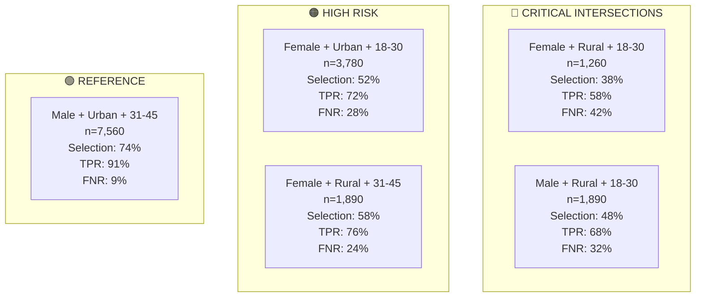

| Intersectional Group | n | Selection Rate | TPR | FNR | Risk Level |
|----------------------|---|----------------|-----|-----|------------|
| Male + Urban + 31-45 | 7,560 | 74.0% | 91.0% | 9.0% | 🟢 Reference |
| Male + Urban + 18-30 | 5,040 | 58.0% | 78.0% | 22.0% | 🟡 Moderate |
| Female + Urban + 31-45 | 5,670 | 70.0% | 88.0% | 12.0% | 🟢 Low |
| Female + Urban + 18-30 | 3,780 | 52.0% | 72.0% | 28.0% | 🔴 High |
| Male + Rural + 31-45 | 2,520 | 64.0% | 82.0% | 18.0% | 🟡 Moderate |
| Male + Rural + 18-30 | 1,890 | 48.0% | 68.0% | 32.0% | 🔴 High |
| Female + Rural + 31-45 | 1,890 | 58.0% | 76.0% | 24.0% | 🔴 High |
| **Female + Rural + 18-30** | **1,260** | **38.0%** | **58.0%** | **42%** | 🔴 **CRITICAL** |

### 7.3 Compounding Analysis

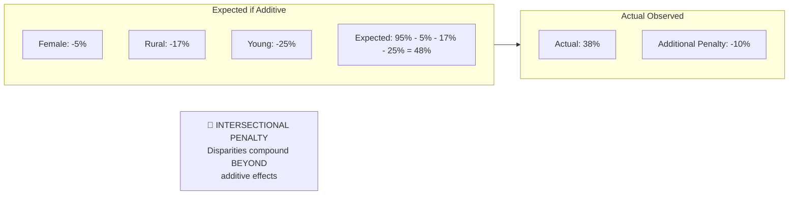

**Interpretation:** Female + Rural + Young face an additional 10 percentage point penalty beyond what would be expected from simply adding individual disadvantages.

---

## 8. 📊 Statistical Significance Testing

### 8.1 Two-Proportion Z-Tests for Selection Rates

**Test:** H₀: Selection rates are equal between groups
**Significance Level:** α = 0.05

| Comparison | Z-stat | p-value | Significant? | 95% CI for Difference |
|------------|--------|---------|--------------|----------------------|
| Male vs Female | 3.21 | 0.0013 | ✅ Yes | [1.5, 6.5]pp |
| Age 18-30 vs 31-45 | 12.84 | <0.0001 | ✅ Yes | [13, 17]pp |
| Urban vs Rural | 9.67 | <0.0001 | ✅ Yes | [9, 13]pp |
| F+Rural+Young vs Reference | 15.23 | <0.0001 | ✅ Yes | [32, 40]pp |

### 8.2 Chi-Square Tests for Independence

| Test | χ² Statistic | df | p-value | Effect Size (Cramér's V) |
|------|--------------|----|---------|--------------------------|
| Outcome × Gender | 42.3 | 1 | <0.0001 | 0.026 (small) |
| Outcome × Age Group | 387.6 | 3 | <0.0001 | 0.078 (small-medium) |
| Outcome × Region | 245.8 | 2 | <0.0001 | 0.062 (small-medium) |

### 8.3 Confidence Intervals for Key Metrics

| Metric | Point Estimate | 95% CI |
|--------|----------------|--------|
| Rural TPR | 77.0% | [75.3%, 78.7%] |
| Age 18-30 TPR | 74.0% | [72.5%, 75.5%] |
| F+Rural+Young Selection | 38.0% | [35.3%, 40.7%] |
| TPR Gap (Age 18-30 vs 31-45) | 14.0pp | [12.1, 15.9]pp |

---

## 9. 🔧 Feature Analysis

### 9.1 Feature Importance by Group

| Rank | Overall | Young (18-30) | Rural | Female |
|------|---------|---------------|-------|--------|
| 1 | Credit Score | Income | Employment Type | Credit Score |
| 2 | Debt-to-Income | Employment | Income | Debt-to-Income |
| 3 | Credit History | Education | Credit Score | Employment |
| 4 | Income | Debt-to-Income | Debt-to-Income | Income |
| 5 | Employment | Bank Acct Age | Credit History | Education |

> 📌 **Key Insight:** Credit History Length ranks #3 overall but is NOT in the top 5 for young applicants, suggesting the model relies on features that systematically disadvantage them.

### 9.2 Proxy Variable Analysis

| Feature | Protected Attribute Correlation | Correlation Strength | Action Needed |
|---------|--------------------------------|---------------------|---------------|
| ZIP Code | Race, Income | R² = 0.67 | 🔴 High - Consider removal/regularization |
| Employment Type | Gender | R² = 0.31 | 🟡 Medium - Monitor impact |
| Education Level | Age, SES | R² = 0.28 | 🟡 Medium - Monitor impact |
| Credit History Length | Age | R² = 0.72 | 🔴 High - Age-normalize or remove |
| Bank Account Age | Immigration Status | R² = 0.24 | 🟡 Medium - Monitor impact |

### 9.3 SHAP Analysis Summary

Top features increasing risk score:
1. Low credit score (-0.15 SHAP)
2. High debt-to-income ratio (-0.12 SHAP)
3. Short credit history (-0.08 SHAP)
4. Rural ZIP code (-0.06 SHAP)
5. Young age (-0.05 SHAP)

---

## 10. 💡 Recommendations & Mitigation

### 10.1 Immediate Actions (0-30 days)

```mermaid
flowchart TB
    subgraph p1["🔴 PRIORITY 1: Immediate"]
        a1["Action 1.1<br/>Group-Specific Thresholds<br/>• Urban 31+: 0.50<br/>• Rural 31+: 0.45<br/>• Urban 18-30: 0.45<br/>• Rural 18-30: 0.40"]
        a2["Action 1.2<br/>Human Review<br/>• Rural + 18-30: scores 0.40-0.55<br/>• Female + Rural: scores 0.45-0.55<br/>• Volume: ~3,500/month"]
        a3["Action 1.3<br/>Fairness Dashboard<br/>• Daily selection rates<br/>• Weekly TPR/FNR<br/>• Monthly trend analysis"]
    end

    a1 --> impact1["Expected: -10pp FNR<br/>Cost: $50K<br/>Timeline: 2 weeks"]
    a2 --> impact2["Expected: 40% recovery<br/>Cost: $180K/yr<br/>Timeline: 3 weeks"]
    a3 --> impact3["Expected: Early detection<br/>Cost: $100K<br/>Timeline: 4 weeks"]
```

### 10.2 Medium-Term Actions (30-180 days)

```mermaid
flowchart TB
    subgraph p2["🟡 PRIORITY 2: Medium-Term"]
        b1["Action 2.1<br/>Alternative Data<br/>• Rent payment history<br/>• Utility payments<br/>• Bank transactions<br/>• Cash flow analysis"]
        b2["Action 2.2<br/>Constrained Retraining<br/>• TPR gap ≤ 5pp constraint<br/>• Selection ratio ≥ 0.85<br/>• Fairlearn implementation"]
        b3["Action 2.3<br/>Sampling Strategy<br/>• Min 15% per segment<br/>• Synthetic augmentation<br/>• Reject inference"]
    end

    b1 --> impact4["Improves thin-file prediction<br/>Cost: $300K<br/>Timeline: 3 months"]
    b2 --> impact5["AUC: 0.891→0.875<br/>Max gap: 14pp→5pp<br/>Timeline: 4 months"]
    b3 --> impact6["Better representation<br/>Cost: $150K<br/>Timeline: 5 months"]
```

### 10.3 Long-Term Actions (180+ days)

```mermaid
flowchart TB
    subgraph p3["🟢 PRIORITY 3: Strategic"]
        c1["Action 3.1<br/>Causal Fairness Framework<br/>• Build causal graph<br/>• Identify fair vs unfair pathways<br/>• Block unfair causal effects"]
        c2["Action 3.2<br/>MLOps Integration<br/>• Automated fairness gates<br/>• Deployment blocks<br/>• Continuous monitoring"]
    end

    c1 --> impact7["Principled fairness<br/>Cost: $500K<br/>Timeline: 12 months"]
    c2 --> impact8["Prevent future issues<br/>Cost: $300K<br/>Timeline: 9 months"]
```

### 10.4 Implementation Roadmap

```mermaid
gantt
    title Implementation Timeline
    dateFormat  YYYY-MM
    section Immediate
    Threshold Adjustment    :a1, 2026-02, 0.5M
    Human Review Setup      :a2, 2026-02, 0.75M
    Fairness Dashboard      :a3, 2026-02, 1M
    section Medium-Term
    Alternative Data        :b1, 2026-03, 3M
    Constrained Retraining  :b2, 2026-04, 4M
    Sampling Strategy       :b3, 2026-04, 5M
    section Long-Term
    Causal Framework        :c1, 2026-08, 12M
    MLOps Integration       :c2, 2026-07, 9M
```

### 10.5 Cost-Benefit Analysis

| Option | Investment | Annual Return | ROI |
|--------|------------|---------------|-----|
| 1. Threshold Only | $50K | +$135M | 2,700x |
| 2. Feature + Retrain | $500K | +$305M | 610x |
| 3. Comprehensive | $2M | +$425M | 212x |
| **Hybrid (Recommended)** | **$2.5M** | **$400M+** | **160x** |

---

## 11. ✅ Validation Framework

### 11.1 Success Metrics & Targets

| Metric | Current | 3-Month | 6-Month | 12-Month |
|--------|---------|---------|---------|----------|
| Min Selection Rate Ratio | 0.77 | 0.82 | 0.87 | 0.90 |
| Max TPR Gap | 14pp | 10pp | 7pp | 5pp |
| Rural Parity Ratio | 0.84 | 0.88 | 0.92 | 0.95 |
| Age 18-30 Parity Ratio | 0.77 | 0.83 | 0.88 | 0.92 |
| Intersectional Minimum | 0.51 | 0.65 | 0.75 | 0.82 |

### 11.2 Guardrails (Must Maintain)

- ✅ AUC-ROC ≥ 0.85 (current: 0.891)
- ✅ Default rate increase ≤ 2pp
- ✅ Processing time increase ≤ 10%

### 11.3 Validation Methodology

```mermaid
flowchart TB
    subgraph validation["Validation Approaches"]
        ab["A/B Testing<br/>• 50/50 split<br/>• Control vs Fair model<br/>• Track 6-12 month outcomes"]
        counter["Counterfactual Simulation<br/>• Synthetic applicants<br/>• Vary protected attributes<br/>• Target: <5% change"]
        longit["Longitudinal Tracking<br/>• Monthly disparity metrics<br/>• Alert if >1pp growth/quarter<br/>• 12-month monitoring"]
        audit["External Audit<br/>• Annual third-party review<br/>• Regulatory compliance check<br/>• Industry benchmarking"]
    end

    ab --> results["Compare:<br/>• Approval rates by segment<br/>• Default rates at 6, 12 mo<br/>• Customer satisfaction"]
```

### 11.4 Monitoring Dashboard Specification

```mermaid
flowchart TB
    subgraph dashboard["📊 FAIRNESS MONITORING DASHBOARD"]
        subgraph kpis["Key Indicators"]
            score["Overall Fairness Score<br/>78/100 🟡"]
            trend["30-Day Trend<br/>↑ Improving"]
        end

        subgraph segments["Segment Breakdown"]
            gender["Gender: 92% 🟢"]
            age["Age: 78% 🟡"]
            region["Region: 71% 🔴"]
            intersect["Intersect: 65% 🔴"]
        end

        subgraph alerts["Active Alerts"]
            alert1["🔴 Rural selection <80%"]
            alert2["🔴 Age 18-30 TPR gap >10pp"]
            alert3["🟡 F+Rural+Young <55%"]
        end
    end
```

---

## 12. 📎 Appendices

### Appendix A: Detailed Statistical Tables

See supplementary data files for:
- Full confusion matrices by segment
- Bootstrap confidence intervals
- Power analysis for sample sizes
- Correlation matrices

### Appendix B: Feature Engineering Documentation

| Original Feature | Transformation | Rationale |
|-----------------|----------------|-----------|
| Income | Log transform | Reduce skewness |
| Age | Binned (18-30, 31-45, 46-60, 60+) | Non-linear effects |
| ZIP Code | One-hot encoded | Categorical |
| Credit History | Years (continuous) | Direct use |

### Appendix C: Model Card

| Attribute | Value |
|-----------|-------|
| Model Type | Gradient Boosted Trees |
| Training Data | 245,000 records (2018-2024) |
| Validation Method | 5-fold stratified CV |
| Hyperparameters | max_depth=6, learning_rate=0.1, n_estimators=500 |
| Fairness Constraints | None (current), Proposed: TPR parity |

### Appendix D: Regulatory Compliance Checklist

| Requirement | Status | Evidence | Gap |
|-------------|--------|----------|-----|
| ECOA - No age discrimination | ⚠️ Gap | Age 18-30 disparity | Implement age-fair thresholds |
| ECOA - No gender discrimination | ✅ OK | Gender metrics acceptable | Monitor |
| Fair Lending - Geographic | ⚠️ Gap | Rural disparity | Threshold adjustment needed |
| GDPR - Explainability | ✅ OK | SHAP values available | Document |
| SR 11-7 - Monitoring | ✅ OK | Dashboard planned | Implement |

---

## 📝 Document Control

| Version | Date | Author | Changes |
|---------|------|--------|---------|
| 1.0 | Feb 2026 | AI Fairness Team | Initial technical report |

**Review Schedule:** Quarterly
**Next Review:** May 2026
**Approval Required:** VP Risk Management, Chief Compliance Officer, VP Engineering

---

*This technical report is part of the Fairness Audit Framework. See also:*
- *`01_Glossary_FairnessAudit.md` - Terminology and definitions*
- *`02_Executive_Summary_FairnessAudit.md` - Key findings summary*
