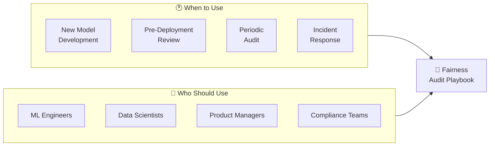
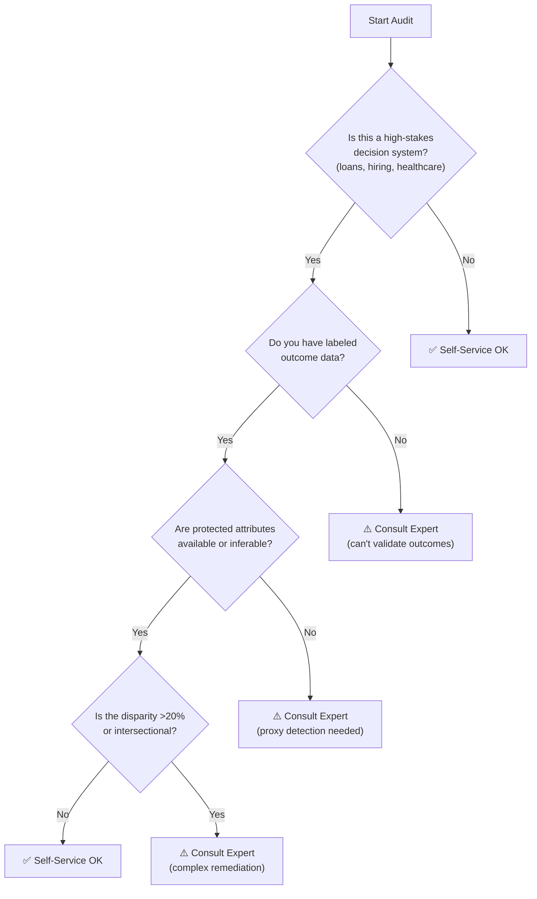
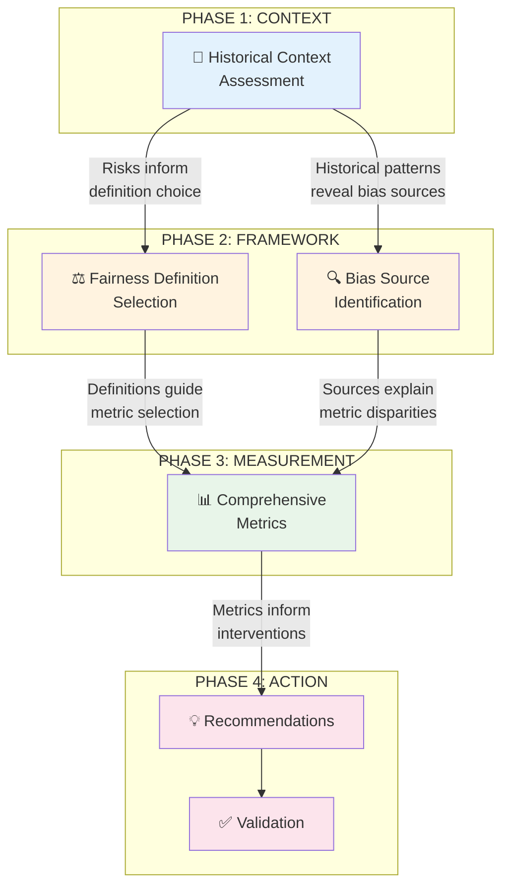
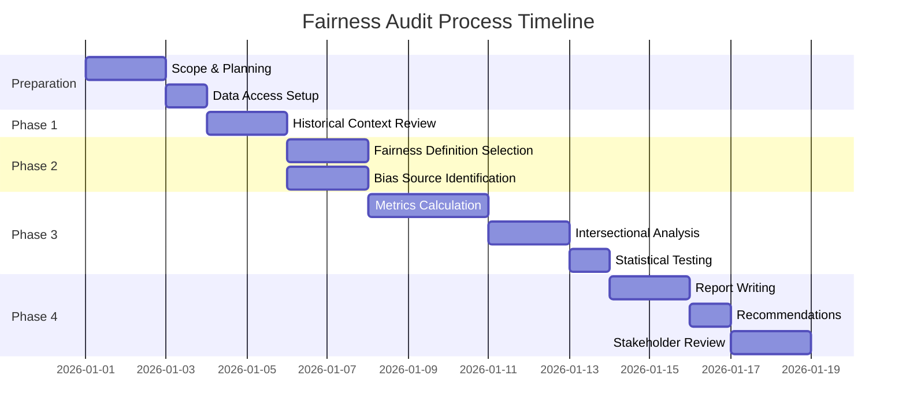
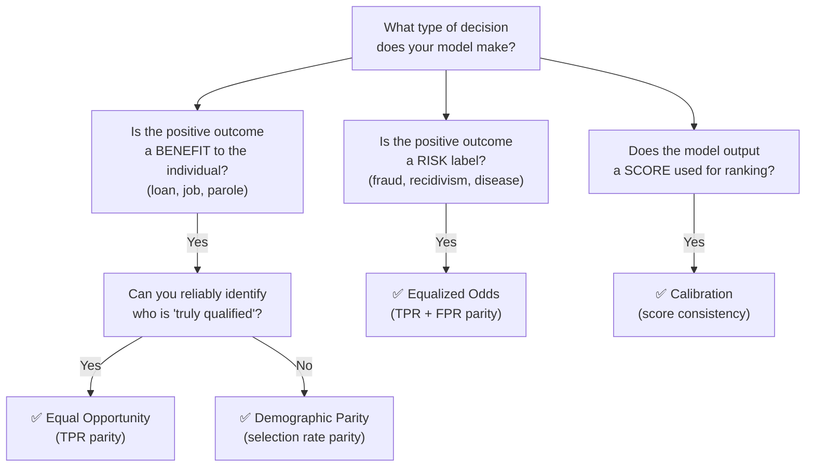
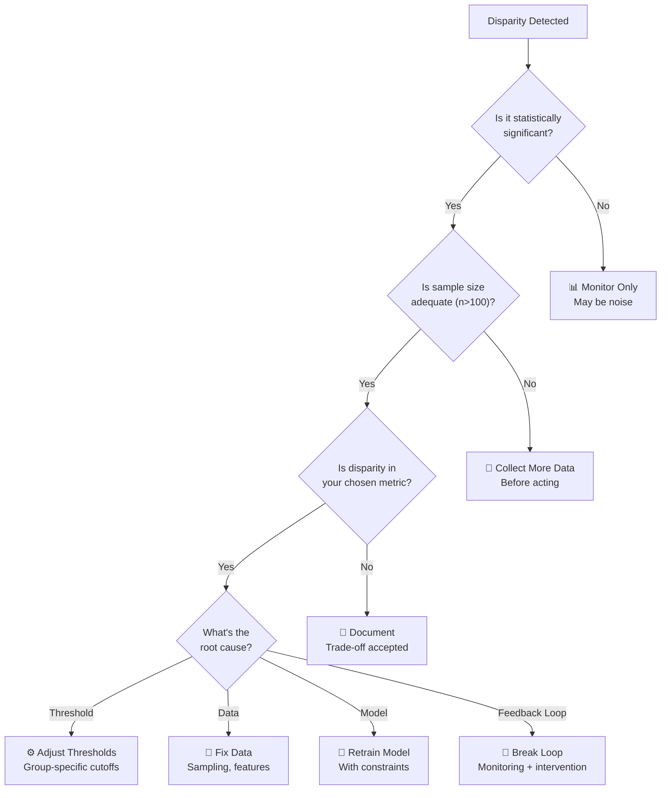
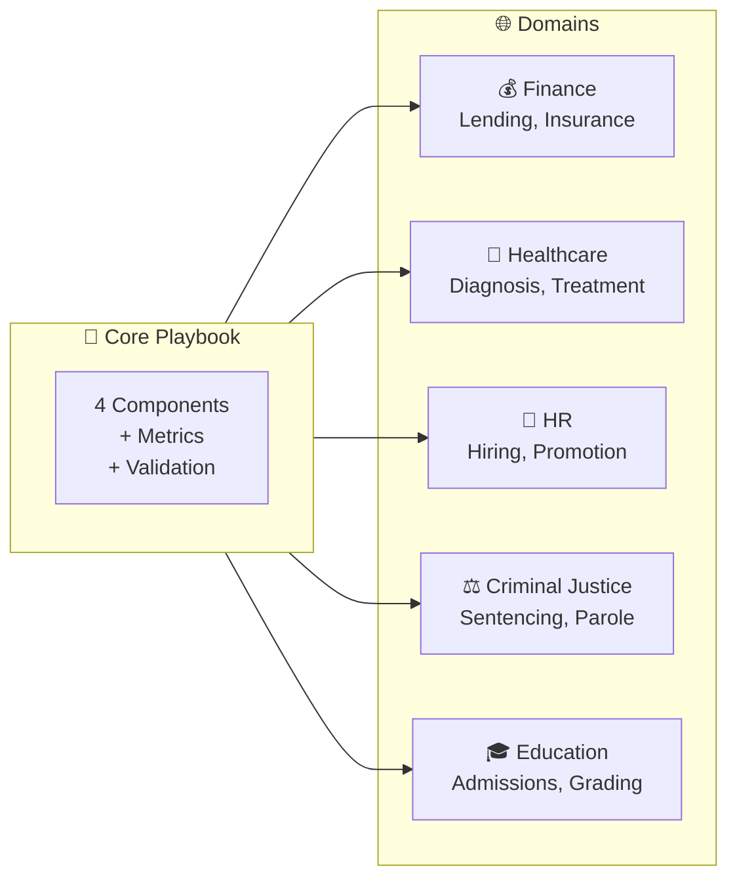
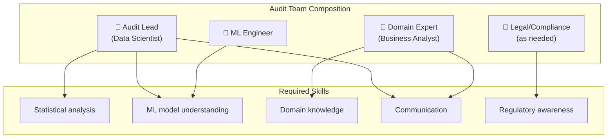
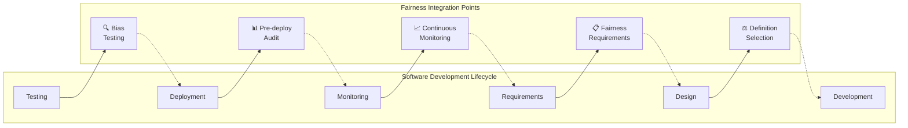
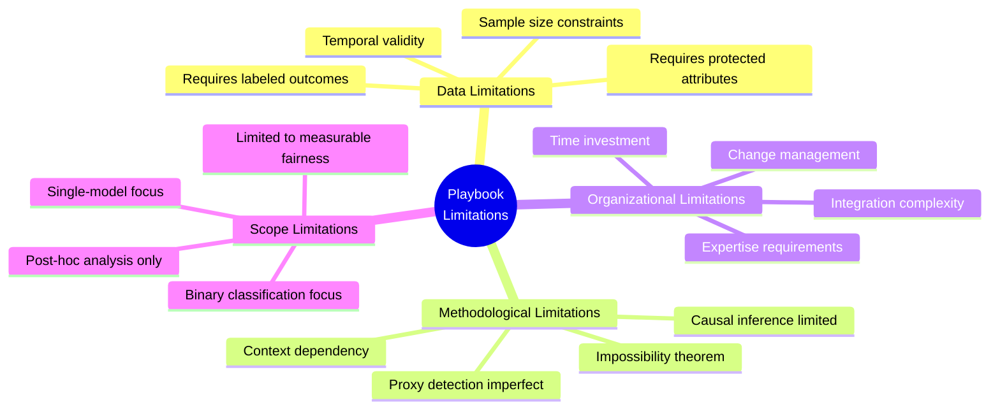

# 📘 Fairness Audit Playbook: Implementation Guide

**Document Version:** 1.0
**Last Updated:** February 2026
**Purpose:** Step-by-step guide for conducting fairness audits using this framework

---

## 📑 Table of Contents

1. [How to Use This Playbook](#1--how-to-use-this-playbook)
2. [Component Workflow & Information Flow](#2--component-workflow--information-flow)
3. [Step-by-Step Audit Process](#3--step-by-step-audit-process)
4. [Decision Points & Guidance](#4--decision-points--guidance)
5. [Adaptability Guidelines](#5--adaptability-guidelines)
6. [Organizational Considerations](#6--organizational-considerations)
7. [Playbook Limitations & Improvements](#7--playbook-limitations--improvements)
8. [Templates & Checklists](#8--templates--checklists)

---

## 1. 🎯 How to Use This Playbook

### 1.1 Purpose & Scope

This playbook enables engineering teams to conduct **self-service fairness audits** on AI/ML systems. It standardizes fairness evaluation across the organization while maintaining methodological rigor.



### 1.2 When to Use This Playbook

| Trigger | Description | Urgency |
|---------|-------------|---------|
| **New Model Development** | Before any model goes to production | 🔴 Required |
| **Model Update/Retrain** | When model is retrained or features change | 🔴 Required |
| **Periodic Review** | Quarterly/annual scheduled audits | 🟡 Scheduled |
| **Regulatory Request** | External audit or compliance requirement | 🔴 Required |
| **Incident Response** | User complaints or bias reports | 🔴 Urgent |
| **Third-Party API** | Evaluating external AI services | 🟡 Recommended |

### 1.3 Document Navigation

| Document | Use For | When to Read |
|----------|---------|--------------|
| **README** | Overview and navigation | First, for orientation |
| **01_Glossary** | Definitions and formulas | Reference during audit |
| **02_Executive_Summary** | Leadership communication | After completing audit |
| **03_Technical_Report** | Detailed methodology | During analysis phase |
| **04_Implementation_Guide** (this) | How to conduct audit | Before starting audit |

### 1.4 Self-Service vs. Expert Escalation



**Escalation Triggers:**
- 🔴 Legal/regulatory risk identified
- 🔴 Disparities exceed 20% (parity ratio < 0.80)
- 🔴 Complex intersectional patterns
- 🔴 Causal pathway analysis needed
- 🔴 Public-facing system with reputational risk

---

## 2. 🔄 Component Workflow & Information Flow

### 2.1 The Four Components

The playbook integrates four components that build upon each other:



### 2.2 Information Flow Between Components

| From | To | Information Passed |
|------|----|--------------------|
| **Historical Context** → | **Fairness Definition** | Risk priorities, stakeholder harm potential, regulatory context |
| **Historical Context** → | **Bias Source** | Known discrimination patterns, proxy variable candidates |
| **Fairness Definition** → | **Metrics** | Which metrics to prioritize (TPR, selection rate, calibration) |
| **Bias Source** → | **Metrics** | Hypotheses about which groups/features will show disparities |
| **Metrics** → | **Recommendations** | Quantified disparities, business impact, priority areas |
| All Components → | **Validation** | Success criteria, monitoring requirements |

### 2.3 Intersectional Considerations Across All Components

> ⚠️ **Critical:** Intersectionality must be considered in EVERY component, not just metrics.

| Component | Intersectional Consideration |
|-----------|------------------------------|
| **Historical Context** | Different groups experienced different historical harms (e.g., Black women vs. Black men vs. white women) |
| **Fairness Definition** | Some definitions may favor one dimension while harming intersections |
| **Bias Source** | Proxy variables may disproportionately affect intersectional groups |
| **Metrics** | Always calculate metrics for intersectional subgroups, not just single attributes |

---

## 3. 📋 Step-by-Step Audit Process

### 3.1 Audit Timeline Overview



**Typical Duration:** 2-3 weeks for standard audit

### 3.2 Detailed Step-by-Step Process

#### Step 1: Preparation (Days 1-3)

```
┌─────────────────────────────────────────────────────────────────────────────┐
│ STEP 1: PREPARATION CHECKLIST                                               │
├─────────────────────────────────────────────────────────────────────────────┤
│                                                                             │
│ □ 1.1 Define audit scope                                                    │
│   • Which model/system is being audited?                                    │
│   • What decisions does it influence?                                       │
│   • Who are the affected stakeholders?                                      │
│                                                                             │
│ □ 1.2 Identify protected attributes                                         │
│   • Which attributes are legally protected? (age, gender, race, etc.)       │
│   • Which attributes are available in the data?                             │
│   • Which might need to be inferred or proxied?                             │
│                                                                             │
│ □ 1.3 Gather required data                                                  │
│   • Model predictions (scores and/or classifications)                       │
│   • Ground truth outcomes (if available)                                    │
│   • Protected attribute values                                              │
│   • Feature values for proxy analysis                                       │
│                                                                             │
│ □ 1.4 Assemble audit team                                                   │
│   • Data scientist (metrics calculation)                                    │
│   • Domain expert (context interpretation)                                  │
│   • Product owner (business impact)                                         │
│                                                                             │
│ □ 1.5 Set stakeholder expectations                                          │
│   • Timeline and deliverables                                               │
│   • Decision authority for remediation                                      │
│                                                                             │
└─────────────────────────────────────────────────────────────────────────────┘
```

#### Step 2: Historical Context Assessment (Days 3-5)

```
┌─────────────────────────────────────────────────────────────────────────────┐
│ STEP 2: HISTORICAL CONTEXT ASSESSMENT                                       │
├─────────────────────────────────────────────────────────────────────────────┤
│                                                                             │
│ □ 2.1 Research domain-specific discrimination history                       │
│   • What historical biases exist in this industry?                          │
│   • Which groups have been historically disadvantaged?                      │
│   • What legal/regulatory actions have occurred?                            │
│                                                                             │
│ □ 2.2 Analyze data heritage                                                 │
│   • When was training data collected?                                       │
│   • What societal conditions existed during collection?                     │
│   • Were any groups under/over-represented?                                 │
│                                                                             │
│ □ 2.3 Identify proxy variable risks                                         │
│   • Which features correlate with protected attributes?                     │
│   • Calculate correlation coefficients                                      │
│   • Flag high-risk proxies (R² > 0.3)                                       │
│                                                                             │
│ □ 2.4 Create risk classification matrix                                     │
│   • Rate each historical pattern: Severity × Likelihood × Relevance         │
│   • Prioritize patterns for investigation                                   │
│                                                                             │
│ □ 2.5 INTERSECTIONAL CHECK                                                  │
│   • Did historical discrimination affect intersections differently?         │
│   • Example: Did redlining affect Black women differently than Black men?   │
│                                                                             │
│ OUTPUT: Risk matrix, proxy list, historical context summary                 │
└─────────────────────────────────────────────────────────────────────────────┘
```

#### Step 3: Fairness Definition Selection (Days 5-7)

```
┌─────────────────────────────────────────────────────────────────────────────┐
│ STEP 3: FAIRNESS DEFINITION SELECTION                                       │
├─────────────────────────────────────────────────────────────────────────────┤
│                                                                             │
│ □ 3.1 Identify stakeholder values                                           │
│   • What does "fair" mean to affected groups?                               │
│   • What does "fair" mean to the organization?                              │
│   • Are there conflicting values?                                           │
│                                                                             │
│ □ 3.2 Evaluate definition options                                           │
│   • Demographic Parity: Equal selection rates                               │
│   • Equal Opportunity: Equal TPR for qualified                              │
│   • Equalized Odds: Equal TPR and FPR                                       │
│   • Predictive Parity: Equal precision                                      │
│   • Calibration: Score consistency                                          │
│                                                                             │
│ □ 3.3 Check base rates                                                      │
│   • Calculate outcome base rates by group                                   │
│   • If rates differ >5pp, note impossibility theorem implications           │
│                                                                             │
│ □ 3.4 Select and justify                                                    │
│   • Choose PRIMARY fairness definition                                      │
│   • Choose SECONDARY definition (if applicable)                             │
│   • Document trade-offs explicitly                                          │
│                                                                             │
│ □ 3.5 INTERSECTIONAL CHECK                                                  │
│   • Will chosen definition help or harm intersectional groups?              │
│   • Example: Equal Opportunity by gender + by race might not help           │
│     Black women if they face unique barriers                                │
│                                                                             │
│ OUTPUT: Selected definitions with documented rationale                      │
└─────────────────────────────────────────────────────────────────────────────┘
```

#### Step 4: Bias Source Identification (Days 5-7, parallel with Step 3)

```
┌─────────────────────────────────────────────────────────────────────────────┐
│ STEP 4: BIAS SOURCE IDENTIFICATION                                          │
├─────────────────────────────────────────────────────────────────────────────┤
│                                                                             │
│ □ 4.1 Map the ML pipeline                                                   │
│   • Data collection → Feature engineering → Model → Deployment              │
│   • Identify decision points at each stage                                  │
│                                                                             │
│ □ 4.2 Analyze each pipeline stage                                           │
│                                                                             │
│   DATA COLLECTION:                                                          │
│   □ Historical bias in labels?                                              │
│   □ Sampling bias in data collection?                                       │
│   □ Measurement bias in data recording?                                     │
│                                                                             │
│   FEATURE ENGINEERING:                                                      │
│   □ Proxy variables included?                                               │
│   □ Aggregation hiding subgroup patterns?                                   │
│   □ Missing data patterns by group?                                         │
│                                                                             │
│   MODEL TRAINING:                                                           │
│   □ Loss function favoring majority?                                        │
│   □ Regularization dropping minority signals?                               │
│   □ Hyperparameter tuning on biased validation set?                         │
│                                                                             │
│   DEPLOYMENT:                                                               │
│   □ Feedback loops creating self-fulfilling prophecies?                     │
│   □ Threshold drift over time?                                              │
│   □ Different usage patterns by group?                                      │
│                                                                             │
│ □ 4.3 INTERSECTIONAL CHECK                                                  │
│   • Do bias sources compound for intersectional groups?                     │
│   • Example: Thin credit files (age bias) + rural ZIP codes (geography)     │
│     = compounded harm for young rural applicants                            │
│                                                                             │
│ OUTPUT: Bias source inventory with impact ratings                           │
└─────────────────────────────────────────────────────────────────────────────┘
```

#### Step 5: Comprehensive Metrics Calculation (Days 7-12)

```
┌─────────────────────────────────────────────────────────────────────────────┐
│ STEP 5: COMPREHENSIVE METRICS CALCULATION                                   │
├─────────────────────────────────────────────────────────────────────────────┤
│                                                                             │
│ □ 5.1 Calculate baseline metrics                                            │
│   • Overall accuracy, precision, recall, F1, AUC                            │
│   • Overall confusion matrix                                                │
│                                                                             │
│ □ 5.2 Calculate fairness metrics by single attribute                        │
│   For each protected attribute (gender, age, region, etc.):                 │
│   □ Selection rate and parity ratio                                         │
│   □ True positive rate (TPR) and gap                                        │
│   □ False positive rate (FPR) and gap                                       │
│   □ False negative rate (FNR) and gap                                       │
│   □ Precision (PPV) by group                                                │
│   □ Calibration curves by group                                             │
│                                                                             │
│ □ 5.3 Calculate INTERSECTIONAL metrics                                      │
│   □ Two-way intersections (gender×age, gender×region, age×region)           │
│   □ Three-way intersections (if sample size permits, n>100)                 │
│   □ Identify compounding effects beyond additive                            │
│                                                                             │
│ □ 5.4 Statistical significance testing                                      │
│   □ Two-proportion z-tests for selection rates                              │
│   □ Chi-square tests for independence                                       │
│   □ 95% confidence intervals for all metrics                                │
│                                                                             │
│ □ 5.5 Apply thresholds                                                      │
│   • 🟢 Acceptable: Parity ratio ≥ 0.85, TPR gap ≤ 5pp                       │
│   • 🟡 Warning: Parity ratio 0.80-0.85, TPR gap 5-10pp                      │
│   • 🔴 Violation: Parity ratio < 0.80, TPR gap > 10pp                       │
│                                                                             │
│ OUTPUT: Complete metrics tables with significance tests                     │
└─────────────────────────────────────────────────────────────────────────────┘
```

#### Step 6: Analysis & Recommendations (Days 12-15)

```
┌─────────────────────────────────────────────────────────────────────────────┐
│ STEP 6: ANALYSIS & RECOMMENDATIONS                                          │
├─────────────────────────────────────────────────────────────────────────────┤
│                                                                             │
│ □ 6.1 Synthesize findings                                                   │
│   • Connect metrics to bias sources                                         │
│   • Connect to historical context                                           │
│   • Identify root causes                                                    │
│                                                                             │
│ □ 6.2 Quantify business impact                                              │
│   • Lost revenue from false negatives                                       │
│   • Risk exposure from false positives                                      │
│   • Regulatory/legal risk                                                   │
│   • Reputational risk                                                       │
│                                                                             │
│ □ 6.3 Prioritize interventions                                              │
│   • Immediate: Threshold adjustments, human review                          │
│   • Medium-term: Feature engineering, retraining                            │
│   • Long-term: Data collection, causal analysis                             │
│                                                                             │
│ □ 6.4 Define success metrics                                                │
│   • Target values for each fairness metric                                  │
│   • Timeline for improvement                                                │
│   • Guardrails (performance floors)                                         │
│                                                                             │
│ □ 6.5 Create validation plan                                                │
│   • A/B testing approach                                                    │
│   • Monitoring dashboard requirements                                       │
│   • Review schedule                                                         │
│                                                                             │
│ OUTPUT: Prioritized recommendations with ROI analysis                       │
└─────────────────────────────────────────────────────────────────────────────┘
```

#### Step 7: Report & Communication (Days 15-17)

```
┌─────────────────────────────────────────────────────────────────────────────┐
│ STEP 7: REPORT & COMMUNICATION                                              │
├─────────────────────────────────────────────────────────────────────────────┤
│                                                                             │
│ □ 7.1 Draft technical report                                                │
│   • Full methodology and results                                            │
│   • Statistical details                                                     │
│   • For data science and engineering teams                                  │
│                                                                             │
│ □ 7.2 Draft executive summary                                               │
│   • Key findings and business impact                                        │
│   • Priority recommendations                                                │
│   • For leadership and stakeholders                                         │
│                                                                             │
│ □ 7.3 Stakeholder review                                                    │
│   • Present findings to relevant teams                                      │
│   • Gather feedback and concerns                                            │
│   • Iterate on recommendations                                              │
│                                                                             │
│ □ 7.4 Sign-off and documentation                                            │
│   • Obtain required approvals                                               │
│   • Archive audit artifacts                                                 │
│   • Schedule follow-up review                                               │
│                                                                             │
│ OUTPUT: Final audit report with approvals                                   │
└─────────────────────────────────────────────────────────────────────────────┘
```

---

## 4. 🔀 Decision Points & Guidance

### 4.1 Fairness Definition Decision Tree



### 4.2 When to Sound the Alarm

| Metric | 🟡 Warning (Investigate) | 🔴 Critical (Escalate) |
|--------|--------------------------|------------------------|
| Selection Rate Parity | 0.80 - 0.85 | < 0.80 |
| TPR Gap | 5 - 10 pp | > 10 pp |
| FPR Gap | 5 - 10 pp | > 10 pp |
| Intersectional Parity | 0.70 - 0.80 | < 0.70 |
| Sample Size | 50 - 100 per group | < 50 per group |

### 4.3 Remediation Decision Guide



---

## 5. 🌐 Adaptability Guidelines

### 5.1 Domain Adaptation Matrix

This playbook was developed for **banking/credit risk** but can be adapted to other domains:



### 5.2 Domain-Specific Considerations

| Domain | Key Protected Attributes | Primary Fairness Concern | Recommended Definition | Special Considerations |
|--------|--------------------------|--------------------------|------------------------|------------------------|
| **Finance/Lending** | Age, Gender, Race, Geography | Equal access to credit | Equal Opportunity | 4/5ths rule, ECOA compliance |
| **Healthcare** | Race, Gender, Age, Disability | Equal treatment quality | Equalized Odds | Life-critical decisions, HIPAA |
| **HR/Hiring** | Gender, Race, Age, Disability | Equal employment opportunity | Equal Opportunity | EEOC guidelines, disparate impact |
| **Criminal Justice** | Race, Gender, Socioeconomic | Minimize wrongful outcomes | Equalized Odds | False positive = wrongful detention |
| **Education** | Race, Gender, Socioeconomic, Disability | Equal access to opportunity | Demographic Parity | Historical exclusion patterns |
| **Insurance** | Age, Gender, Health Status | Actuarial fairness vs. access | Calibration | Legally allowed factors vary |

### 5.3 Adapting Historical Context by Domain

| Domain | Historical Patterns to Research | Key Questions |
|--------|--------------------------------|---------------|
| **Healthcare** | Racial bias in pain assessment, gender bias in cardiac care, disability discrimination | Were certain groups historically under-diagnosed or under-treated? |
| **HR/Hiring** | Occupational segregation, glass ceiling, resume name bias | Were certain groups historically excluded from certain roles? |
| **Criminal Justice** | Racial profiling, sentencing disparities, war on drugs impact | Were certain groups historically over-policed or over-sentenced? |
| **Education** | Segregation, tracking, standardized test bias | Were certain groups historically excluded from educational opportunity? |

### 5.4 Adapting Metrics by Problem Type

```mermaid
flowchart TD
    subgraph problem["Problem Type"]
        class["Binary<br/>Classification"]
        multi["Multi-class<br/>Classification"]
        reg["Regression"]
        rank["Ranking"]
        rec["Recommendation"]
    end

    subgraph metrics["Applicable Metrics"]
        class --> m1["TPR, FPR, Selection Rate<br/>Parity Ratios, Calibration"]
        multi --> m2["Per-class TPR/FPR<br/>Confusion matrix by group"]
        reg --> m3["Mean prediction by group<br/>Error distribution by group<br/>Residual analysis"]
        rank --> m4["Exposure fairness<br/>Position bias<br/>NDCG by group"]
        rec --> m5["Coverage by group<br/>Popularity bias<br/>Filter bubble analysis"]
    end
```

#### Regression Adaptations

For regression problems (predicting continuous values):

| Fairness Concept | Classification Metric | Regression Equivalent |
|------------------|----------------------|----------------------|
| Demographic Parity | Equal selection rates | Equal mean predictions |
| Equal Opportunity | Equal TPR | Equal prediction accuracy for qualified |
| Calibration | Score = probability | Predicted value = actual value |
| Error Parity | Equal FPR/FNR | Equal RMSE/MAE by group |

**Regression-specific checks:**
- Mean prediction by group (should be similar if base rates similar)
- Prediction variance by group (should be similar)
- Residual distribution by group (should be centered at 0 for all groups)
- Under/over-prediction patterns by group

#### Ranking Adaptations

For ranking/recommendation problems:

| Metric | Description | Threshold |
|--------|-------------|-----------|
| **Exposure Fairness** | Groups should appear in top-k proportionally | Within 20% of expected |
| **Position Bias** | Average rank shouldn't differ by group | Gap < 10 positions |
| **Attention Fairness** | Click-through opportunity should be equal | Ratio > 0.80 |

### 5.5 Adapting to Data Availability

| Scenario | What You Have | Adaptation |
|----------|---------------|------------|
| **Full data** | Predictions + outcomes + protected attributes | Full audit as described |
| **No outcomes** | Predictions + protected attributes (no ground truth) | Focus on Demographic Parity only; note limitations |
| **No protected attributes** | Predictions + outcomes only | Use proxy detection; Bayesian imputation; aggregate statistics |
| **Third-party API** | Black-box predictions only | Synthetic audit data; input/output probing; compare to baseline |

---

## 6. 🏢 Organizational Considerations

### 6.1 Required Expertise & Team Roles



| Role | Responsibilities | Time Commitment | Required For |
|------|------------------|-----------------|--------------|
| **Audit Lead** | Overall coordination, metrics calculation, report writing | 40-60 hours | All audits |
| **Data Scientist** | Statistical analysis, significance testing, visualization | 20-30 hours | All audits |
| **ML Engineer** | Model access, pipeline understanding, implementation | 10-20 hours | All audits |
| **Domain Expert** | Historical context, business interpretation, stakeholder needs | 10-15 hours | All audits |
| **Product Owner** | Business impact, prioritization, resource allocation | 5-10 hours | All audits |
| **Legal/Compliance** | Regulatory requirements, risk assessment | 5-10 hours | High-risk audits |
| **Fairness Expert** | Complex cases, methodology questions | As needed | Escalations only |

### 6.2 Time & Resource Requirements

| Audit Type | Duration | Team Size | Estimated Cost |
|------------|----------|-----------|----------------|
| **Quick Check** (single model, single attribute) | 3-5 days | 1-2 people | $5-10K |
| **Standard Audit** (full playbook, single model) | 2-3 weeks | 2-3 people | $20-40K |
| **Comprehensive Audit** (multiple models, intersectional) | 4-6 weeks | 3-5 people | $50-100K |
| **Enterprise-wide Assessment** | 2-3 months | 5+ people | $200K+ |

### 6.3 Integration with Development Processes



### 6.4 CI/CD Integration

**Automated Fairness Checks (recommended):**

```yaml
# Example CI/CD pipeline integration
fairness_check:
  stage: test
  script:
    - python calculate_fairness_metrics.py
    - |
      if [ $(cat metrics.json | jq '.min_parity_ratio') < 0.80 ]; then
        echo "FAIRNESS CHECK FAILED: Parity ratio below threshold"
        exit 1
      fi
  artifacts:
    reports:
      fairness: metrics.json
```

**Integration Points:**
1. **Pre-commit**: Check for protected attributes in feature list
2. **Build**: Calculate fairness metrics on validation set
3. **Pre-deploy**: Full audit gate for production
4. **Post-deploy**: Continuous monitoring alerts

### 6.5 Governance & Accountability

| Artifact | Owner | Review Frequency | Retention |
|----------|-------|------------------|-----------|
| Audit Reports | Audit Lead | Per audit | 7 years |
| Fairness Metrics | ML Team | Monthly | 3 years |
| Remediation Plans | Product Owner | Quarterly | Until resolved |
| Model Cards | ML Engineer | Per model version | Indefinite |
| Escalation Records | Compliance | As needed | 7 years |

---

## 7. 🔮 Playbook Limitations & Improvements

### 7.1 Current Limitations



### 7.2 Detailed Limitation Analysis

| Limitation | Description | Workaround | Future Improvement |
|------------|-------------|------------|-------------------|
| **Requires labeled outcomes** | Can't validate Equal Opportunity without ground truth | Focus on Demographic Parity; use proxy outcomes | Develop outcome-free fairness testing methods |
| **Requires protected attributes** | Can't segment without knowing group membership | Proxy detection; Bayesian estimation | Fairness without demographics techniques |
| **Impossibility theorem** | Can't achieve all fairness criteria simultaneously | Document trade-offs; prioritize based on context | Multi-objective optimization approaches |
| **Binary classification focus** | Playbook assumes binary outcomes | Adapt metrics for regression/ranking (see Section 5.4) | Expand playbook for all ML types |
| **Post-hoc analysis** | Audit happens after model is built | Integrate earlier in development | Pre-training fairness constraints |
| **Context dependency** | "Fair" varies by domain and stakeholder | Domain adaptation guidelines | Stakeholder value elicitation tools |
| **Sample size constraints** | Intersectional groups may be too small | Bootstrap confidence intervals; aggregation | Synthetic data augmentation methods |
| **Single point in time** | Audit captures one moment | Monitoring and re-audit | Continuous fairness tracking |

### 7.3 Proposed Improvements

#### Short-term Improvements (Next 6 months)

| Improvement | Description | Priority | Effort |
|-------------|-------------|----------|--------|
| **Automated metrics dashboard** | Real-time fairness monitoring | 🔴 High | Medium |
| **Regression/ranking modules** | Extend playbook to other ML types | 🔴 High | High |
| **Template library** | Pre-built templates for common domains | 🟡 Medium | Low |
| **API integration** | Automated third-party model auditing | 🟡 Medium | Medium |

#### Medium-term Improvements (6-18 months)

| Improvement | Description | Priority | Effort |
|-------------|-------------|----------|--------|
| **Causal fairness module** | Add counterfactual and path-specific fairness | 🔴 High | High |
| **Pre-training integration** | Fairness constraints during model development | 🔴 High | High |
| **Stakeholder value capture** | Systematic elicitation of fairness preferences | 🟡 Medium | Medium |
| **Uncertainty quantification** | Better handling of small sample sizes | 🟡 Medium | Medium |

#### Long-term Vision (18+ months)

| Improvement | Description | Impact |
|-------------|-------------|--------|
| **Fairness-aware AutoML** | Automated model selection with fairness constraints | Transformative |
| **Federated fairness audits** | Privacy-preserving audits across organizations | Enabler |
| **Continuous fairness CI/CD** | Fully automated fairness gates in deployment | Standard practice |
| **Industry benchmarks** | Cross-organization fairness comparisons | Accountability |

### 7.4 Known Gaps Requiring Expert Input

The following scenarios require consultation with fairness experts:

1. **Novel fairness definitions** - When standard definitions don't fit the use case
2. **Causal pathway analysis** - When you need to distinguish legitimate vs. illegitimate causes
3. **Multi-model systems** - When fairness depends on multiple interacting models
4. **Dynamic environments** - When population or behavior shifts rapidly
5. **Adversarial settings** - When bad actors may game the fairness metrics
6. **Regulatory gray areas** - When legal requirements are unclear or conflicting

---

## 8. 📋 Templates & Checklists

### 8.1 Audit Kickoff Checklist

```
AUDIT KICKOFF CHECKLIST
═══════════════════════════════════════════════════════════════════════════════

Model Name: _______________________     Audit ID: _______________________
Start Date: _______________________     Target End: _______________________

SCOPE DEFINITION
□ Model/system clearly identified
□ Decision type documented (classification/regression/ranking)
□ Affected stakeholders identified
□ Business impact understood

PROTECTED ATTRIBUTES
□ Legally protected attributes listed: _______________________
□ Available in data: □ Yes □ No □ Partial
□ Proxy detection needed: □ Yes □ No

DATA ACCESS
□ Model predictions available
□ Ground truth outcomes available: □ Yes □ No
□ Protected attribute values available: □ Yes □ No □ Needs inference
□ Data access approved and secured

TEAM ASSEMBLY
□ Audit Lead: _______________________
□ Data Scientist: _______________________
□ Domain Expert: _______________________
□ ML Engineer: _______________________
□ Legal/Compliance (if needed): _______________________

STAKEHOLDER ALIGNMENT
□ Timeline communicated
□ Deliverables agreed
□ Decision authority clear
□ Escalation path defined

Kickoff Approved By: _______________________  Date: _______________________
```

### 8.2 Fairness Metrics Summary Template

```
FAIRNESS METRICS SUMMARY
═══════════════════════════════════════════════════════════════════════════════

Model: _______________________     Date: _______________________
Audit ID: _______________________

OVERALL PERFORMANCE
┌─────────────────────┬─────────┬─────────┬─────────┐
│ Metric              │ Value   │ Target  │ Status  │
├─────────────────────┼─────────┼─────────┼─────────┤
│ Accuracy            │         │ >80%    │ □✅ □❌ │
│ Precision           │         │ >75%    │ □✅ □❌ │
│ Recall              │         │ >75%    │ □✅ □❌ │
│ F1-Score            │         │ >75%    │ □✅ □❌ │
│ AUC-ROC             │         │ >0.85   │ □✅ □❌ │
└─────────────────────┴─────────┴─────────┴─────────┘

FAIRNESS BY PROTECTED ATTRIBUTE
┌─────────────────────┬─────────┬─────────┬─────────┬─────────┬─────────┐
│ Group               │ n       │ Sel Rate│ TPR     │ FNR     │ Status  │
├─────────────────────┼─────────┼─────────┼─────────┼─────────┼─────────┤
│ [Attribute 1]       │         │         │         │         │         │
│   - Group A (ref)   │         │         │         │         │ 🟢      │
│   - Group B         │         │         │         │         │ □🟢□🟡□🔴│
├─────────────────────┼─────────┼─────────┼─────────┼─────────┼─────────┤
│ [Attribute 2]       │         │         │         │         │         │
│   - Group A (ref)   │         │         │         │         │ 🟢      │
│   - Group B         │         │         │         │         │ □🟢□🟡□🔴│
└─────────────────────┴─────────┴─────────┴─────────┴─────────┴─────────┘

INTERSECTIONAL ANALYSIS (Top 5 Most Affected)
┌─────────────────────┬─────────┬─────────┬─────────┬─────────┬─────────┐
│ Intersection        │ n       │ Sel Rate│ TPR     │ FNR     │ Status  │
├─────────────────────┼─────────┼─────────┼─────────┼─────────┼─────────┤
│ 1.                  │         │         │         │         │ □🟢□🟡□🔴│
│ 2.                  │         │         │         │         │ □🟢□🟡□🔴│
│ 3.                  │         │         │         │         │ □🟢□🟡□🔴│
│ 4.                  │         │         │         │         │ □🟢□🟡□🔴│
│ 5.                  │         │         │         │         │ □🟢□🟡□🔴│
└─────────────────────┴─────────┴─────────┴─────────┴─────────┴─────────┘

SUMMARY ASSESSMENT
Overall Fairness Status: □ 🟢 Pass  □ 🟡 Conditional  □ 🔴 Fail

Key Findings:
1. _______________________________________________________
2. _______________________________________________________
3. _______________________________________________________

Prepared By: _______________________  Date: _______________________
```

### 8.3 Executive Summary Template

```
FAIRNESS AUDIT EXECUTIVE SUMMARY
═══════════════════════════════════════════════════════════════════════════════

Model: _______________________
Audit Date: _______________________

┌─────────────────────────────────────────────────────────────────────────────┐
│ OVERALL ASSESSMENT:  □ 🟢 LOW RISK  □ 🟡 MODERATE RISK  □ 🔴 HIGH RISK     │
└─────────────────────────────────────────────────────────────────────────────┘

KEY FINDINGS
┌─────────────────────┬─────────────────────────────────────────────────────────┐
│ Dimension           │ Finding                                                 │
├─────────────────────┼─────────────────────────────────────────────────────────┤
│ [Attribute 1]       │                                                         │
│ [Attribute 2]       │                                                         │
│ Intersectional      │                                                         │
└─────────────────────┴─────────────────────────────────────────────────────────┘

BUSINESS IMPACT
• Lost Revenue Estimate: $_______________
• Regulatory Risk Estimate: $_______________
• Reputational Risk: □ Low □ Medium □ High

PRIORITY RECOMMENDATIONS
┌─────────┬────────────────────────────────┬─────────────┬────────────────────┐
│ Priority│ Action                         │ Timeline    │ Expected Impact    │
├─────────┼────────────────────────────────┼─────────────┼────────────────────┤
│ 🔴 P1   │                                │             │                    │
│ 🟡 P2   │                                │             │                    │
│ 🟢 P3   │                                │             │                    │
└─────────┴────────────────────────────────┴─────────────┴────────────────────┘

SIGN-OFF
□ Audit Lead: _______________________  Date: _______
□ VP Engineering: _______________________  Date: _______
□ Compliance: _______________________  Date: _______
```

---

## 📞 Support & Escalation

| Need | Contact | Response Time |
|------|---------|---------------|
| Methodology questions | fairness-team@company.com | 24-48 hours |
| Urgent escalations | fairness-oncall@company.com | 4 hours |
| Tool/access issues | ml-platform@company.com | 24 hours |
| Legal/regulatory | legal@company.com | 48 hours |

---

**Document Control**

| Version | Date | Author | Changes |
|---------|------|--------|---------|
| 1.0 | Feb 2026 | AI Fairness Team | Initial implementation guide |

---

*This implementation guide is part of the Fairness Audit Framework. See also:*
- *`README.md` - Entry point and navigation*
- *`01_Glossary` - Definitions and formulas*
- *`02_Executive_Summary` - Leadership summary*
- *`03_Technical_Report` - Detailed methodology*
