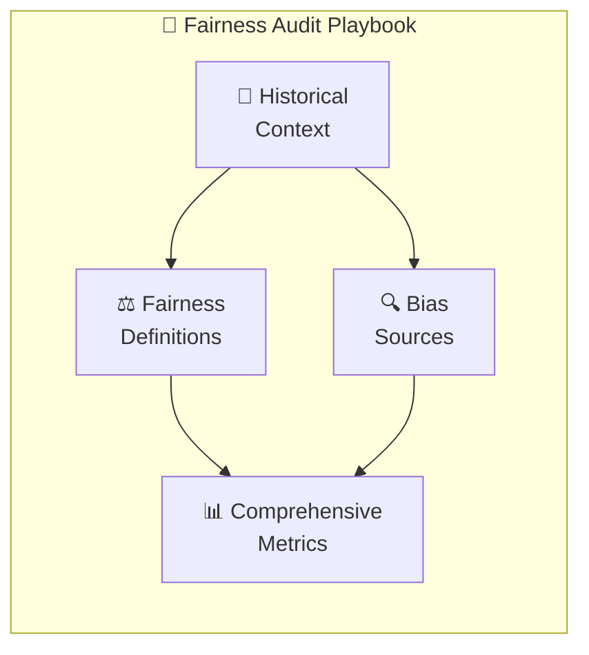
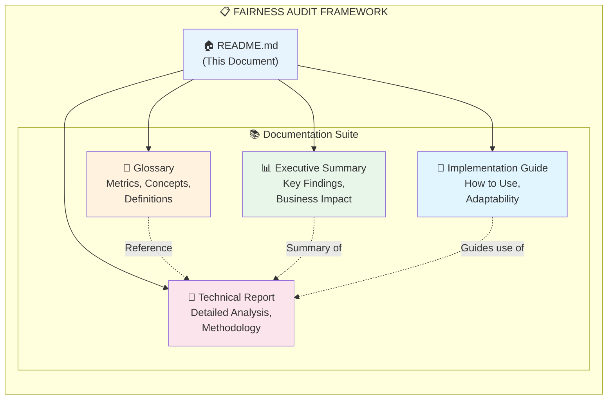
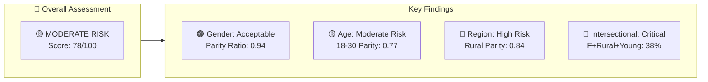
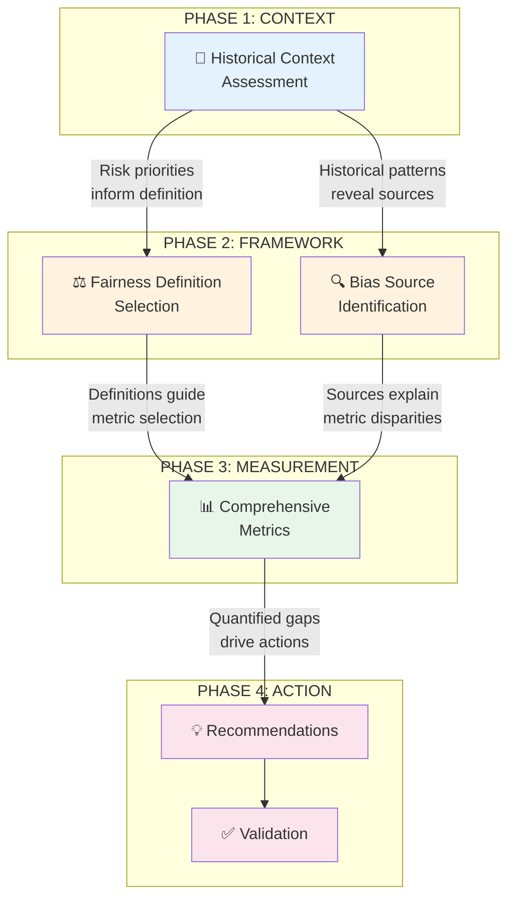
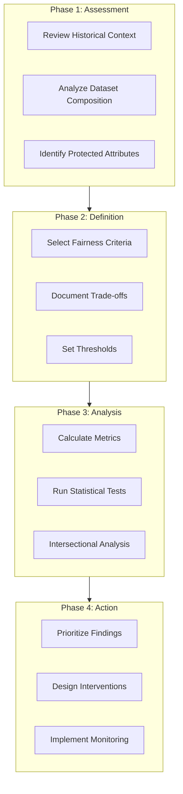

# 🏛️ Fairness Audit Framework

> A comprehensive playbook for systematically evaluating AI systems for bias and fairness issues.

---

## 📖 Introduction

### The Problem

Organizations increasingly rely on AI systems across multiple domains—from loan approvals to hiring decisions to healthcare recommendations. However, these systems can inadvertently perpetuate or amplify historical biases, leading to unfair outcomes for certain groups.

Currently, many organizations face a critical challenge: **there are no centralized fairness tools or guidelines**. Fairness assessments and interventions happen inconsistently, with different teams using their own ad hoc approaches. This leads to:

- ❌ Inconsistent evaluation standards across teams
- ❌ Potential regulatory and legal exposure
- ❌ Undetected biases affecting vulnerable populations
- ❌ Lost revenue from qualified applicants being wrongly denied
- ❌ Reputational risk from algorithmic discrimination

### The Solution

This **Fairness Audit Playbook** provides a standardized framework for evaluating AI/ML systems for bias and fairness issues. It integrates four core components developed through hands-on experience supporting engineering teams:

The playbook enables **self-service fairness audits** by engineering teams, requiring fairness experts only for the most complex cases.

### Target Audience

| Audience | Primary Use |
|----------|-------------|
| **Engineering Teams** | Conduct self-service fairness assessments |
| **VP of Engineering** | Understand implementation and business impact |
| **Compliance Teams** | Ensure regulatory compliance |
| **Fairness Experts** | Handle escalated complex cases |

### Case Study

To demonstrate the practical application of this framework, all reports and analyses are based on a **binary classification model for the financial services domain** (Credit Risk Classifier).

> ⚠️ **Note:** The data used throughout this playbook is **simulated/dummy data** created for illustrative purposes. The metrics, findings, and recommendations are fictional examples designed to demonstrate how a real fairness audit would be conducted and documented. The goal is to exemplify the methodology and expected outputs, not to represent an actual model audit.

| Aspect | Details |
|--------|---------|
| **Domain** | Banking / Financial Services |
| **Model Type** | Binary Classification (High Risk / Low Risk) |
| **Model** | Credit Risk Classifier |
| **Protected Attributes** | Gender, Age, Region |
| **Decision Impact** | Loan approvals, credit limits, interest rates |
| **Data** | 🔶 Simulated for demonstration purposes |

---

## 📁 Project Structure

---

## 📑 Document Navigation

| Document | Description | Audience | File |
|----------|-------------|----------|------|
| 📖 **[Glossary](./01_Glossary_FairnessAudit.md)** | Comprehensive reference for fairness metrics, concepts, formulas, and regulatory terms | All stakeholders | `01_Glossary_FairnessAudit.md` |
| 📊 **[Executive Summary](./02_Executive_Summary_FairnessAudit.md)** | High-level findings, key metrics, business impact, and action recommendations | VP Engineering, Leadership | `02_Executive_Summary_FairnessAudit.md` |
| 🔬 **[Technical Report](./03_Technical_Report_FairnessAudit.md)** | Detailed methodology, comprehensive metrics analysis, statistical testing, and implementation guidance | Engineering Teams, Data Scientists | `03_Technical_Report_FairnessAudit.md` |
| 📘 **[Implementation Guide](./04_Implementation_Guide.md)** | Step-by-step playbook usage, adaptability guidelines, organizational considerations, and improvement insights | Teams conducting audits | `04_Implementation_Guide.md` |

---

## 🎯 Quick Start Guide

### For Executives & Leadership
1. Start with the **[Executive Summary](./02_Executive_Summary_FairnessAudit.md)** for key findings and recommendations
2. Review the "Business Impact Summary" section for financial implications
3. Check "Action Summary" for proposed interventions and timeline

### For Engineering Teams Conducting Audits
1. **Start here:** **[Implementation Guide](./04_Implementation_Guide.md)** for step-by-step process
2. Reference the **[Glossary](./01_Glossary_FairnessAudit.md)** for metric definitions and formulas
3. Review the **[Technical Report](./03_Technical_Report_FairnessAudit.md)** for detailed methodology examples
4. Use the templates and checklists in the Implementation Guide

### For Compliance & Risk
1. Check the "Regulatory Requirements" sections in both Technical Report and Glossary
2. Review "Statistical Significance Testing" for evidence of disparities
3. Use the "Validation Framework" for ongoing monitoring requirements
4. See "Organizational Considerations" in Implementation Guide for governance

---

## 📈 Key Findings at a Glance

| Dimension | Status | Key Metric | Action Needed |
|-----------|--------|------------|---------------|
| **Gender** | 🟢 Low Risk | 94% parity ratio | Monitor |
| **Age** | 🟡 Moderate | 77% parity (18-30) | Threshold adjustment |
| **Region** | 🔴 High Risk | 84% parity (Rural) | Immediate intervention |
| **Intersectional** | 🔴 Critical | 38% selection (F+Rural+Young) | Priority remediation |

### Business Impact

| Category | Estimated Impact |
|----------|------------------|
| Lost Revenue (qualified denials) | ~$650M annually |
| Regulatory Risk Exposure | $200-450M |
| ROI of Remediation | 160x |

---

## 🔄 Framework Components

This audit framework integrates four core components with clear information flow:

| Component | Purpose | Key Output | Feeds Into |
|-----------|---------|------------|------------|
| **Historical Context** | Understand legacy discrimination patterns | Risk classification matrix, proxy list | Definition Selection, Bias Sources |
| **Fairness Definition** | Choose appropriate fairness criteria | Selected metrics, trade-off documentation | Comprehensive Metrics |
| **Bias Source** | Identify where bias enters the pipeline | Bias inventory, feedback loop analysis | Comprehensive Metrics |
| **Comprehensive Metrics** | Quantify fairness across segments | Disparity measurements, statistical tests | Recommendations |

> 📘 **For detailed workflow instructions**, see the **[Implementation Guide](./04_Implementation_Guide.md)**

---

## 📋 Audit Workflow

---

## 🚀 Implementation Priorities

### Immediate (0-30 days)
- [ ] Implement group-specific thresholds
- [ ] Set up human review for borderline cases
- [ ] Deploy fairness monitoring dashboard

### Medium-term (30-180 days)
- [ ] Integrate alternative data sources
- [ ] Retrain model with fairness constraints
- [ ] Revise sampling strategy

### Long-term (180+ days)
- [ ] Develop causal fairness framework
- [ ] Integrate fairness gates into MLOps pipeline

---

## ✅ Requirements Compliance

This playbook fulfills all project requirements:

| Requirement | Status | Location |
|-------------|--------|----------|
| Integration of 4 components with workflow | ✅ | This README, 04_Implementation_Guide Sec 2 |
| Implementation guide (decision points, evidence, risks) | ✅ | 04_Implementation_Guide Sec 3-4 |
| Case study demonstration | ✅ | 02_Executive_Summary, 03_Technical_Report |
| Validation framework | ✅ | 03_Technical_Report Sec 11 |
| Intersectional fairness in each component | ✅ | 03_Technical_Report Sec 3.4, 4.4, 5.4, 7 |
| Adaptability guidelines (domains, problem types) | ✅ | 04_Implementation_Guide Sec 5 |
| Organizational considerations (time, expertise) | ✅ | 04_Implementation_Guide Sec 6 |
| Improvement insights | ✅ | 04_Implementation_Guide Sec 7 |

---

## 🔧 Playbook Adaptability

This playbook is designed to be adaptable across:

| Dimension | Adaptability |
|-----------|--------------|
| **Domains** | Finance, Healthcare, HR, Criminal Justice, Education |
| **Problem Types** | Binary classification, multi-class, regression, ranking |
| **Data Availability** | Full data, no outcomes, no protected attributes, third-party APIs |
| **Team Sizes** | Individual auditors to enterprise-wide programs |

> 📘 See **[Implementation Guide Section 5](./04_Implementation_Guide.md#5--adaptability-guidelines)** for detailed adaptation instructions.

---

## 🔗 References

- Chouldechova, A. (2017). "Fair prediction with disparate impact"
- Verma & Rubin (2018). "Fairness Definitions Explained"
- EEOC Uniform Guidelines on Employee Selection Procedures
- CFPB Fair Lending Guidelines
- NIST AI Risk Management Framework

---

**Turing College · Module 1 · Sprint 5**

**[📖 Glossary](./01_Glossary_FairnessAudit.md)** · **[📊 Executive Summary](./02_Executive_Summary_FairnessAudit.md)** · **[🔬 Technical Report](./03_Technical_Report_FairnessAudit.md)** · **[📘 Implementation Guide](./04_Implementation_Guide.md)**

