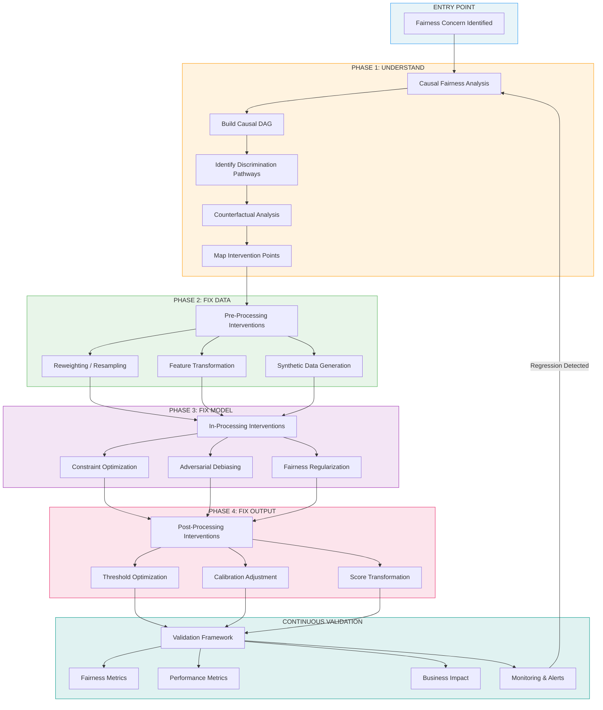
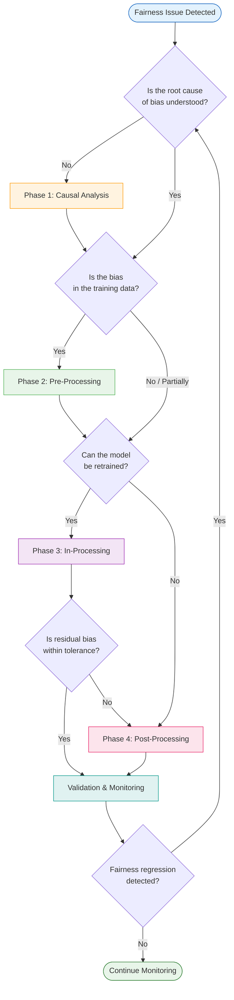

# Fairness Intervention Playbook

## Executive Summary

This playbook provides a standardized, end-to-end methodology for implementing fairness interventions across AI systems. Developed from first-hand experience supporting engineering teams at our bank, it transforms ad hoc fairness fixes into a repeatable, auditable process.

The playbook integrates four intervention components — **Causal Analysis**, **Pre-Processing**, **In-Processing**, and **Post-Processing** — into a coherent pipeline that teams can follow with minimal external support. Each component builds on the outputs of the previous one, progressively reducing bias while preserving model performance.

**Key outcomes demonstrated in our loan approval case study:**

| Metric | Before | After Full Pipeline | Change |
|--------|--------|-------------------|--------|
| Gender approval gap | 18% | 0.5% | -97% reduction |
| Model accuracy (AUC) | 0.84 | 0.81 | -3.6% (acceptable) |
| Overall approval rate | 67% | 65% | Within business target |
| Regulatory compliance | At risk | Compliant | Full audit trail |

---

## Problem Statement

Our bank uses numerous AI systems across lending, insurance, fraud detection, and customer service. Recent audits revealed troubling disparities — most notably, a loan approval system approving 76% of male applicants versus 58% of female applicants despite similar qualifications.

Currently, fairness interventions happen inconsistently. Each team uses their own approach, leading to:

- **Duplication of effort** — teams reinvent solutions to similar problems
- **Inconsistent standards** — no shared definition of "fair enough"
- **Incomplete fixes** — teams apply one technique without exploring the full intervention space
- **No accountability** — no standardized validation or monitoring post-intervention

This playbook solves these problems by providing a structured, evidence-based workflow that any engineering team can follow.

---

## Playbook Architecture

---

## Quick-Start Decision Flowchart

Not every system needs all four phases. Use this flowchart to determine where to start and what to skip:

---

## Playbook Components

### Phase 1: Causal Fairness Analysis
**Purpose**: Understand *why* bias exists before attempting to fix it.

Uses Structural Causal Models (DAGs) and counterfactual analysis to trace how protected attributes (gender, race, age) influence outcomes through direct, mediated, and proxy pathways. This analysis determines *where* to intervene.

> **Workflow**: [01_integration_workflow.md](01_integration_workflow.md) | **How-to**: [02_implementation_guide.md](02_implementation_guide.md) (Step 1) | **In practice**: [03_case_study.md](03_case_study.md) (Phase 1)

### Phase 2: Pre-Processing Interventions
**Purpose**: Fix bias at the data level before model training.

Applies reweighting, feature transformation, and synthetic data techniques to correct representation gaps, break proxy correlations, and address label bias in training data.

> **Workflow**: [01_integration_workflow.md](01_integration_workflow.md) | **How-to**: [02_implementation_guide.md](02_implementation_guide.md) (Step 2) | **In practice**: [03_case_study.md](03_case_study.md) (Phase 2)

### Phase 3: In-Processing Interventions
**Purpose**: Embed fairness directly into model training.

Uses constraint optimization, adversarial debiasing, and fairness regularization to address bias patterns that survive data-level fixes — patterns the model itself learns or amplifies.

> **Workflow**: [01_integration_workflow.md](01_integration_workflow.md) | **How-to**: [02_implementation_guide.md](02_implementation_guide.md) (Step 3) | **In practice**: [03_case_study.md](03_case_study.md) (Phase 3)

### Phase 4: Post-Processing Interventions
**Purpose**: Adjust predictions on deployed or black-box models.

Applies threshold optimization, probability calibration, and score transformation to fix residual disparities — especially useful for production systems where retraining is costly or impossible.

> **Workflow**: [01_integration_workflow.md](01_integration_workflow.md) | **How-to**: [02_implementation_guide.md](02_implementation_guide.md) (Step 4) | **In practice**: [03_case_study.md](03_case_study.md) (Phase 4)

---

## Cross-Cutting Concerns

| Concern | Document |
|---------|----------|
| Integration workflows & decision logic | [01_integration_workflow.md](01_integration_workflow.md) |
| Step-by-step implementation guide | [02_implementation_guide.md](02_implementation_guide.md) |
| Full case study (loan approval) | [03_case_study.md](03_case_study.md) |
| Validation & monitoring framework | [04_validation_framework.md](04_validation_framework.md) |
| Intersectional fairness | [05_intersectional_fairness.md](05_intersectional_fairness.md) |
| Cross-domain adaptability | [06_adaptability_guidelines.md](06_adaptability_guidelines.md) |
| Known limitations & future improvements | [07_improvements_insights.md](07_improvements_insights.md) |

---

## Who Should Use This Playbook

| Role | How to Use |
|------|-----------|
| **ML Engineers** | Follow the phase-by-phase workflow for hands-on implementation |
| **Tech Leads** | Use decision flowcharts to scope interventions and estimate effort |
| **Data Scientists** | Reference technique catalogs and selection criteria |
| **Product Managers** | Read case study and business impact sections for stakeholder communication |
| **Compliance / Legal** | Use validation framework and audit trail documentation |
| **VP / Leadership** | Review executive summary and case study for strategic decisions |

---

## Key Principles

1. **Causality First** — Always understand *why* bias exists before trying to fix it. Interventions without causal understanding risk introducing new biases or removing legitimate signals.

2. **Progressive Intervention** — Start at the data layer and work downstream. Each phase addresses what the previous one couldn't, avoiding over-correction at any single stage.

3. **Measure Everything** — Every intervention must be validated across fairness metrics, model performance, and business outcomes. If you can't measure it, don't deploy it.

4. **Intersectionality by Default** — Single-axis analysis (gender alone, race alone) misses compounding effects. Every component includes intersectional analysis guidance.

5. **Practical Over Perfect** — A deployed 80% solution beats an unimplemented 100% solution. The playbook provides "good enough" checkpoints alongside ideal targets.

6. **Continuous, Not One-Time** — Fairness is not a box to check. The validation framework includes ongoing monitoring, drift detection, and regression alerts.
