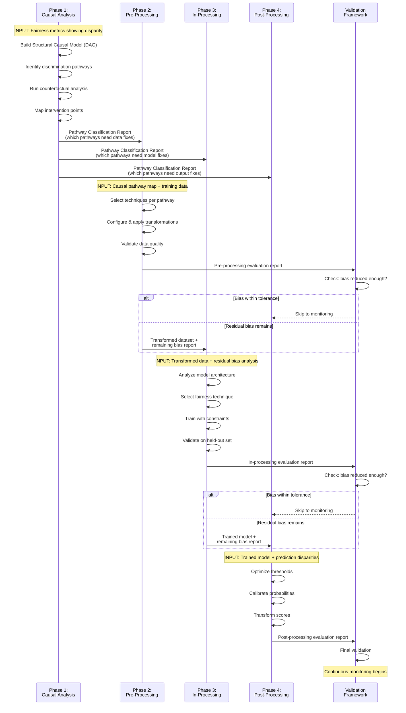
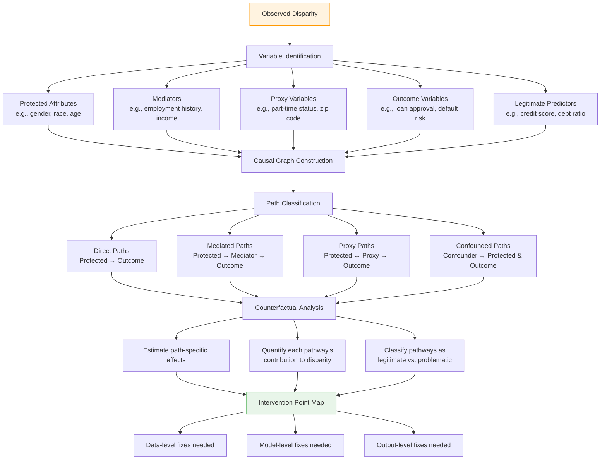
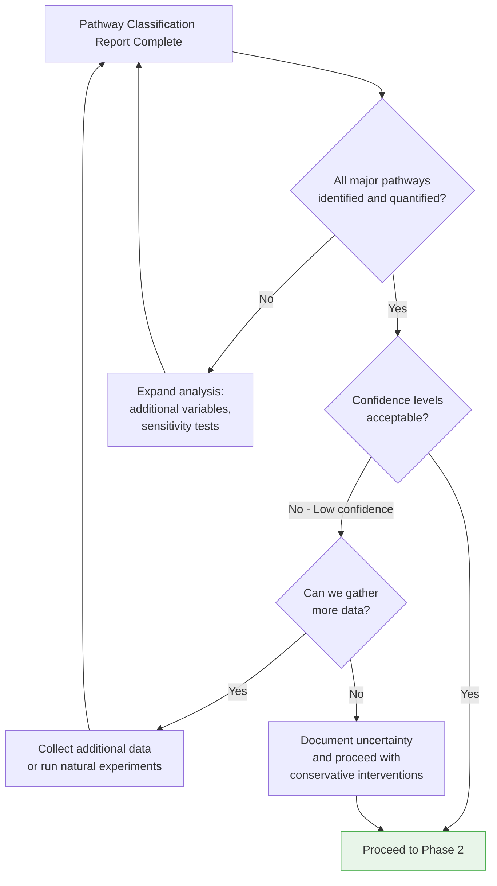
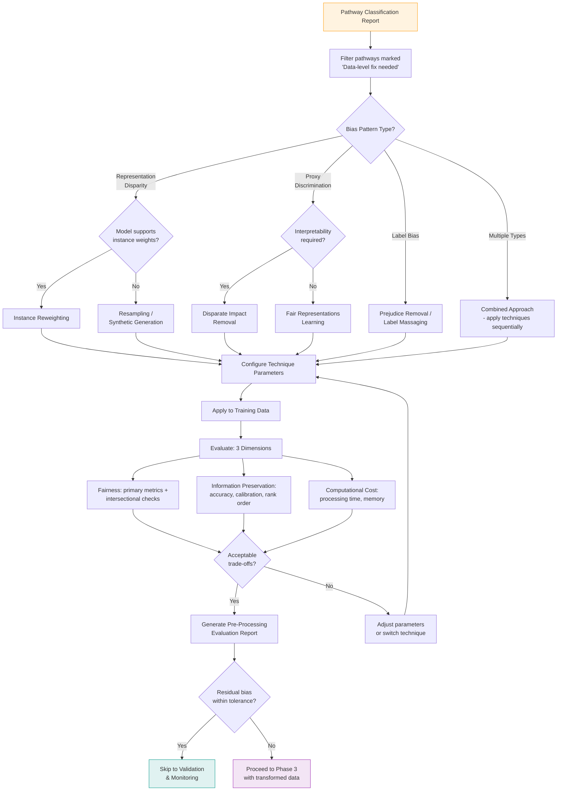
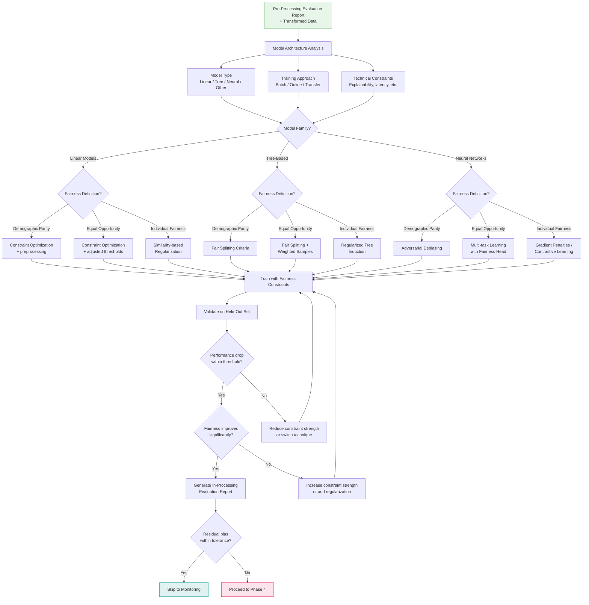
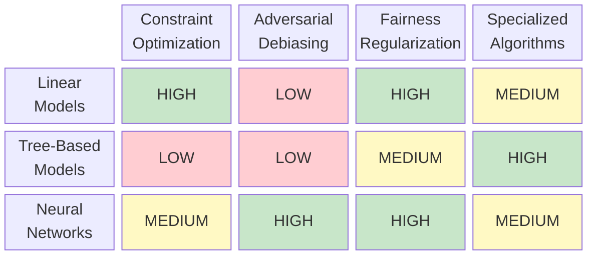
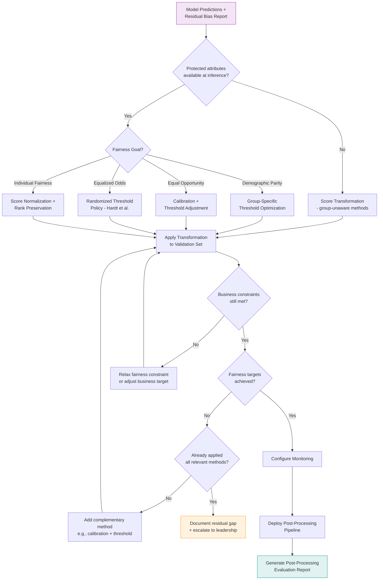
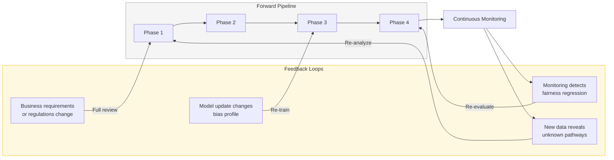
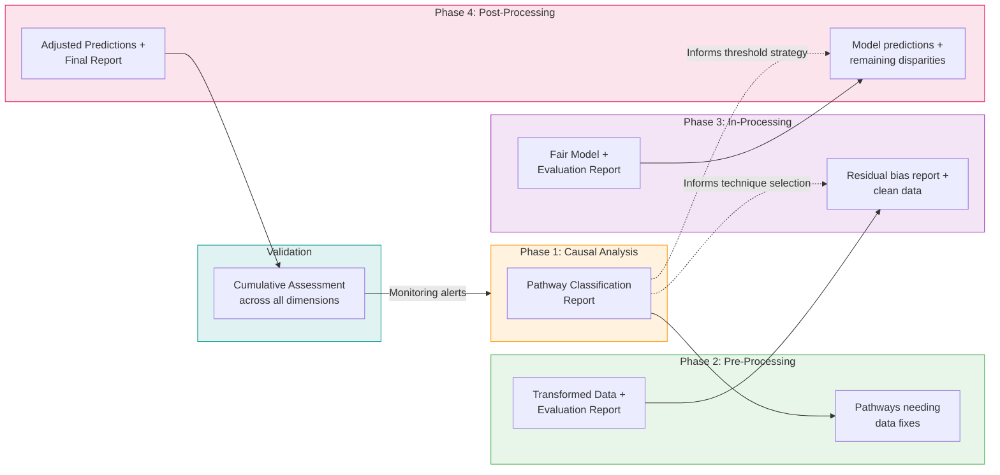
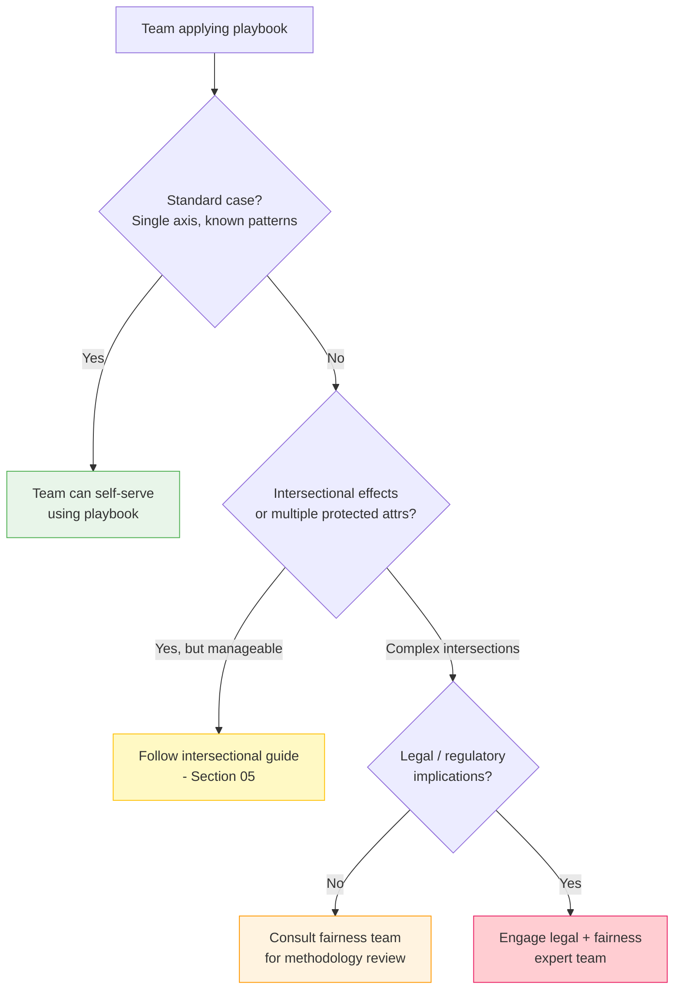

# Integration Workflow: Connecting the Four Components

## Overview

The Fairness Intervention Playbook operates as a sequential pipeline where each phase's outputs inform the next phase's inputs. This document details the information flows, decision logic, and feedback mechanisms that connect the four components into a coherent intervention strategy.

> **Related documents**: For step-by-step implementation instructions, see [02_implementation_guide.md](02_implementation_guide.md). For a practical end-to-end demonstration, see [03_case_study.md](03_case_study.md). For validation protocols at each checkpoint, see [04_validation_framework.md](04_validation_framework.md). For intersectional considerations at each phase, see [05_intersectional_fairness.md](05_intersectional_fairness.md).

---

## End-to-End Pipeline

---

## Phase 1: Causal Fairness Analysis — Detailed Workflow

### Purpose
Understand the causal mechanisms behind observed disparities. Without causal understanding, interventions risk being superficial (treating symptoms, not causes) or harmful (removing legitimate signals).

### Inputs
- Observed fairness metrics showing disparity (e.g., approval rate gap)
- Domain knowledge about the system and its variables
- Historical data for causal inference

### Process

### Outputs → Pathway Classification Report

The Pathway Classification Report is the key artifact that feeds into all subsequent phases. It contains:

| Field | Description | Example |
|-------|-------------|---------|
| Pathway ID | Unique identifier | PATH-001 |
| Causal chain | Variable sequence | Gender → Employment History → Default Risk → Approval |
| Effect size | Proportion of total disparity | 40% |
| Classification | Legitimate vs. problematic | Problematic (career breaks penalized) |
| Recommended intervention layer | Data / Model / Output | Data (Pre-Processing) |
| Confidence level | Certainty of causal claim | High (supported by domain knowledge + data) |
| Sensitivity notes | How robust is this finding? | Robust to moderate unmeasured confounding (E-value > 2.5) |

### Decision Logic: When to Proceed vs. Iterate

---

## Phase 2: Pre-Processing Interventions — Detailed Workflow

### Purpose
Fix bias at the data source before the model ever sees it. Targets representation gaps, proxy correlations, and label bias identified in Phase 1.

### Inputs
- Pathway Classification Report (from Phase 1)
- Training dataset
- Fairness metric targets

### Process

### Technique Selection Matrix

| Bias Pattern | Recommended Technique | When to Use | Key Parameter | Expected Impact |
|-------------|----------------------|------------|---------------|-----------------|
| Representation disparity | Instance Reweighting | Model supports weights; moderate imbalance | Weight cap (2.0-3.0) | Equalizes group influence |
| Representation disparity | SMOTE / Fair-SMOTE | No weight support; severe imbalance | Oversampling ratio | Balances group sizes |
| Proxy discrimination | Disparate Impact Removal | Feature interpretability needed | Repair level (0.0-1.0) | Removes proxy correlation |
| Proxy discrimination | Fair Representations (LFR) | Non-linear proxies; interpretability not critical | Encoding dimensions | Masks protected info in features |
| Label bias | Prejudice Removal | Historical discrimination in labels | Massage proportion | Corrects label distribution |
| Multiple types | Combined sequential | Complex bias with multiple sources | Per-technique params | Addresses multiple pathways |

### Outputs → Pre-Processing Evaluation Report

| Field | Description |
|-------|-------------|
| Techniques applied | List of techniques with parameters |
| Fairness metrics before/after | Primary metric + intersectional breakdown |
| Performance impact | Accuracy, AUC, calibration changes |
| Remaining bias | Residual disparity after pre-processing |
| Computational overhead | Time and memory added to pipeline |
| Recommendation | Proceed to Phase 3 / Skip to monitoring |

---

## Phase 3: In-Processing Interventions — Detailed Workflow

### Purpose
Address bias that survives data-level fixes by embedding fairness constraints directly into model training. Necessary when the model architecture itself learns or amplifies discriminatory patterns.

### Inputs
- Pre-Processing Evaluation Report (from Phase 2)
- Transformed training dataset
- Model architecture specifications
- Acceptable performance degradation threshold

### Process

### Model-Technique Compatibility Matrix

### Outputs → In-Processing Evaluation Report

| Field | Description |
|-------|-------------|
| Technique applied | Method with all hyperparameters |
| Fairness metrics before/after | Comparison on validation set |
| Performance impact | AUC, accuracy, F1 changes |
| Explainability impact | Feature importance stability, SHAP value changes |
| Training overhead | Additional training time, memory |
| Robustness assessment | Sensitivity to hyperparameters, data subsets |
| Recommendation | Proceed to Phase 4 / Skip to monitoring |

---

## Phase 4: Post-Processing Interventions — Detailed Workflow

### Purpose
The last line of defense. Adjusts model predictions without retraining — essential for production systems, black-box models, or situations where retraining is impractical.

### Inputs
- In-Processing Evaluation Report (from Phase 3) or direct model predictions
- Validation data with ground truth
- Business constraints (e.g., target approval rates)
- Deployment constraints (e.g., protected attributes available at inference?)

### Process

### Technique Selection by Scenario

| Scenario | Recommended Approach | Reason |
|----------|---------------------|--------|
| Binary classification, protected attr. known | Group-specific thresholds | Direct, interpretable |
| Probability outputs, calibration gap exists | Platt Scaling per group | Fixes miscalibrated probabilities |
| Black-box model, no protected attr. at inference | Score transformation + uniform threshold | Works without group info |
| Regulatory requirement for equal TPR | Threshold optimization for equal opportunity | Directly targets the constraint |
| Uncertainty near boundary | Rejection option classification | Routes uncertain cases to human review |
| Real-time system, minimal latency budget | Pre-computed lookup table | Zero inference overhead |

### Outputs → Post-Processing Evaluation Report

| Field | Description |
|-------|-------------|
| Techniques applied | Methods with parameters |
| Fairness metrics final | All metrics after full pipeline |
| Performance impact | Cumulative impact across all phases |
| Business metrics | Approval rates, expected loss, customer impact |
| Deployment details | Latency impact, infrastructure needs |
| Monitoring configuration | Alerts, dashboards, drift detection |

---

## Feedback Loops and Iteration

The pipeline is not strictly linear. Several feedback loops ensure continuous improvement:

### When to Re-Enter the Pipeline

| Trigger | Re-entry Point | Action |
|---------|---------------|--------|
| Fairness metric degrades > 2% | Phase 4 | Adjust thresholds/calibration |
| Fairness metric degrades > 5% | Phase 3 | Retrain with updated constraints |
| New proxy variable discovered | Phase 1 | Re-run causal analysis |
| Population shift detected | Phase 1 | Full pipeline re-evaluation |
| New protected attribute added to scope | Phase 1 | Full pipeline with new attribute |
| Regulatory requirement changes | Phase 1 | Reassess fairness definition |
| Model architecture changes | Phase 3 | Re-select in-processing technique |
| Business constraints change | Phase 4 | Re-optimize thresholds |

---

## Information Flow Summary

---

## Key Decision Points

Throughout the pipeline, teams face critical decisions. Here is a consolidated decision reference:

| Decision Point | Options | Criteria for Selection | Risk if Wrong |
|---------------|---------|----------------------|---------------|
| Which causal model to use | Full DAG vs. simplified | Data availability, domain knowledge | Under/over-correction |
| Skip pre-processing? | Yes / No | Bias is not in data; model can compensate | Bias baked into training |
| Technique for proxy removal | DI Removal vs. Fair Representations | Interpretability needs, linearity of proxy | Lose legitimate signal or miss non-linear proxies |
| Skip in-processing? | Yes / No | Pre-processing sufficient; model is black-box | Miss model-amplified bias |
| Fairness constraint strength | Conservative (low λ) vs. aggressive (high λ) | Acceptable performance trade-off | Under-correction or accuracy collapse |
| Skip post-processing? | Yes / No | Bias within tolerance after training | Miss residual disparities |
| Threshold strategy | Group-specific vs. uniform | Legal constraints, attribute availability | Legal exposure or suboptimal fairness |
| When to escalate | Self-serve vs. expert consultation | Complexity, intersectionality, stakes | Inadequate intervention |

### Escalation Decision Tree

