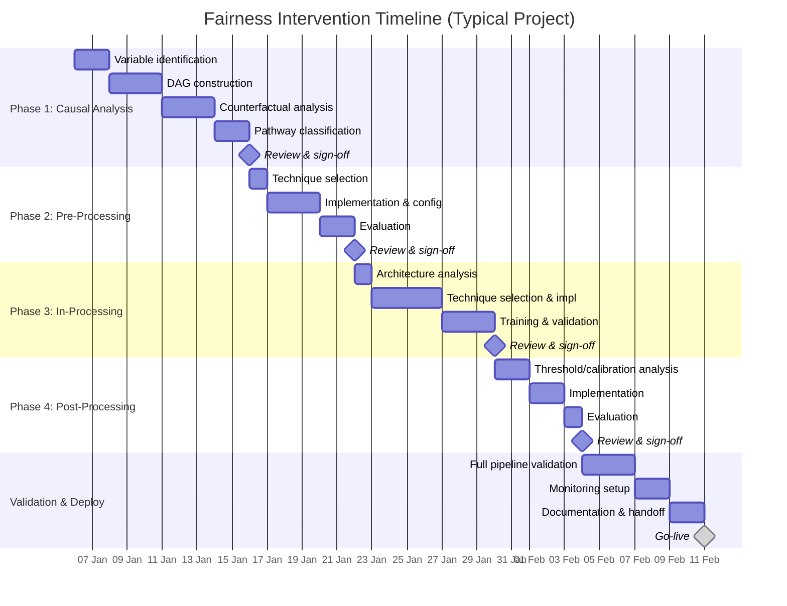
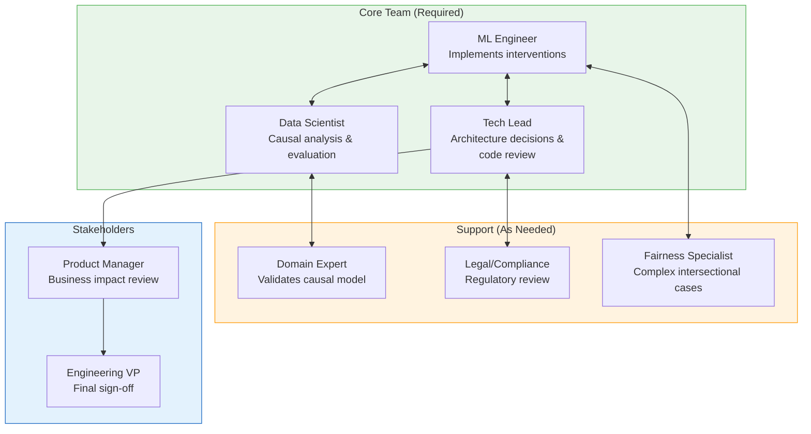
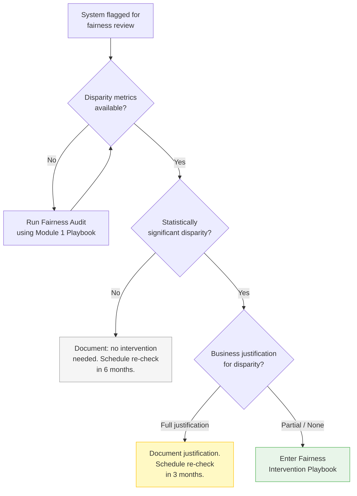
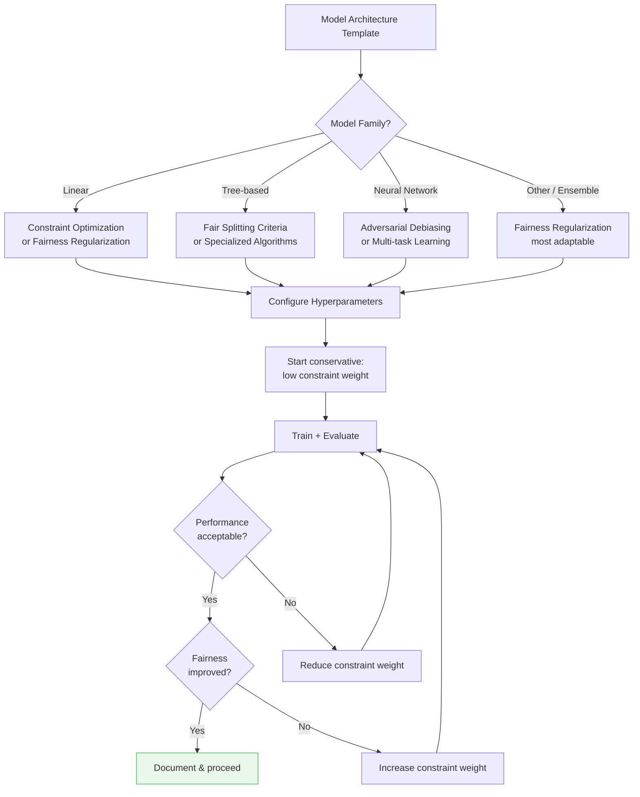
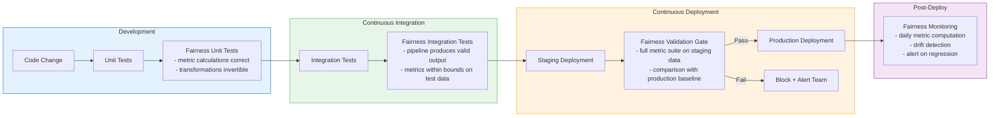

# Implementation Guide

## Overview

This guide provides step-by-step instructions for engineering teams adopting the Fairness Intervention Playbook. It covers practical considerations: who does what, how long it takes, what expertise is needed, and how to integrate fairness interventions into existing development processes.

> **Related documents**: For the technical workflow and decision logic underlying each step, see [01_integration_workflow.md](01_integration_workflow.md). For a complete worked example of these steps in action, see [03_case_study.md](03_case_study.md). For adapting these steps to other domains, see [06_adaptability_guidelines.md](06_adaptability_guidelines.md). For known pitfalls and lessons learned, see [07_improvements_insights.md](07_improvements_insights.md).

---

## Implementation Roadmap



**Total estimated duration: 5-7 weeks** (varies by system complexity)

---

## Resource Requirements

### Team Composition



### RACI Matrix

| Activity | ML Engineer | Data Scientist | Tech Lead | Domain Expert | Legal | Fairness Specialist |
|----------|:-----------:|:--------------:|:---------:|:-------------:|:-----:|:-------------------:|
| **Phase 1: Causal Analysis** |
| Variable identification | C | R | A | C | I | C |
| DAG construction | C | R | A | R | I | C |
| Counterfactual analysis | I | R | A | C | I | C |
| Pathway classification | C | R | A | C | C | C |
| **Phase 2: Pre-Processing** |
| Technique selection | R | C | A | I | I | C |
| Implementation | R | C | A | I | I | I |
| Evaluation | R | R | A | I | I | C |
| **Phase 3: In-Processing** |
| Architecture analysis | R | C | A | I | I | I |
| Technique selection | R | C | A | I | I | C |
| Training & validation | R | C | A | I | I | I |
| **Phase 4: Post-Processing** |
| Threshold optimization | R | C | A | I | C | C |
| Calibration | R | R | A | I | I | C |
| **Validation & Monitoring** |
| Pipeline validation | R | R | A | C | C | C |
| Monitoring setup | R | I | A | I | I | I |
| Documentation | C | C | R | I | C | I |

**R** = Responsible | **A** = Accountable | **C** = Consulted | **I** = Informed

---

## Step-by-Step Usage Instructions

### Step 0: Pre-Engagement Assessment

Before entering the pipeline, confirm the engagement is appropriate:



**Checklist before starting:**

- [ ] Fairness metrics quantified (from audit or monitoring)
- [ ] Protected attributes identified and legal constraints understood
- [ ] Fairness definition agreed with stakeholders (demographic parity, equal opportunity, etc.)
- [ ] Acceptable performance degradation threshold defined (e.g., max 3% AUC loss)
- [ ] Timeline and resources allocated
- [ ] Success criteria documented

---

### Step 1: Causal Analysis (Phase 1)

**Who**: Data Scientist (lead) + Domain Expert (support)
**Duration**: 1.5-2 weeks
**Expertise**: Causal inference fundamentals, domain knowledge

#### 1.1 Variable Identification

Use this template with the domain expert:

```
VARIABLE IDENTIFICATION TEMPLATE
================================
System: [Name]
Date: [Date]
Analyst: [Name]

PROTECTED ATTRIBUTES:
- [Variable name] | [Type: binary/categorical/continuous] | [Legal status]

MEDIATORS (causally downstream of protected attribute):
- [Variable] | [Causal pathway: Protected → ... → Mediator]
- Classification: [Legitimate / Problematic / Uncertain]

PROXY VARIABLES (correlated but not causally downstream):
- [Variable] | [Correlation with protected attr] | [Mechanism]

OUTCOME VARIABLES:
- [Primary outcome] | [Business definition]
- [Secondary outcomes]

LEGITIMATE PREDICTORS (causally independent of protected attr):
- [Variable] | [Justification for legitimacy]
```

#### 1.2 Causal Graph Construction

Guidelines:
1. Start with protected attributes and outcomes
2. Add known causal relationships from domain knowledge
3. Add mediators identified with the domain expert
4. Add suspected proxy variables
5. Document every edge with evidence/assumption
6. Review with domain expert for validation

#### 1.3 Counterfactual Analysis

For each pathway identified:
1. Define the counterfactual question: "What would this applicant's outcome be if their protected attribute value were different?"
2. Estimate path-specific effects using available methods
3. Quantify each pathway's contribution to the total disparity
4. Classify each pathway as legitimate or problematic

#### 1.4 Produce Pathway Classification Report

Fill the report template (see [01_integration_workflow.md](01_integration_workflow.md)).

**Decision point**: Review with Tech Lead. Confirm pathway classifications before proceeding.

---

### Step 2: Pre-Processing (Phase 2)

**Who**: ML Engineer (lead) + Data Scientist (evaluation)
**Duration**: 1-1.5 weeks
**Expertise**: Data engineering, statistical testing

#### 2.1 Map Pathways to Techniques

For each pathway classified as "data-level fix needed", select technique:

| Pathway Type | Primary Technique | Configuration Starting Point |
|-------------|-------------------|------------------------------|
| Representation disparity | Instance Reweighting | Weight cap = 2.5; square-root dampening |
| Feature proxy | Disparate Impact Removal | Repair level = 0.5; adjust by 0.1 increments |
| Non-linear proxy | Fair Representations | Start with encoding dim = original dim / 2 |
| Label bias | Prejudice Removal | Massage rate = observed label disparity |

#### 2.2 Implementation Checklist

- [ ] Split data: training (70%) / validation (15%) / test (15%) — stratified by protected attribute
- [ ] Baseline: record all fairness and performance metrics on unmodified data
- [ ] Apply technique(s) to training data only
- [ ] Evaluate on validation set
- [ ] Check intersectional subgroups (see [05_intersectional_fairness.md](05_intersectional_fairness.md))
- [ ] Document all parameter choices and rationale

#### 2.3 Evaluate

Use the three-dimensional evaluation:

| Dimension | Metrics | Threshold |
|-----------|---------|-----------|
| Fairness | Primary fairness metric (agreed in Step 0) | Statistically significant improvement (p < 0.05) |
| Performance | AUC, accuracy, F1, calibration | Loss < agreed threshold (typically 1-3%) |
| Cost | Processing time, memory | Within infrastructure budget |

**Decision point**: Is residual bias within tolerance? If yes, skip Phase 3.

---

### Step 3: In-Processing (Phase 3)

**Who**: ML Engineer (lead) + Tech Lead (architecture review)
**Duration**: 1.5-2 weeks
**Expertise**: ML engineering, model training optimization

#### 3.1 Architecture Analysis

```
MODEL ARCHITECTURE TEMPLATE
============================
Model family: [Linear / Tree-based / Neural Network / Ensemble / Other]
Framework: [scikit-learn / XGBoost / PyTorch / TensorFlow / etc.]
Training approach: [Batch / Mini-batch / Online]
Current loss function: [Cross-entropy / MSE / Custom]
Explainability requirement: [Yes/No - specify standard]
Max acceptable training overhead: [X% increase]
Retraining feasible: [Yes/No - if No, skip to Phase 4]
```

#### 3.2 Select Technique

Use the compatibility matrix from [01_integration_workflow.md](01_integration_workflow.md):



#### 3.3 Training Protocol

1. Reserve 20% of training data as fairness validation set
2. Start with low constraint strength (λ = 0.1)
3. Train and evaluate at checkpoints
4. Increment constraint strength by 0.1 until fairness target met or performance degrades
5. Early stopping based on fairness validation metric
6. Document the Pareto frontier of accuracy vs. fairness

#### 3.4 Robustness Checks

- [ ] Consistent across 5 random seeds
- [ ] Consistent across 5 data splits
- [ ] Feature importance rankings stable (Spearman ρ > 0.9 with baseline)
- [ ] Performance on intersectional subgroups (no group degrades > 5%)

**Decision point**: Is residual bias within tolerance? If yes, skip Phase 4.

---

### Step 4: Post-Processing (Phase 4)

**Who**: ML Engineer (lead) + Data Scientist (calibration analysis)
**Duration**: 0.5-1 week
**Expertise**: Statistical calibration, threshold optimization

#### 4.1 Diagnose Remaining Bias

```
POST-PROCESSING DIAGNOSTIC TEMPLATE
=====================================
Model: [Name/version]
Residual fairness gap: [metric = value]

Calibration check:
- ECE (overall): [value]
- ECE (group A): [value]
- ECE (group B): [value]
- Calibration gap: [value]

Score distribution check:
- Mean score (group A): [value]
- Mean score (group B): [value]
- Score distribution overlap: [%]

Protected attribute available at inference: [Yes/No]
Legal constraints on group-specific thresholds: [Yes/No]
```

#### 4.2 Select and Apply

| Diagnostic Finding | Recommended Action |
|-------------------|-------------------|
| Calibration gap > 0.05 | Platt scaling per group |
| Score distributions shifted | Score transformation |
| Simple threshold will suffice | Group-specific thresholds |
| Uncertainty near boundary | Rejection option classification |
| Cannot use protected attr at inference | Transform scores pre-deployment |

#### 4.3 Business Constraint Verification

- [ ] Overall approval/selection rate within target range
- [ ] Expected loss/revenue within budget
- [ ] Customer experience impact assessed
- [ ] Deployment latency within SLA

**Decision point**: Proceed to full validation.

---

### Step 5: Validation & Deployment

**Who**: Full core team
**Duration**: 1-1.5 weeks
**Details**: See [04_validation_framework.md](04_validation_framework.md)

---

## Integration with Existing Processes

### CI/CD Integration



### MLOps Integration Points

| MLOps Stage | Fairness Integration |
|-------------|---------------------|
| Data versioning | Tag datasets with pre-processing transformations applied |
| Feature store | Flag proxy variables; store fair representations |
| Experiment tracking | Log fairness metrics alongside performance metrics |
| Model registry | Include fairness evaluation report in model metadata |
| A/B testing | Include fairness metrics in experiment success criteria |
| Model monitoring | Add fairness drift detection to monitoring dashboards |
| Incident response | Include fairness regression in incident playbooks |

---

## Effort Estimation Guide

Teams can use this table to estimate effort based on system complexity:

| Factor | Simple | Moderate | Complex |
|--------|--------|----------|---------|
| Protected attributes | 1 | 2-3 | 4+ or intersectional |
| Feature count | < 20 | 20-100 | > 100 |
| Model type | Linear / logistic | Tree ensemble | Deep learning |
| Data volume | < 100K rows | 100K-10M | > 10M |
| Regulatory scrutiny | Low | Medium | High (lending, healthcare) |
| **Estimated total effort** | **3-4 weeks** | **5-7 weeks** | **8-12 weeks** |

### Phase-Level Effort Breakdown

| Phase | Simple | Moderate | Complex |
|-------|--------|----------|---------|
| Phase 1: Causal Analysis | 3-5 days | 7-10 days | 10-15 days |
| Phase 2: Pre-Processing | 3-5 days | 5-8 days | 8-12 days |
| Phase 3: In-Processing | 3-5 days | 7-10 days | 10-15 days |
| Phase 4: Post-Processing | 2-3 days | 3-5 days | 5-7 days |
| Validation & Deployment | 3-5 days | 5-8 days | 8-12 days |

---

## Common Pitfalls and Mitigations

| Pitfall | Symptom | Mitigation |
|---------|---------|------------|
| Skipping causal analysis | Interventions address symptoms, not causes | Always start with Phase 1, even if abbreviated |
| Over-correcting at one phase | One phase removes too much signal; later phases have nothing to work with | Set per-phase fairness improvement targets (e.g., reduce gap by 50% max per phase) |
| Ignoring intersectionality | Single-axis fairness met, but subgroups still disparate | Include intersectional checks at every phase |
| Not documenting assumptions | Causal model choices are unjustifiable later | Use templates; require evidence for every DAG edge |
| Fairness-performance tunnel vision | Focus only on primary metric; miss secondary degradation | Multi-dimensional evaluation at every checkpoint |
| Deploying without monitoring | Bias re-emerges due to data drift | Mandatory monitoring setup before go-live |
| Analysis paralysis | Team spends too long searching for perfect causal model | Set time-boxes per phase; "good enough" causal model with documented uncertainty is fine |

---

## Documentation Requirements

Every fairness intervention must produce these artifacts:

| Artifact | Owner | Template Location |
|----------|-------|-------------------|
| Pathway Classification Report | Data Scientist | Phase 1 template above |
| Pre-Processing Evaluation Report | ML Engineer | Integration workflow doc |
| In-Processing Evaluation Report | ML Engineer | Integration workflow doc |
| Post-Processing Evaluation Report | ML Engineer | Integration workflow doc |
| Validation Summary | Tech Lead | [04_validation_framework.md](04_validation_framework.md) |
| Monitoring Configuration | ML Engineer | CI/CD integration section |
| Executive Summary | Tech Lead | 1-page summary for leadership |

All artifacts should be stored in the model registry alongside the model version they correspond to.
