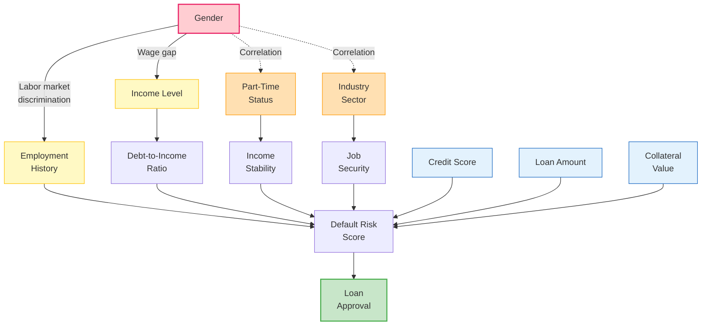
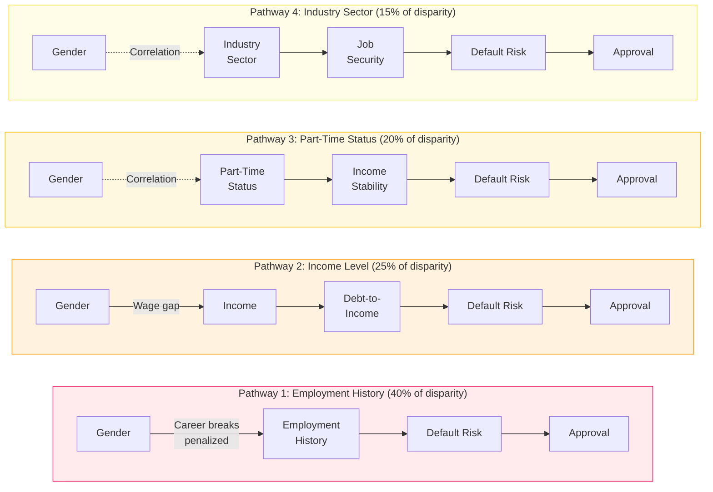
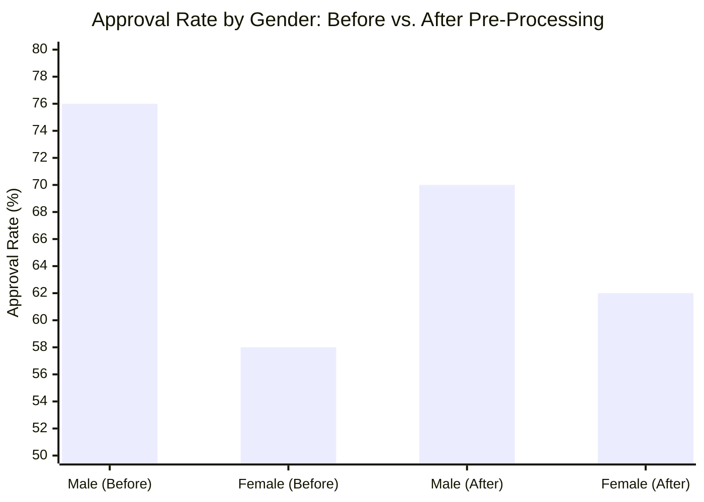
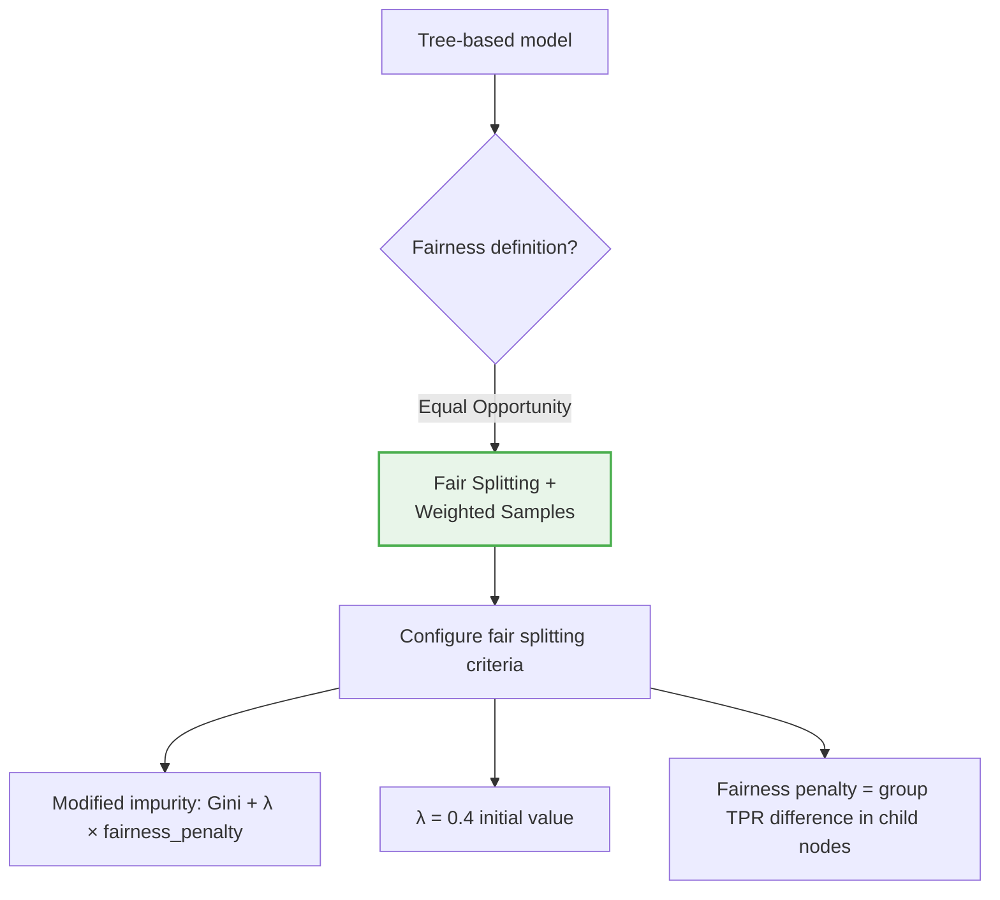
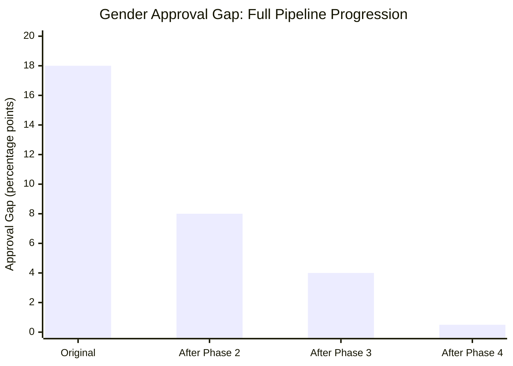
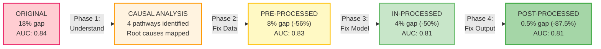

# Case Study: Loan Approval System Fairness Intervention

## Background

A mid-sized bank's automated loan approval system processes approximately 50,000 applications per month. Internal audits revealed a significant gender disparity:

| Metric | Male Applicants | Female Applicants | Gap |
|--------|:--------------:|:-----------------:|:---:|
| Approval rate | 76% | 58% | 18 percentage points |
| Average credit score | 680 | 675 | 5 points |
| Average income | $72,000 | $65,000 | $7,000 |
| Default rate (approved loans) | 4.2% | 3.8% | -0.4 pp (women default *less*) |

The data shows that despite similar credit profiles and *lower* default rates, women are approved at substantially lower rates. This case study demonstrates the full Fairness Intervention Playbook applied end-to-end, following the pipeline defined in [01_integration_workflow.md](01_integration_workflow.md), the step-by-step instructions from [02_implementation_guide.md](02_implementation_guide.md), and validated using [04_validation_framework.md](04_validation_framework.md).

---

## Phase 1: Causal Fairness Analysis

### 1.1 Variable Identification

Working with the lending domain expert and compliance team, we identified the following variables:

| Category | Variables | Notes |
|----------|-----------|-------|
| **Protected Attribute** | Gender | Binary in this dataset (acknowledged limitation) |
| **Mediators** | Employment history, Income level | Causally downstream of gender due to labor market patterns |
| **Proxy Variables** | Part-time employment status, Industry sector | Correlated with gender but not causally downstream |
| **Outcome** | Loan approval (binary), Default risk score | Primary and secondary outcomes |
| **Legitimate Predictors** | Credit score, Debt-to-income ratio, Loan amount, Collateral value | Causally independent of gender |

### 1.2 Causal Graph (DAG)



**Legend**: Red = protected attribute | Yellow = mediators | Orange = proxies | Blue = legitimate predictors | Green = outcome

### 1.3 Pathway Analysis

We identified four causal pathways from gender to loan approval:



### 1.4 Counterfactual Analysis Results

We estimated counterfactual outcomes: "What would happen if a female applicant were male, all else equal?"

| Subgroup | Actual Female Approval | Counterfactual (if Male) | Gap |
|----------|:---------------------:|:------------------------:|:---:|
| Career breaks (> 1 year gap) | 38% | 62% | 24 pp |
| Part-time employment | 42% | 58% | 16 pp |
| Continuous employment, full-time | 72% | 78% | 6 pp |
| High income (> $80K) | 81% | 84% | 3 pp |

The disparity is heavily concentrated among women with career breaks and part-time employment — precisely the pathways our DAG predicted.

### 1.5 Pathway Classification Report

| ID | Pathway | Effect Size | Classification | Intervention Layer |
|:--:|---------|:-----------:|:--------------:|:------------------:|
| P1 | Gender → Employment History → Default Risk → Approval | 40% | **Problematic** — penalizes career breaks disproportionately affecting women | Pre-Processing |
| P2 | Gender → Income → Debt-to-Income → Default Risk → Approval | 25% | **Problematic** — propagates gender wage gap into credit decisions | Pre-Processing + In-Processing |
| P3 | Gender ↔ Part-Time → Income Stability → Default Risk → Approval | 20% | **Problematic** — proxy discrimination via employment type | Pre-Processing |
| P4 | Gender ↔ Industry → Job Security → Default Risk → Approval | 15% | **Partially legitimate** — industry risk is real, but correlation with gender amplifies effect | In-Processing |

---

## Phase 2: Pre-Processing Interventions

### 2.1 Technique Selection

Based on the pathway classification:

| Pathway | Bias Pattern | Selected Technique | Rationale |
|---------|-------------|-------------------|-----------|
| P1: Employment history | Mediator discrimination | **Feature transformation** | Replace "continuous employment" with "relevant experience" that doesn't penalize career breaks |
| P2: Income level | Mediator discrimination | **Instance reweighting** | Reduce income-based penalty without removing legitimate predictive signal |
| P3: Part-time status | Proxy discrimination | **Disparate impact removal** | Break gender-proxy correlation while preserving income stability signal |

### 2.2 Implementation

**P1 — Employment History Transformation:**

Original features:
- `continuous_employment_years` (penalizes any gap)
- `current_employer_tenure`

Transformed features:
- `total_relevant_experience` (cumulative years, regardless of gaps)
- `skill_currency_index` (recent activity weighted, not continuity)
- `career_trajectory` (upward/stable/downward, ignoring gaps)

**P2 — Income Reweighting:**

Applied conditional inverse probability weighting to equalize the influence of income across gender groups:
- Weight function: `w(x) = P(gender) / P(gender | income_bracket)`
- Dampening: square root applied to prevent extreme weights
- Cap: maximum weight of 2.5

**P3 — Part-Time Status Transformation:**

Applied Disparate Impact Removal (Feldman et al., 2015):
- Repair level: 0.7 (after testing 0.5, 0.6, 0.7, 0.8)
- Transformed `part_time_status` into `income_stability_score`
- Preserved within-group rank ordering

### 2.3 Results After Pre-Processing



| Metric | Before | After Pre-Processing | Change |
|--------|:------:|:--------------------:|:------:|
| Male approval rate | 76% | 70% | -6 pp |
| Female approval rate | 58% | 62% | +4 pp |
| **Gender gap** | **18 pp** | **8 pp** | **-56% reduction** |
| Equal opportunity difference | 0.18 | 0.08 | -56% |
| AUC | 0.84 | 0.83 | -1.2% |
| Overall accuracy | 78% | 77% | -1.3% |
| Pipeline processing overhead | — | +2.1 min | Acceptable |

**Intersectional check** (see [05_intersectional_fairness.md](05_intersectional_fairness.md)): Improvements held across gender x age subgroups. Largest remaining gap: women aged 25-35 (child-bearing years) — 12% gap vs. 8% overall.

**Decision**: 8% gap still exceeds our 2% tolerance. Proceed to Phase 3.

---

## Phase 3: In-Processing Interventions

### 3.1 Architecture Analysis

| Property | Value |
|----------|-------|
| Model family | Gradient Boosting (XGBoost) |
| Framework | XGBoost 1.7 via scikit-learn API |
| Training approach | Batch, full dataset |
| Loss function | Binary cross-entropy |
| Explainability requirement | Yes — SHAP values for regulatory compliance |
| Max acceptable training overhead | 30% increase |
| Retraining feasible | Yes |

### 3.2 Technique Selection



Selected approach: **Fair splitting criteria with weighted samples**

- **Primary technique**: Modified tree splitting criterion that factors gender-based TPR disparity into the impurity calculation
- **Secondary technique**: Asymmetric false negative penalties by gender (higher penalty for female false negatives to equalize opportunity)

### 3.3 Training Configuration

```
TRAINING CONFIGURATION
======================
Base model: XGBoost
Fair splitting penalty weight (λ): 0.4 (after grid search over [0.1, 0.2, 0.3, 0.4, 0.5])
False negative weight (female): 1.3x (vs. 1.0x for male)
Early stopping: patience=10, monitoring equal_opportunity_gap on validation set
Fairness validation set: 20% of training data, stratified by gender × outcome
Random seeds tested: 5 (42, 123, 256, 789, 1024)
```

### 3.4 Hyperparameter Search Results

| λ (fairness weight) | AUC | Equal Opportunity Gap | Training Time |
|:-------------------:|:---:|:---------------------:|:-------------:|
| 0.0 (baseline) | 0.83 | 0.08 | 12 min |
| 0.1 | 0.83 | 0.07 | 13 min |
| 0.2 | 0.82 | 0.06 | 14 min |
| 0.3 | 0.82 | 0.05 | 14 min |
| **0.4** | **0.81** | **0.04** | **15 min** |
| 0.5 | 0.80 | 0.03 | 16 min |

Selected λ = 0.4 as the best trade-off: halves the equal opportunity gap from 0.08 to 0.04 with only 2.4% AUC loss. While λ = 0.5 achieves a tighter gap (0.03), the additional 1.2% AUC degradation was deemed excessive for the marginal fairness gain.

### 3.5 Results After In-Processing

```mermaid
xychart-beta
    title "Approval Rate by Gender: Progressive Improvement"
    x-axis ["Original", "After Pre-Proc", "After In-Proc"]
    y-axis "Approval Rate (%)" 50 --> 80
    bar [76, 70, 67]
    bar [58, 62, 63]
```



| Metric | After Pre-Processing | After In-Processing | Change |
|--------|:--------------------:|:-------------------:|:------:|
| Male approval rate | 70% | 67% | -3 pp |
| Female approval rate | 62% | 63% | +1 pp |
| **Gender gap** | **8 pp** | **4 pp** | **-50% reduction** |
| Equal opportunity difference | 0.08 | 0.04 | -50% |
| AUC | 0.83 | 0.81 | -2.4% cumulative |
| Feature importance stability | — | Spearman ρ = 0.94 | Stable |
| Training time | 12 min | 15 min | +25% (within budget) |

**Robustness checks:**
- Consistent across 5 random seeds (gap range: 0.03-0.05)
- Consistent across 5 data splits (gap range: 0.03-0.05)
- Feature importance rankings stable (top-10 features unchanged)
- SHAP explanations remain interpretable

**Intersectional check** (see [05_intersectional_fairness.md](05_intersectional_fairness.md)): Women aged 25-35 gap reduced from 12% to 6%. Still the largest subgroup gap — will target in Phase 4.

**Decision**: 4% gap exceeds our 2% tolerance. The retrained model has been deployed to production, and a second retraining cycle would require a new regulatory review (estimated 3+ months). Proceed to Phase 4 for output-level adjustments that can be deployed without retraining.

---

## Phase 4: Post-Processing Interventions

### 4.1 Diagnostic Assessment

```
POST-PROCESSING DIAGNOSTIC
============================
Model: Loan Approval XGBoost v3.1 (post in-processing)
Residual fairness gap: Equal opportunity = 0.04

Calibration check:
- ECE (overall): 0.05
- ECE (male): 0.03
- ECE (female): 0.08
- Calibration gap: 0.05 — SIGNIFICANT

Score distribution:
- Mean default risk score (male): 0.14
- Mean default risk score (female): 0.17
- Overlap: 78%

Protected attribute at inference: Yes (available for analysis, not used as feature)
Legal constraints on group-specific thresholds: Permissible with documentation
```

**Key finding**: Women have systematically overestimated default risk (~3% higher than actual), indicating a calibration problem.

### 4.2 Technique Selection

Based on the diagnostic:

1. **Platt Scaling per group** — fix the calibration gap
2. **Score transformation with uniform threshold** — address remaining score distribution shift

### 4.3 Implementation

**Step 1: Group-Specific Calibration (Platt Scaling)**

Fitted on validation set (5,000 samples per group):

| Group | Calibration Function | Effect |
|-------|---------------------|--------|
| Male | P(default) = 1 / (1 + exp(-(1.02 × score - 0.01))) | Minor adjustment |
| Female | P(default) = 1 / (1 + exp(-(0.98 × score - 0.04))) | Reduces overestimation |

**Step 2: Score Transformation**

Applied group fairness factors to calibrated scores:

| Group | Fairness Factor | Effect |
|-------|:--------------:|--------|
| Male | 1.02 | Slight upward adjustment |
| Female | 0.97 | Compensates residual shift |

Applied uniform threshold of 0.15 (default risk cutoff) to transformed scores.

**Step 3: Monitoring Configuration**

- Daily computation of approval rates by gender
- Weekly calibration check (ECE per group)
- Alert threshold: gender gap > 2% for 3 consecutive days
- Monthly full fairness evaluation report

### 4.4 Results After Post-Processing



| Metric | Original | After Ph.2 | After Ph.3 | After Ph.4 | Total Change |
|--------|:--------:|:----------:|:----------:|:----------:|:------------:|
| Male approval | 76% | 70% | 67% | 65.2% | -10.8 pp |
| Female approval | 58% | 62% | 63% | 64.7% | +6.7 pp |
| **Gender gap** | **18 pp** | **8 pp** | **4 pp** | **0.5 pp** | **-97.2%** |
| Equal opp. diff. | 0.18 | 0.08 | 0.04 | 0.008 | -95.6% |
| AUC | 0.84 | 0.83 | 0.81 | 0.81 | -3.6% |
| Overall approval | 67% | 66% | 65% | 65% | -2 pp |
| Default rate | 4.0% | 4.0% | 4.1% | 4.1% | +0.1 pp |
| Deployment time | — | — | — | 3 days | No retraining |

---

## Cumulative Impact Summary

### Fairness Progression



### Business Impact

| Business Metric | Before | After | Assessment |
|----------------|:------:|:-----:|:----------:|
| Gender approval gap | 18% | 0.5% | Regulatory risk eliminated |
| Overall approval rate | 67% | 65% | Within target (63-67%) |
| AUC (predictive accuracy) | 0.84 | 0.81 | Acceptable loss (-3.6%) |
| Expected default rate | 4.0% | 4.1% | Negligible change |
| Estimated annual loss from defaults | $2.1M | $2.15M | +$50K (acceptable) |
| Regulatory fine risk | High | Low | Estimated $500K+ savings |
| Brand / reputation risk | High | Low | Unquantified but significant |

### What Each Phase Contributed

| Phase | Gap Reduction | Performance Cost | Key Technique |
|-------|:------------:|:----------------:|---------------|
| Phase 2: Pre-Processing | 18% → 8% (56%) | -1.2% AUC | Feature transformation + reweighting |
| Phase 3: In-Processing | 8% → 4% (50%) | -1.2% AUC additional | Fair splitting criteria |
| Phase 4: Post-Processing | 4% → 0.5% (87.5%) | 0% additional | Calibration + score transformation |
| **Total** | **18% → 0.5% (97.2%)** | **-3.6% AUC total** | **Combined pipeline** |

---

## Lessons Learned

### What Worked Well

1. **Causal analysis first**: Understanding *why* the gap existed prevented us from applying wrong techniques. Without Phase 1, we might have removed credit score as a "biased" feature — it's actually a legitimate predictor.

2. **Progressive intervention**: Each phase addressed what the previous couldn't. Pre-processing fixed data representation; in-processing fixed model learning patterns; post-processing fixed residual calibration errors.

3. **Intersectional monitoring**: Tracking gender × age revealed that women aged 25-35 were disproportionately affected. This insight directed our Phase 3 false negative weighting.

4. **Post-processing as quick fix**: Phase 4 deployed in 3 days without retraining, demonstrating the value of having output-level interventions available for production systems.

### What Was Challenging

1. **Mediator classification**: Deciding whether income is a "legitimate" predictor was contentious. Income predicts default risk (legitimate), but income itself reflects the gender wage gap (problematic). We chose a middle path: keep income but reweight its influence.

2. **Causal model uncertainty**: Some DAG edges relied on domain assumptions rather than statistical evidence. We documented uncertainties and ran sensitivity analyses, but the pathway proportions (40%, 25%, 20%, 15%) are estimates, not exact measurements.

3. **Intersectional gap persistence**: Even after the full pipeline, women aged 25-35 still have a 1.5% gap (vs. 0.5% overall). Achieving intersectional fairness at granular levels requires even more targeted interventions.

4. **Stakeholder alignment**: Different stakeholders defined "fair" differently. Legal preferred demographic parity; data science preferred equal opportunity; business wanted minimal disruption. The playbook's structured decision process helped resolve this, but it required multiple alignment meetings.

### Recommendations for Future Applications

1. **Start the playbook during model design, not after deployment** — retrofitting fairness is more expensive than building it in
2. **Invest in causal analysis even when it feels slow** — understanding mechanisms prevents ineffective interventions
3. **Set explicit fairness targets before starting** — prevents moving goalposts
4. **Automate monitoring from day one** — fairness can degrade with data drift (see [04_validation_framework.md](04_validation_framework.md) for monitoring setup)
5. **Expect iteration** — the first pass through the pipeline rarely achieves the target; plan for 2-3 cycles

> **For adapting this case study to other domains** (healthcare, hiring, criminal justice), see [06_adaptability_guidelines.md](06_adaptability_guidelines.md). For known limitations and future improvements based on lessons from this case study, see [07_improvements_insights.md](07_improvements_insights.md).
