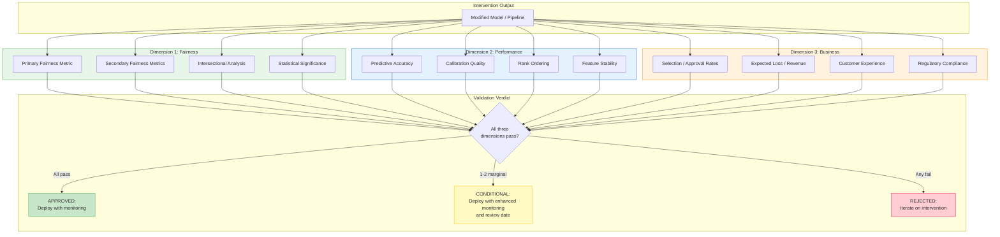
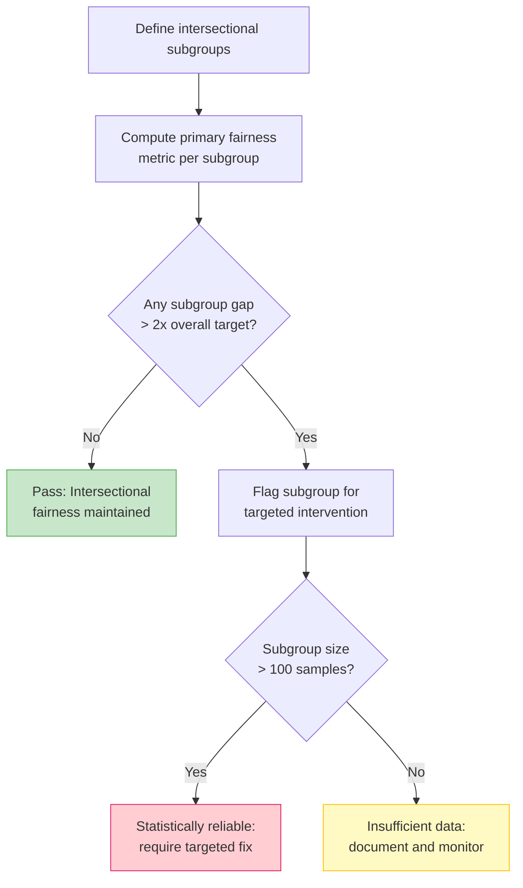
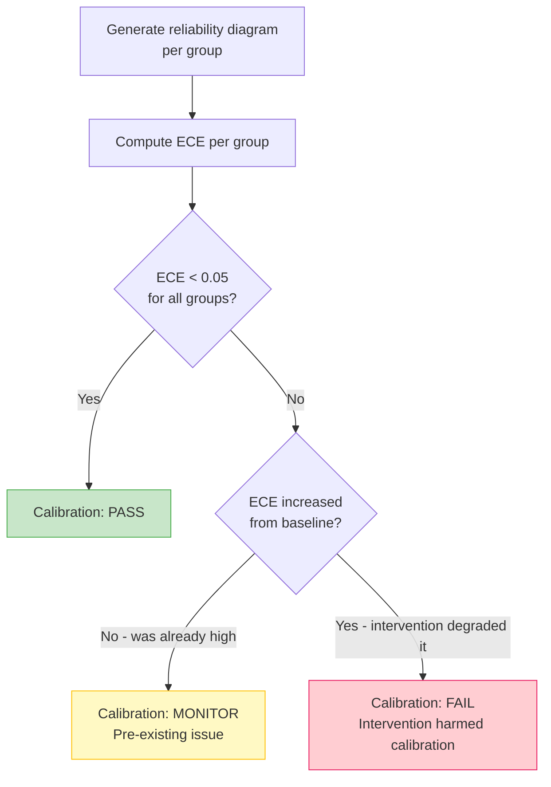
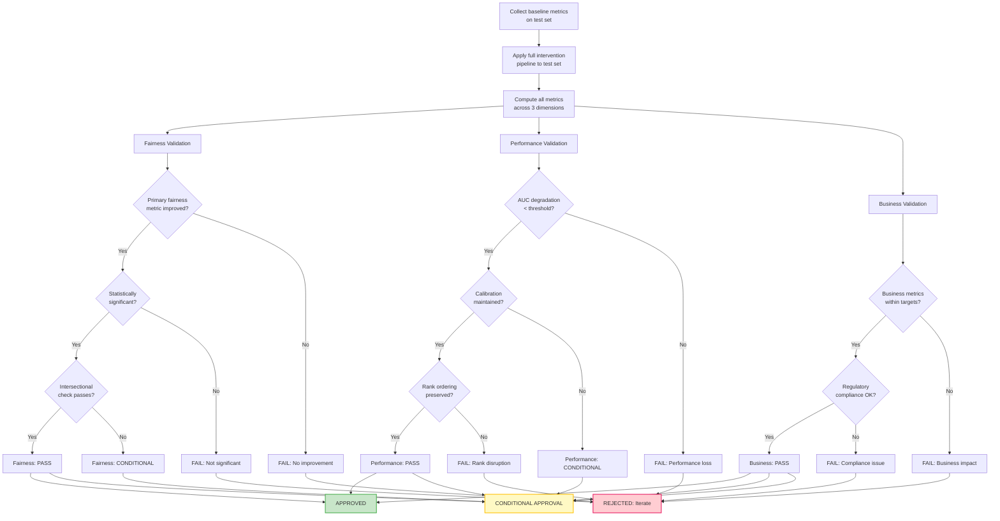
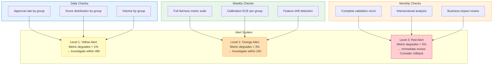
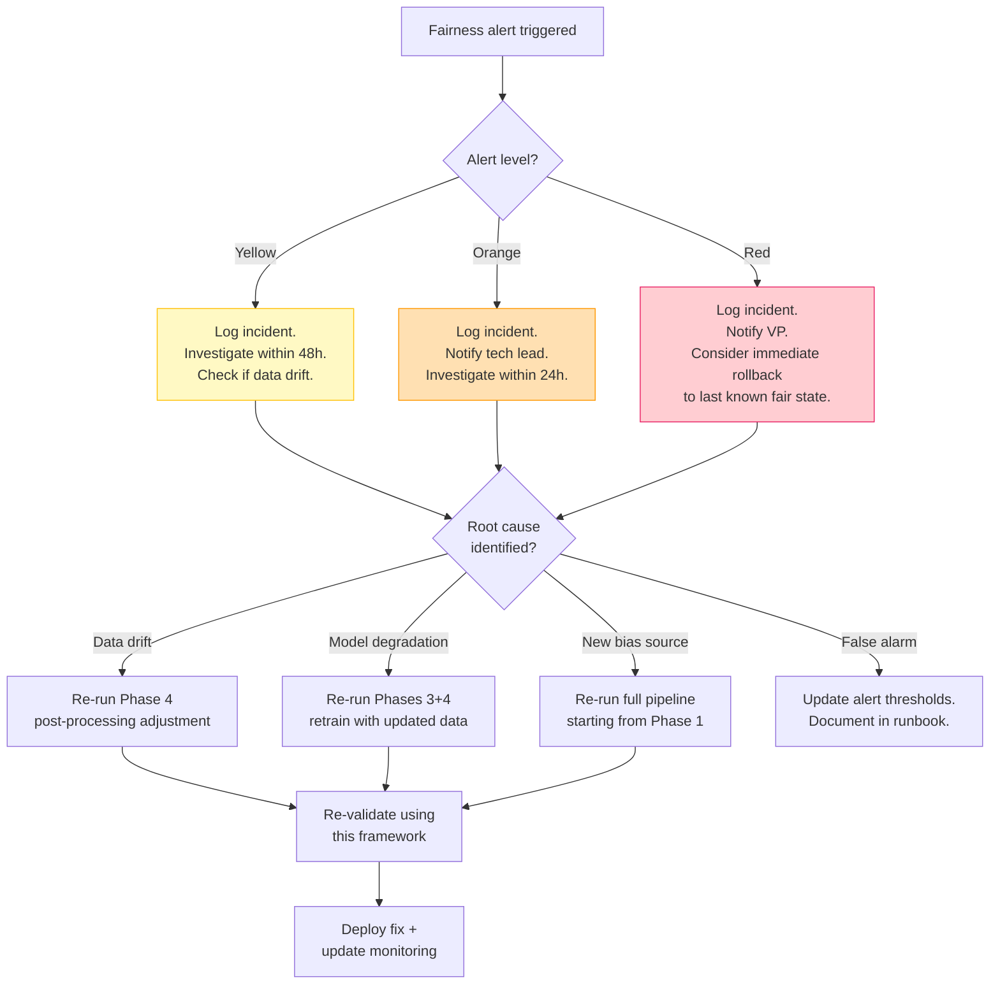

# Validation Framework

## Overview

Every fairness intervention must be validated across three dimensions: **fairness improvement**, **model performance**, and **business outcomes**. This framework provides the protocols, metrics, and thresholds that implementing teams use to verify their interventions are effective, safe, and sustainable.

> **Related documents**: This framework is referenced by [02_implementation_guide.md](02_implementation_guide.md) (Step 5: Validation & Deployment). For a practical demonstration of how validation was applied, see the [03_case_study.md](03_case_study.md). For intersectional validation details, see [05_intersectional_fairness.md](05_intersectional_fairness.md). For how validation adapts across domains, see [06_adaptability_guidelines.md](06_adaptability_guidelines.md).

---

## Validation Architecture



---

## Dimension 1: Fairness Validation

### Primary Fairness Metrics

Select the primary metric based on the fairness definition agreed with stakeholders:

| Fairness Definition | Metric | Formula | Target |
|-------------------|--------|---------|--------|
| Demographic Parity | Selection Rate Ratio | min(SR_a, SR_b) / max(SR_a, SR_b) | > 0.80 (4/5 rule) |
| Equal Opportunity | True Positive Rate Difference | \|TPR_a - TPR_b\| | < 0.05 |
| Equalized Odds | Max(TPR diff, FPR diff) | max(\|TPR_a - TPR_b\|, \|FPR_a - FPR_b\|) | < 0.05 |
| Predictive Parity | Positive Predictive Value Diff | \|PPV_a - PPV_b\| | < 0.05 |
| Calibration | Expected Calibration Error Gap | \|ECE_a - ECE_b\| | < 0.03 |

### Secondary Fairness Metrics

Even when optimizing for one definition, track others to ensure no metric degrades significantly:

```
FAIRNESS METRIC CHECKLIST
==========================
Primary metric (chosen definition):    [value] → [value]  Pass/Fail
Demographic parity ratio:              [value] → [value]  Monitor
Equal opportunity difference:          [value] → [value]  Monitor
Equalized odds (max gap):              [value] → [value]  Monitor
Calibration gap:                       [value] → [value]  Monitor

ALERT: Flag if any secondary metric degrades > 0.05 from baseline.
```

### Intersectional Fairness Validation

For each intersection of protected attributes (see [05_intersectional_fairness.md](05_intersectional_fairness.md)):



### Statistical Significance Testing

All fairness improvements must be statistically validated:

| Test | When to Use | Threshold |
|------|------------|-----------|
| Two-proportion z-test | Comparing rates (approval, selection) | p < 0.05 |
| Bootstrap confidence interval | Small samples or complex metrics | 95% CI excludes zero |
| Permutation test | Non-standard metrics, no distributional assumptions | p < 0.05 |
| Bonferroni correction | Multiple comparisons (intersectional groups) | p < 0.05 / n_comparisons |

**Template:**

```
STATISTICAL SIGNIFICANCE REPORT
================================
Test: [Two-proportion z-test / Bootstrap / Permutation]
Groups compared: [Group A vs. Group B]
Metric: [Metric name]
Before: [value] (95% CI: [lower, upper])
After:  [value] (95% CI: [lower, upper])
Difference: [value]
p-value: [value]
Conclusion: [Statistically significant / Not significant]

If intersectional (n comparisons = [n]):
Bonferroni-corrected threshold: [0.05/n]
```

---

## Dimension 2: Performance Validation

### Predictive Accuracy

| Metric | Formula | Acceptable Degradation |
|--------|---------|----------------------|
| AUC-ROC | Area under ROC curve | < 3% relative decrease |
| Accuracy | (TP + TN) / Total | < 3% absolute decrease |
| F1 Score | 2 × (Precision × Recall) / (Precision + Recall) | < 5% relative decrease |
| Precision | TP / (TP + FP) | Context-dependent |
| Recall | TP / (TP + FN) | Context-dependent |

### Calibration Quality



### Rank Ordering Preservation

Verify that the intervention preserves the relative ordering of predictions within groups:

| Check | Method | Threshold |
|-------|--------|-----------|
| Within-group rank stability | Spearman correlation (before vs. after) | ρ > 0.95 |
| Cross-group rank stability | Kendall's τ on full population | τ > 0.90 |
| Extreme predictions preserved | Top/bottom 5% overlap | > 80% overlap |

### Feature Importance Stability

| Check | Method | Threshold |
|-------|--------|-----------|
| Top-10 feature overlap | Jaccard similarity of top-10 lists | > 0.80 |
| Importance rank correlation | Spearman on feature importance vectors | ρ > 0.90 |
| SHAP value direction | Check no feature flipped sign | 0 flips allowed |

---

## Dimension 3: Business Validation

### Business Impact Assessment Template

```
BUSINESS IMPACT ASSESSMENT
===========================
System: [Name]
Date: [Date]
Assessor: [Name]

SELECTION / APPROVAL RATES:
- Overall rate before: [%]
- Overall rate after:  [%]
- Target range:        [%] - [%]
- Within target:       [Yes/No]

FINANCIAL IMPACT:
- Expected loss/revenue before: [$]
- Expected loss/revenue after:  [$]
- Net impact:                   [$]
- Acceptable threshold:         [$]
- Within threshold:             [Yes/No]

CUSTOMER EXPERIENCE:
- Affected population size: [N]
- Applicants gaining approval:  [N] ([%])
- Applicants losing approval:   [N] ([%])
- Net impact assessment:        [Positive/Neutral/Negative]

REGULATORY COMPLIANCE:
- Relevant regulations: [List]
- Compliance before:    [Status]
- Compliance after:     [Status]
- Legal review needed:  [Yes/No]

OPERATIONAL IMPACT:
- Inference latency change: [ms]
- Pipeline complexity added: [Description]
- Maintenance burden: [Low/Medium/High]
```

---

## Validation Protocol: Step-by-Step

### Pre-Validation Checklist

- [ ] Baseline metrics documented (fairness, performance, business)
- [ ] Test set is held-out (never used during intervention development)
- [ ] Test set is representative of production data
- [ ] Test set size sufficient for statistical power (> 1,000 per group minimum)
- [ ] Fairness definition and targets agreed with stakeholders
- [ ] Performance degradation threshold agreed

### Validation Execution



---

## Post-Deployment Monitoring

### Monitoring Dashboard



### Data Drift Detection

Monitor for shifts in the input data distribution that could affect fairness:

| What to Monitor | Method | Alert Threshold |
|----------------|--------|-----------------|
| Protected attribute distribution | Chi-squared test vs. training data | p < 0.05 |
| Feature distributions per group | Kolmogorov-Smirnov test | D > 0.1 |
| Label distribution per group | Proportion test | > 2% shift |
| Proxy variable correlations | Pearson/Spearman correlation change | > 0.1 change |
| Population composition | Group proportion change | > 5% shift |

### Incident Response Protocol



> **See also**: The re-entry triggers and corresponding pipeline entry points are detailed in the [Integration Workflow — When to Re-Enter the Pipeline](01_integration_workflow.md#when-to-re-enter-the-pipeline) table.

---

## Audit Trail Requirements

Every validation must produce a permanent audit record:

| Artifact | Content | Retention |
|----------|---------|-----------|
| Validation Report | Full metric suite across all 3 dimensions | 7 years (regulatory) |
| Test Data Snapshot | Anonymized test set used for validation | 7 years |
| Model Artifact | Exact model version validated | Lifetime of model |
| Configuration Record | All parameters, thresholds, techniques applied | 7 years |
| Decision Log | Who approved, when, with what conditions | 7 years |
| Monitoring Alerts | All triggered alerts and resolutions | 3 years |

### Validation Report Template

```
FAIRNESS INTERVENTION VALIDATION REPORT
========================================
Report ID: [UUID]
Date: [Date]
System: [Name]
Model Version: [Version]
Validator: [Name]
Approver: [Name]

1. INTERVENTION SUMMARY
   Phases applied: [1/2/3/4]
   Techniques used: [List]
   Fairness definition: [Definition]
   Target: [Metric < value]

2. FAIRNESS RESULTS
   Primary metric: [before] → [after] (p = [value])
   Secondary metrics: [table]
   Intersectional analysis: [summary]
   Statistical significance: [confirmed/not confirmed]

3. PERFORMANCE RESULTS
   AUC: [before] → [after] ([% change])
   Calibration: [ECE before] → [ECE after]
   Rank stability: [ρ = value]

4. BUSINESS RESULTS
   Approval rate: [before] → [after]
   Expected loss: [before] → [after]
   Regulatory status: [Compliant/Non-compliant]

5. VERDICT
   [ ] APPROVED - Deploy with standard monitoring
   [ ] CONDITIONAL - Deploy with enhanced monitoring until [date]
   [ ] REJECTED - Reason: [explanation]

6. MONITORING PLAN
   Daily checks: [list]
   Weekly checks: [list]
   Alert thresholds: [table]
   Review date: [date]

Signatures:
- Validator: _____________ Date: _______
- Tech Lead: _____________ Date: _______
- Compliance: ____________ Date: _______
```

---

## Success Criteria Summary

| Criterion | Must Pass | Should Pass | Nice to Have |
|-----------|:---------:|:-----------:|:------------:|
| Primary fairness metric improved | X | | |
| Improvement statistically significant | X | | |
| No intersectional group > 2x target | | X | |
| AUC degradation < threshold | X | | |
| Calibration maintained or improved | | X | |
| Rank ordering preserved (ρ > 0.95) | | X | |
| Business metrics within targets | X | | |
| Regulatory compliance maintained | X | | |
| Feature importance stable | | | X |
| Consistent across random seeds | | X | |
| Monitoring configured and tested | X | | |
