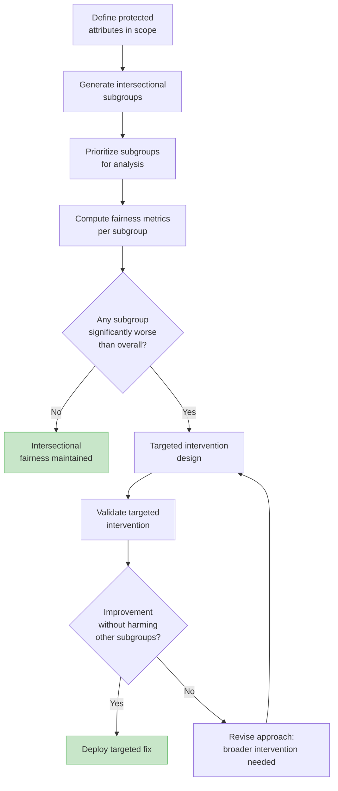
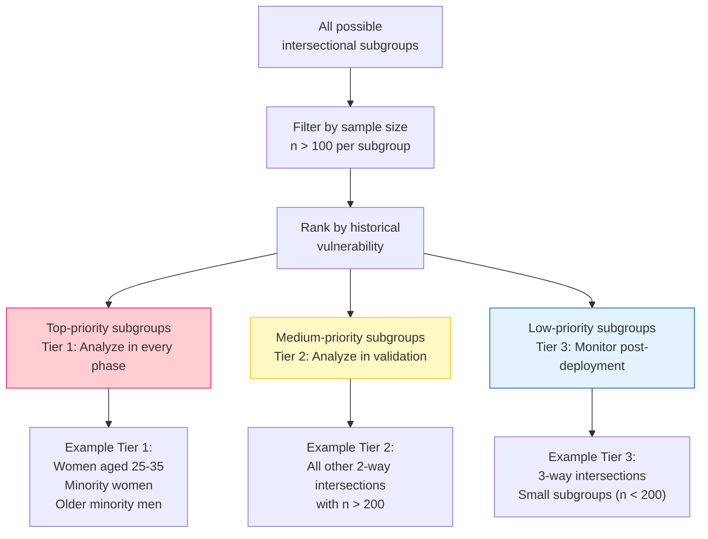
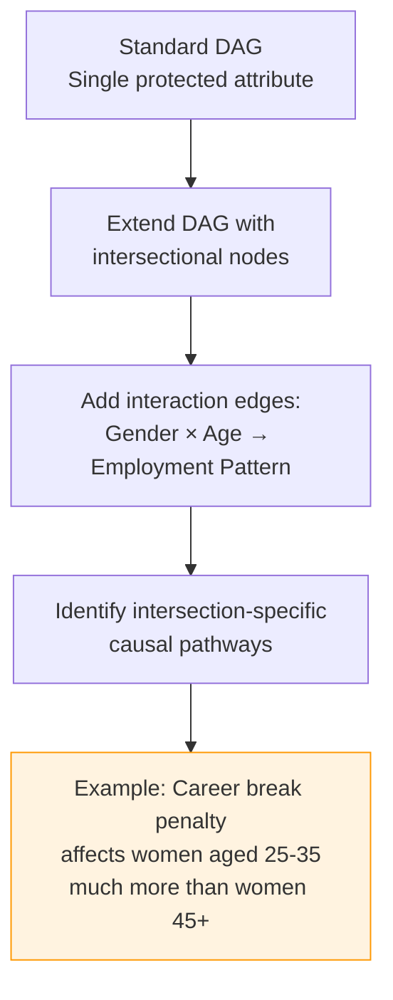
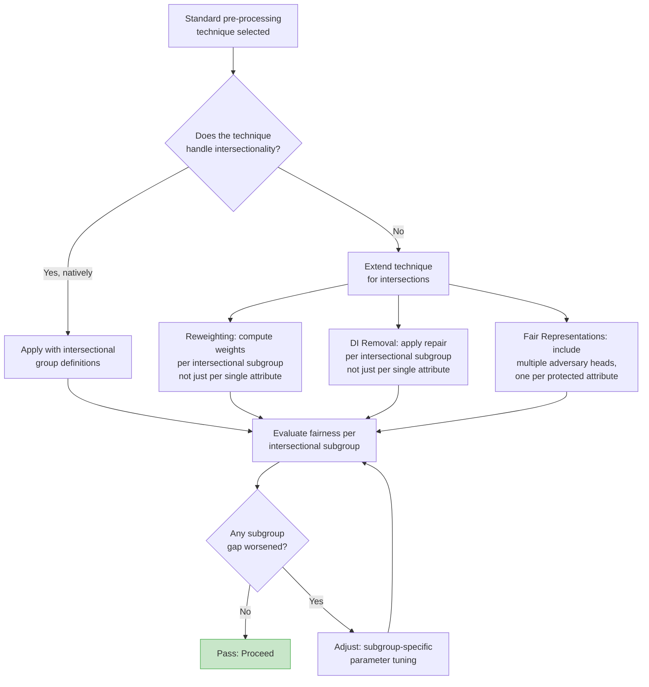
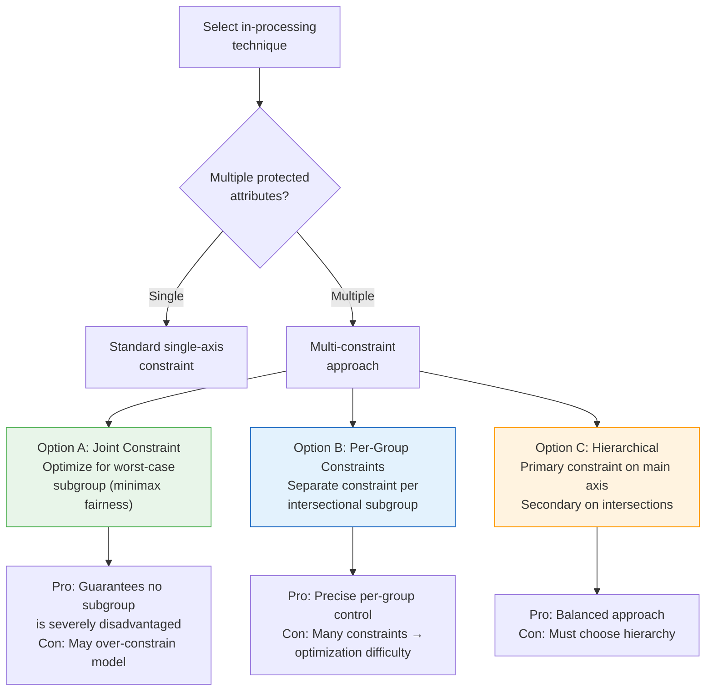
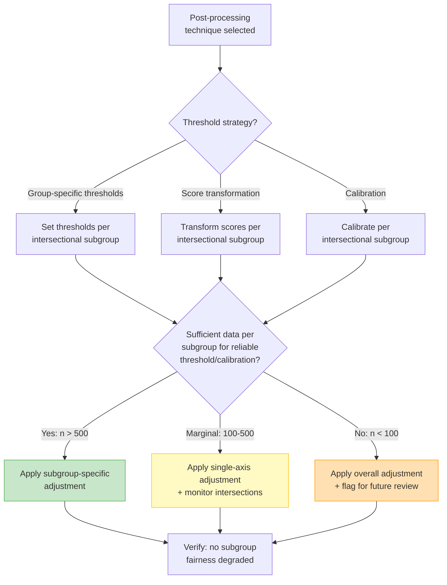
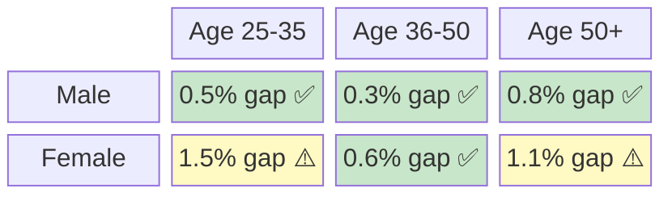
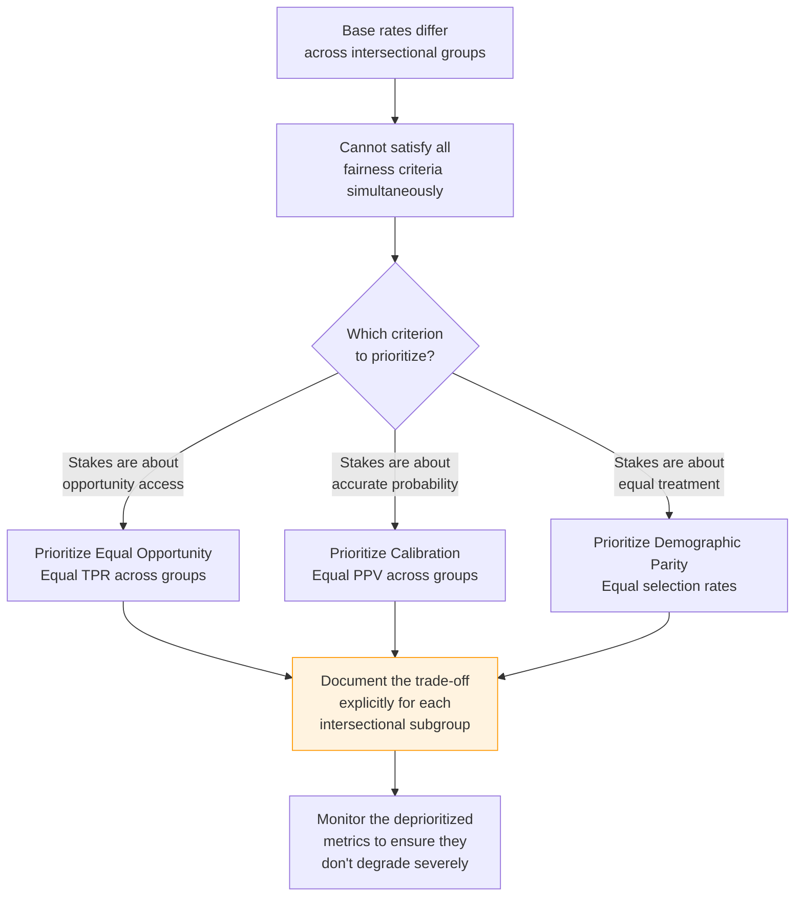

# Intersectional Fairness Guide

## Why Intersectionality Matters

Single-axis fairness analysis (gender alone, race alone) can miss compounding effects. A system may appear fair for women overall and fair for older applicants overall, while being systematically unfair to *older women specifically*. Crenshaw (1989) introduced the concept of intersectionality to describe how multiple dimensions of identity interact to create unique experiences of discrimination.

**Example from our loan system** (see [03_case_study.md](03_case_study.md)): After initial interventions, the overall gender gap was 4%. But women aged 25-35 still faced a 12% gap — three times the overall figure. This subgroup gap would be invisible in single-axis analysis.

> **Related documents**: This guide applies across all four phases described in [01_integration_workflow.md](01_integration_workflow.md). For validation of intersectional fairness, see [04_validation_framework.md](04_validation_framework.md). For domain-specific intersectional considerations, see [06_adaptability_guidelines.md](06_adaptability_guidelines.md).

---

## Intersectional Analysis Framework



---

## Step 1: Subgroup Generation and Prioritization

### The Combinatorial Challenge

With *k* protected attributes each having *n_i* categories, the number of intersectional subgroups is:

**Total subgroups = n_1 x n_2 x ... x n_k**

For example: 2 genders x 4 age groups x 3 race categories = 24 subgroups. Not all will have sufficient data for meaningful analysis.

### Prioritization Framework



### Prioritization Scoring

| Factor | Weight | Scoring |
|--------|:------:|---------|
| Historical disadvantage | 30% | Known marginalized group = 3; Potentially disadvantaged = 2; No known issues = 1 |
| Subgroup size | 25% | > 1000 = 3; 200-1000 = 2; 100-200 = 1 |
| Observed disparity magnitude | 25% | Gap > 2x overall = 3; Gap > 1.5x = 2; Gap ≈ overall = 1 |
| Legal/regulatory sensitivity | 20% | Explicitly protected intersection = 3; Implicitly protected = 2; Not specified = 1 |

**Priority score = weighted sum. Tier 1: score > 2.5. Tier 2: score 1.5-2.5. Tier 3: score < 1.5.**

---

## Step 2: Intersectionality in Each Phase

### Phase 1: Causal Analysis — Intersectional Considerations



**Key actions:**
- Extend the causal DAG to include interaction effects between protected attributes
- Identify pathways that are specific to intersectional subgroups (e.g., career breaks disproportionately affect women of child-bearing age)
- Run counterfactual analysis for Tier 1 subgroups specifically
- Document which pathways contribute most to each subgroup's disparity

**Template addition for Pathway Classification Report:**

```
INTERSECTIONAL PATHWAY ANALYSIS
================================
Pathway: [ID]
Subgroup-specific effects:
- [Subgroup 1]: [Effect size] — [Notes]
- [Subgroup 2]: [Effect size] — [Notes]
- [Subgroup 3]: [Effect size] — [Notes]

Interaction effect detected: [Yes/No]
If yes: [Description of how protected attributes interact on this pathway]
```

### Phase 2: Pre-Processing — Intersectional Considerations



**Key actions:**
- Compute reweighting factors per intersectional subgroup, not just per single attribute
- When using Disparate Impact Removal, apply repair within intersectional groups
- After any transformation, verify that **no** intersectional subgroup's fairness *worsened*
- Use the "do no harm" principle: improvements for one subgroup must not come at the expense of another

**Example — Intersectional Reweighting:**

| Subgroup | Population % | Positive Outcome % | Standard Weight | Intersectional Weight |
|----------|:-----------:|:------------------:|:--------------:|:--------------------:|
| Male, age 25-35 | 22% | 78% | 0.95 | 0.90 |
| Male, age 36-50 | 18% | 80% | 0.92 | 0.88 |
| Female, age 25-35 | 20% | 52% | 1.15 | 1.45 |
| Female, age 36-50 | 15% | 62% | 1.08 | 1.20 |
| Male, age 50+ | 14% | 74% | 0.98 | 0.95 |
| Female, age 50+ | 11% | 58% | 1.12 | 1.30 |

Notice how intersectional weights amplify the correction for the most disadvantaged subgroup (women aged 25-35).

### Phase 3: In-Processing — Intersectional Considerations



**Recommended approach: Minimax Fairness**

Instead of optimizing for average fairness across groups, optimize for the worst-off subgroup:

```
Minimize: Loss(model)
Subject to: max_g |FairnessMetric(group_g) - target| < epsilon
            for all intersectional subgroups g with n_g > 100
```

This prevents "fairness gerrymandering" where aggregate metrics look good but specific subgroups remain disadvantaged (Kearns et al., 2018).

### Phase 4: Post-Processing — Intersectional Considerations



**Key challenge**: Post-processing adjustments per intersectional subgroup require sufficient data. With 24 subgroups, some may be too small for reliable threshold estimation. Use hierarchical smoothing:

1. Estimate subgroup-specific parameters
2. Shrink toward the single-axis group parameter based on subgroup sample size
3. The smaller the subgroup, the more it relies on the broader group estimate

---

## Step 3: Intersectional Monitoring

### Monitoring Dashboard Extensions

Add these intersectional views to the standard monitoring dashboard:

| View | Frequency | Purpose |
|------|-----------|---------|
| Subgroup fairness heatmap | Weekly | Visual scan for emerging disparities |
| Worst-case subgroup metric | Daily | Early warning for most vulnerable group |
| Subgroup metric trends | Monthly | Detect gradual degradation |
| New subgroup detection | Monthly | Population shift may create new intersections |

### Intersectional Heatmap Example



---

## Handling the Impossibility Results

### Chouldechova-Kleinberg Impossibility

When base rates differ across groups (which they almost always do in practice), it is mathematically impossible to simultaneously satisfy:
1. Calibration (equal PPV across groups)
2. Equal false positive rates
3. Equal false negative rates

**Intersectional implication**: Base rate differences are often *larger* at intersectional levels, making the impossibility more acute.



### Practical Resolution

1. **Choose the primary fairness criterion** based on the system's purpose and stakeholder agreement
2. **Set floors for secondary criteria**: "We optimize for equal opportunity, but no group's calibration can deviate by more than 10%"
3. **Document the trade-off per subgroup**: Show stakeholders exactly what is being traded and why
4. **Review periodically**: As base rates evolve, the trade-off may shift

---

## Intersectional Fairness Checklist

Use this checklist at each phase of the playbook:

### Phase 1 (Causal Analysis)
- [ ] Protected attributes and their intersections identified
- [ ] Subgroups prioritized using scoring framework
- [ ] Causal DAG extended with interaction effects
- [ ] Counterfactual analysis run for Tier 1 subgroups
- [ ] Intersection-specific pathways documented

### Phase 2 (Pre-Processing)
- [ ] Reweighting/transformation applied per intersectional subgroup (not just single axis)
- [ ] "Do no harm" check: no subgroup fairness worsened
- [ ] Intersectional evaluation metrics computed

### Phase 3 (In-Processing)
- [ ] Fairness constraints include intersectional groups
- [ ] Minimax fairness considered (optimize for worst-off subgroup)
- [ ] Pareto frontier includes intersectional metrics

### Phase 4 (Post-Processing)
- [ ] Sufficient data per subgroup for reliable adjustment
- [ ] Hierarchical smoothing applied for small subgroups
- [ ] Post-processing verified across all Tier 1 subgroups

### Validation
- [ ] All Tier 1 subgroups pass fairness targets (or within 2x tolerance)
- [ ] Statistical tests use Bonferroni correction for multiple comparisons
- [ ] Heatmap visualization prepared for stakeholder review
- [ ] Monitoring configured for worst-case subgroup metric
