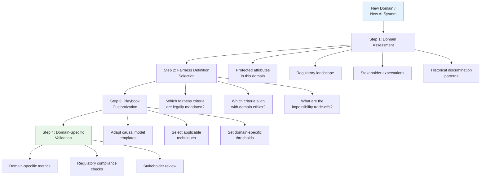
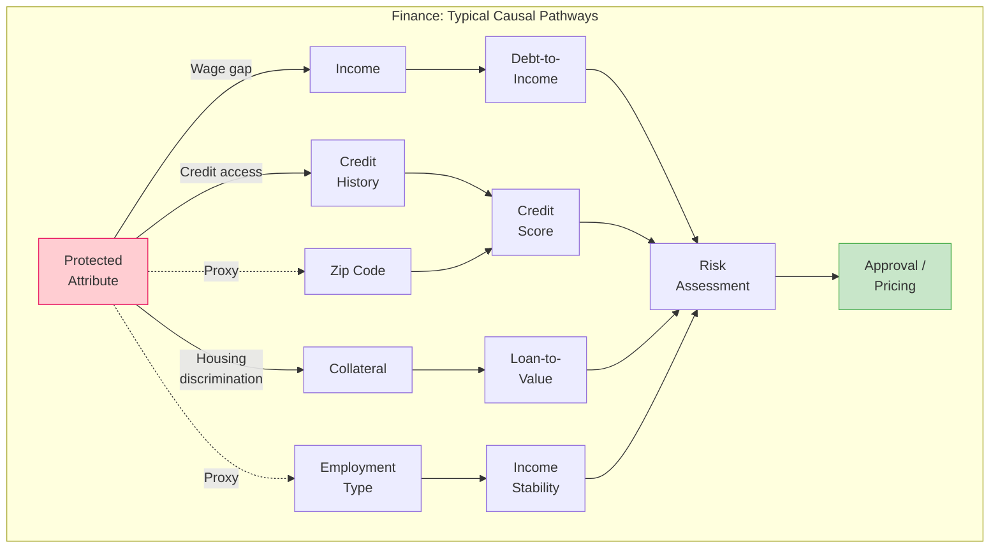
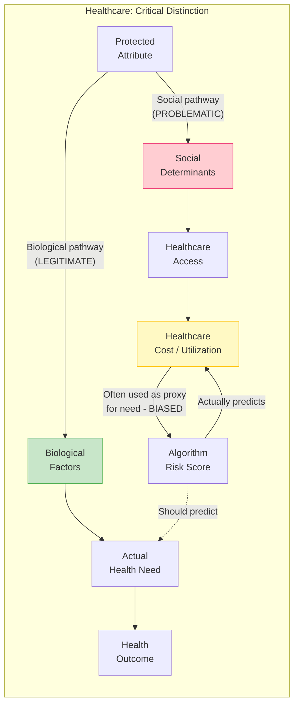
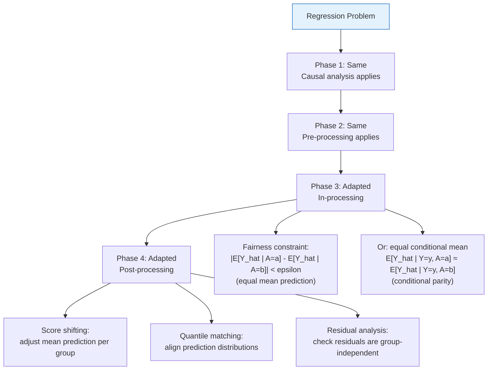
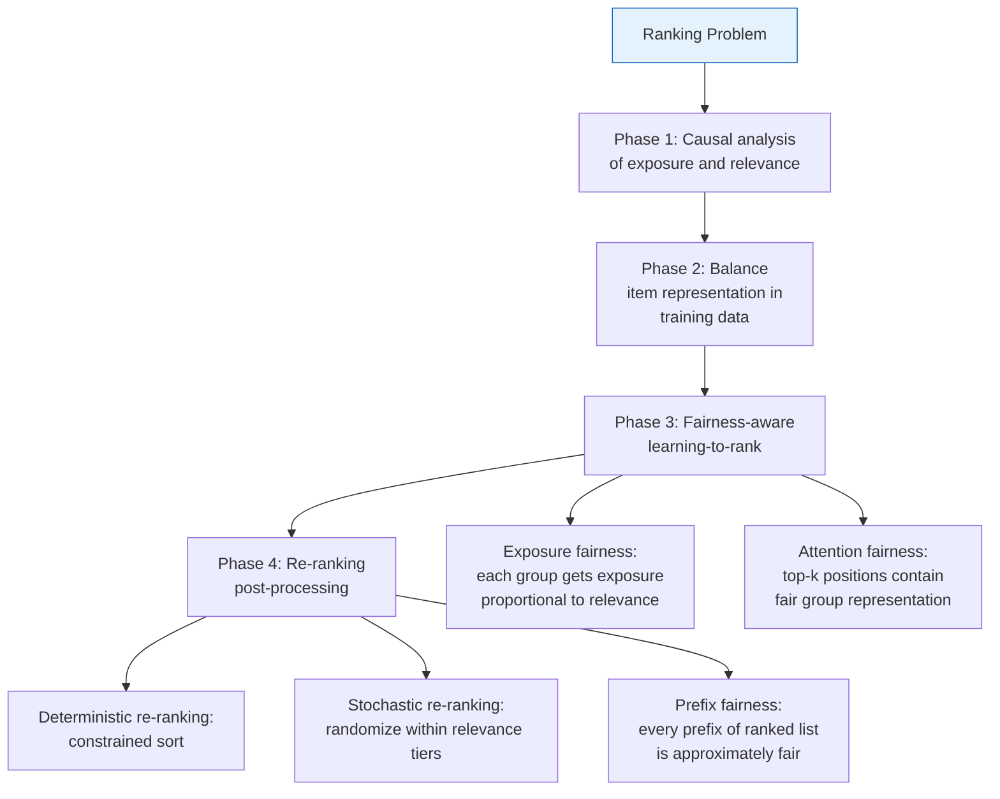

# Adaptability Guidelines

## Overview

The Fairness Intervention Playbook was developed in the context of a loan approval system (see [03_case_study.md](03_case_study.md)), but its framework is domain-agnostic. This guide explains how to adapt the playbook for different domains (healthcare, hiring, insurance, criminal justice) and different problem types (classification, regression, ranking, recommendation systems).

> **Related documents**: For the core pipeline being adapted, see [01_integration_workflow.md](01_integration_workflow.md). For implementation templates that need domain customization, see [02_implementation_guide.md](02_implementation_guide.md). For domain-specific validation requirements, see [04_validation_framework.md](04_validation_framework.md). For intersectional considerations across domains, see [05_intersectional_fairness.md](05_intersectional_fairness.md).

---

## Domain Adaptation Framework

---

## Domain-Specific Adaptations

### Finance (Lending, Credit, Insurance)

| Aspect | Adaptation |
|--------|-----------|
| **Key regulations** | Equal Credit Opportunity Act (ECOA), Fair Housing Act, EU AI Act (high-risk), Basel III |
| **Protected attributes** | Gender, race/ethnicity, age, marital status, national origin, religion |
| **Primary fairness concern** | Disparate impact in approval/pricing decisions |
| **Recommended fairness definition** | Equal opportunity (equal TPR) for approval; calibration for risk scoring |
| **Causal model focus** | Income pathways (wage gaps), credit history (access to credit), collateral (homeownership gaps) |
| **Pre-processing priorities** | Address proxy variables (zip code → race, employment type → gender) |
| **In-processing priorities** | Constraint optimization compatible with explainability requirements |
| **Post-processing priorities** | Threshold optimization under regulatory constraints; calibration across groups |
| **Validation additions** | Adverse action notice fairness, 4/5 rule compliance, stress testing under economic scenarios |
| **Key risk** | Over-correction leading to increased default rates → regulatory backlash |

---

### Healthcare (Diagnosis, Treatment, Resource Allocation)

| Aspect | Adaptation |
|--------|-----------|
| **Key regulations** | HIPAA, ACA non-discrimination, EU AI Act (high-risk), FDA guidelines for clinical AI |
| **Protected attributes** | Race/ethnicity, gender, age, disability status, socioeconomic status |
| **Primary fairness concern** | Unequal quality of care; biased risk scores leading to resource misallocation |
| **Recommended fairness definition** | Equal opportunity (don't miss diagnoses in any group); calibration (accurate risk estimates) |
| **Causal model focus** | Biological pathways vs. social pathways — critical to distinguish |
| **Pre-processing priorities** | Address healthcare cost as proxy for health need (Obermeyer et al., 2019 — cost-based algorithms disadvantage Black patients) |
| **In-processing priorities** | Multi-task learning: predict health need directly, not cost as proxy |
| **Post-processing priorities** | Calibration is paramount — miscalibrated risk scores can harm patients |
| **Validation additions** | Clinical outcome validation, patient safety metrics, clinical expert review |
| **Key risk** | Removing legitimate biological differences in the name of fairness (e.g., sex differences in disease prevalence) |

**Critical adaptation**: In healthcare, the causal analysis phase (Phase 1) must carefully distinguish biological pathways (which may be legitimate predictors that differ across groups) from social pathways (which reflect systemic disadvantage). Removing biological factors in the name of fairness can worsen care.

---

### Hiring and Recruitment

| Aspect | Adaptation |
|--------|-----------|
| **Key regulations** | Title VII (US), EU Employment Equality Directive, EEOC 4/5 rule, local ban-the-box laws |
| **Protected attributes** | Race, gender, age, disability, veteran status, pregnancy, religion |
| **Primary fairness concern** | Disparate impact in screening and selection |
| **Recommended fairness definition** | Demographic parity (4/5 rule is the legal standard); equal opportunity for callbacks |
| **Causal model focus** | Education access (socioeconomic proxy), name/language signals (race proxy), employment gaps (gender proxy) |
| **Pre-processing priorities** | Anonymization (names, photos); transform employment gap features; address prestige signals (university name → socioeconomic status) |
| **In-processing priorities** | Constraint optimization targeting 4/5 rule compliance |
| **Post-processing priorities** | Threshold adjustment per demographic group; rejection option for borderline candidates |
| **Validation additions** | Adverse impact ratio calculation, job-relatedness documentation, business necessity defense |
| **Key risk** | Resume screening AI that learns proxies from historical hiring data |

---

### Criminal Justice (Risk Assessment, Sentencing, Parole)

| Aspect | Adaptation |
|--------|-----------|
| **Key regulations** | Equal Protection Clause (14th Amendment), state-specific bail reform laws, EU AI Act (prohibited/high-risk) |
| **Protected attributes** | Race/ethnicity, gender, age, socioeconomic status |
| **Primary fairness concern** | Racial bias in recidivism prediction (COMPAS controversy, ProPublica 2016) |
| **Recommended fairness definition** | Context-dependent — calibration vs. equal FPR is the core tension |
| **Causal model focus** | Arrest records ≠ crime rates (policing bias); neighborhood features as proxies |
| **Pre-processing priorities** | Address arrest data bias; transform neighborhood features; account for policing intensity |
| **In-processing priorities** | Careful — explainability and individual rights are paramount |
| **Post-processing priorities** | Equalize false positive rates (wrongful detention) across racial groups |
| **Validation additions** | Recidivism outcome validation (not just re-arrest), disparate impact on liberty, appellate review compatibility |
| **Key risk** | Feedback loops: biased predictions → biased enforcement → biased data → more biased predictions |

> **Note**: This is the most contentious domain. Some jurisdictions are moving away from algorithmic risk assessment entirely. Teams should consult legal counsel before applying the playbook in this domain.

---

## Problem Type Adaptations

### Classification (Binary and Multi-Class)

This is the default problem type for the playbook. The loan approval case study is a binary classification example.

| Phase | Standard Approach |
|-------|------------------|
| Phase 1 | Causal DAG → outcome node is binary/categorical |
| Phase 2 | All techniques apply directly |
| Phase 3 | All techniques apply directly |
| Phase 4 | Threshold optimization, calibration, score transformation |

**Multi-class adaptation**: Apply fairness constraints per class or per one-vs-rest decomposition.

---

### Regression (Continuous Outcomes)

Examples: salary prediction, insurance pricing, credit limit assignment, healthcare cost prediction.

**Key differences from classification:**
- No natural threshold → fairness definitions focus on distributional properties
- Calibration = mean prediction accuracy, not probability calibration
- Post-processing uses score shifting or distribution matching, not threshold adjustment
- Validation uses mean absolute error (MAE) per group, residual analysis

---

### Ranking (Search, Recommendations, Candidate Lists)

Examples: resume ranking, product recommendations, search results, credit card offers.

**Key differences from classification:**
- Fairness is about **exposure** (position in the ranking) not just outcome
- Singh & Joachims (2018): exposure should be proportional to merit
- Post-processing uses **re-ranking** algorithms (not threshold adjustment)
- Validation includes position-weighted fairness metrics (NDCG per group, attention fairness)

---

### Recommendation Systems

Examples: content recommendations, product suggestions, job matching.

| Phase | Adaptation |
|-------|-----------|
| Phase 1 | Causal model of user preferences vs. algorithmic bias vs. popularity bias |
| Phase 2 | Balance training data: correct for interaction bias (users only rate items they've seen) |
| Phase 3 | Fairness regularization in embedding space; adversarial debiasing of user/item representations |
| Phase 4 | Calibrated recommendations: recommendation distribution matches user interest distribution per group |

**Unique fairness dimensions:**
- **Provider fairness**: Are items from all groups recommended equally? (e.g., jobs from minority-owned businesses)
- **Consumer fairness**: Do all user groups receive equally good recommendations?
- **Two-sided fairness**: Both provider and consumer fairness simultaneously

---

## Adaptation Checklist

When applying the playbook to a new domain or problem type:

### Domain Assessment
- [ ] Identify all protected attributes relevant to this domain
- [ ] Research applicable regulations and legal requirements
- [ ] Document historical discrimination patterns in this domain
- [ ] Identify domain-specific proxy variables
- [ ] Consult domain experts on legitimate vs. problematic predictive signals
- [ ] Determine which fairness definition is most appropriate (and legally required)

### Playbook Customization
- [ ] Adapt causal model templates with domain-specific variables
- [ ] Review technique catalog for domain applicability
- [ ] Set domain-appropriate thresholds (e.g., 4/5 rule for hiring)
- [ ] Add domain-specific validation checks
- [ ] Include domain-specific monitoring metrics

### Problem Type Adjustment
- [ ] Confirm fairness metric definitions match problem type
- [ ] Adapt post-processing techniques for output type (probability, score, ranking, list)
- [ ] Adjust validation framework for problem-specific evaluation

---

## Cross-Domain Comparison Matrix

| Dimension | Finance | Healthcare | Hiring | Criminal Justice |
|-----------|---------|------------|--------|-----------------|
| **Regulatory strictness** | High | High | Medium-High | Very High |
| **Typical fairness definition** | Equal opportunity | Equal opportunity + Calibration | Demographic parity (4/5) | Contested |
| **Primary bias source** | Historical lending patterns | Cost as proxy for need | Resume screening bias | Policing data bias |
| **Intervention urgency** | Medium | High (patient safety) | Medium | Very high (liberty at stake) |
| **Explainability requirement** | High (adverse action notices) | High (clinical decisions) | Medium | Very high (due process) |
| **Data availability** | Usually good | Often limited/siloed | Varies | Often biased by design |
| **Feedback loop risk** | Medium | Low | Medium | Very high |
| **Playbook difficulty** | Moderate | High | Moderate | Very high |
| **Recommended starting phase** | Phase 1 (full pipeline) | Phase 1 (full pipeline) | Phase 2 (data is key) | Phase 1 (causal critical) |
