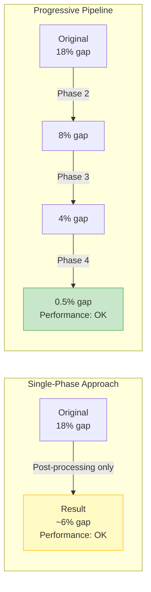
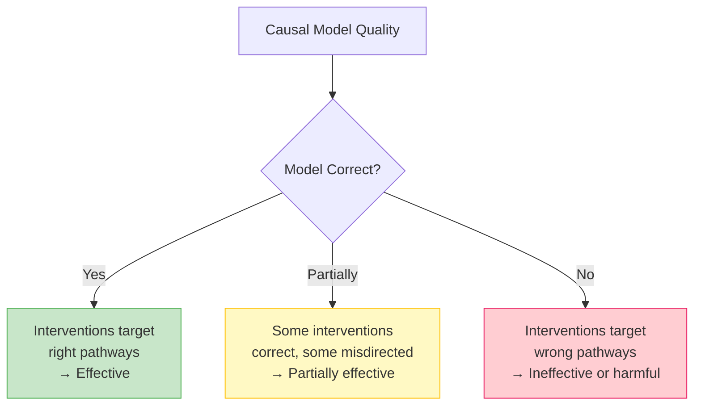
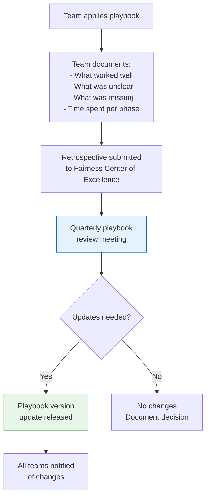

# Insights and Future Improvements

> **Related documents**: These insights were derived from developing the full playbook pipeline ([01_integration_workflow.md](01_integration_workflow.md)) and applying it end-to-end in our [case study](03_case_study.md). For the monitoring capabilities that address some limitations, see [04_validation_framework.md](04_validation_framework.md). For the intersectional challenges discussed here, see [05_intersectional_fairness.md](05_intersectional_fairness.md).

## Key Insights from Playbook Development

### Insight 1: Causal Analysis Is Non-Negotiable

The most important finding from developing this playbook is that **interventions without causal understanding are unreliable**. In our loan case study, a naive approach might have removed income as a feature because it correlates with gender. But income is a legitimate predictor of default risk — the problem isn't that the model uses income, but that the gender wage gap makes income an unfair signal.

Causal analysis (Phase 1) revealed that the 18% approval gap was driven by four distinct pathways, each requiring a different intervention. Without this analysis, we would have applied a single technique and either under-corrected or over-corrected.

**Implication for teams**: Even when time-pressured, always invest in at least a lightweight causal analysis. A simple DAG built with a domain expert in 2-3 hours prevents weeks of wasted effort on misguided interventions.

### Insight 2: Progressive Intervention Outperforms Single-Phase Fixes



Applying all fairness correction at one layer (e.g., only post-processing) leads to larger distortions. The progressive pipeline distributes the correction across layers, with each phase doing less work:

| Approach | Final Gap | AUC Loss | Stability |
|----------|:---------:|:--------:|:---------:|
| Post-processing only | ~6% | -1% | Fragile (large threshold shifts) |
| Pre-processing only | ~8% | -1.2% | Moderate |
| Full pipeline | 0.5% | -3.6% total | Robust (small corrections at each layer) |

### Insight 3: The Impossibility Results Are Practical, Not Just Theoretical

Chouldechova (2017) and Kleinberg et al. (2016) proved that when base rates differ across groups, you cannot simultaneously achieve calibration, equal false positive rates, and equal false negative rates. During development, we encountered this directly:

- Optimizing for equal opportunity (equal TPR) slightly worsened calibration for men
- Optimizing for calibration left a residual approval gap
- The trade-off was most acute for intersectional subgroups with the largest base rate differences

**Practical lesson**: The playbook forces teams to *choose* which fairness criterion to prioritize — and this choice is fundamentally a values decision, not a technical one. The playbook's role is to make the trade-offs transparent and quantified, enabling informed stakeholder decisions.

### Insight 4: Intersectional Fairness Requires Deliberate Design

In our case study, overall gender fairness was achieved (0.5% gap), but women aged 25-35 still experienced a 1.5% gap — three times the overall figure. This subgroup was invisible until we explicitly checked for it.

**Key finding**: Intersectional disparities are the norm, not the exception. Single-axis fairness is a necessary but insufficient condition. The playbook now requires intersectional analysis at every phase, with tiered prioritization to manage the combinatorial explosion of subgroups.

### Insight 5: Post-Processing Is Indispensable for Production Systems

Phase 4 (post-processing) was the only intervention that could be deployed in 3 days without model retraining. For production systems under regulatory scrutiny, this ability to make immediate corrections is invaluable.

However, post-processing alone is a band-aid. If applied without fixing root causes (Phases 1-3), it masks bias rather than resolving it. The playbook positions post-processing as a complement to deeper interventions, not a substitute.

---

## Known Limitations

### Limitation 1: Causal Model Dependence

The entire pipeline rests on the quality of the causal model built in Phase 1. If the DAG is wrong — missing important pathways, incorrectly classifying mediators — all subsequent interventions may be misguided.



**Mitigation**: The playbook includes sensitivity analysis and robustness checks, but these cannot fully compensate for a fundamentally wrong causal model.

**Future improvement**: Develop automated causal discovery tools that can supplement domain expertise, identify candidate DAGs from data, and quantify structural uncertainty.

### Limitation 2: Fairness-Performance Trade-Off Uncertainty

The playbook presents the fairness-performance trade-off as manageable (our case study lost 3.6% AUC). But the actual trade-off depends on:
- How much the true data-generating process discriminates
- How entangled legitimate and illegitimate signals are
- The model's capacity to learn fair representations

In some systems, achieving meaningful fairness may require substantial performance sacrifices that the current playbook doesn't fully address.

**Future improvement**: Develop methods to estimate the fairness-performance frontier *before* committing to interventions, helping teams set realistic expectations.

### Limitation 3: Static Snapshot vs. Dynamic Populations

The playbook treats each intervention as a point-in-time fix applied to a static population. In reality:
- Population demographics shift over time
- Feature distributions drift
- Societal norms and definitions of fairness evolve
- Feedback loops between the system and the population it serves can amplify or reduce bias

**Mitigation**: The monitoring framework addresses drift detection, but doesn't model long-term dynamics.

**Future improvement**: Integrate longitudinal fairness analysis — modeling how interventions affect population behavior over time, and designing interventions robust to anticipated shifts.

### Limitation 4: Binary Treatment of Protected Attributes

The playbook primarily handles categorical protected attributes (male/female, racial categories). It is less equipped for:
- Continuous protected attributes (age as a spectrum)
- Non-binary or fluid identity categories
- Self-identified vs. externally-attributed protected characteristics
- Intersections where subgroup membership is uncertain

**Future improvement**: Extend techniques to handle continuous and probabilistic group membership, drawing on soft-labeling approaches and uncertainty-aware fairness constraints.

### Limitation 5: Single-System Scope

The playbook addresses fairness within a single AI system. In practice, individuals interact with multiple systems (loan approval + insurance pricing + credit scoring), and fairness compound effects across systems are not captured.

**Future improvement**: Develop a multi-system fairness framework that considers an individual's cumulative exposure to AI decisions.

---

## Emerging Techniques Not Yet Included

### Causal Representation Learning

Recent work (e.g., Schölkopf et al., 2021) on learning causal representations from observational data could automate much of Phase 1. Instead of manually building DAGs, models could learn disentangled representations where causal factors are separated — including protected attributes and their effects.

**Potential integration**: Replace or augment the manual DAG construction in Phase 1 with automated causal discovery, using domain expert review as validation rather than construction.

### Foundation Model Fairness

Large language models and foundation models present unique fairness challenges not fully addressed by the playbook:
- Bias is embedded in pre-training data at scale
- Fine-tuning for fairness may be insufficient to override pre-trained biases
- Prompt sensitivity: small prompt changes can dramatically shift fairness outcomes

**Potential integration**: Add a "Phase 0: Foundation Model Assessment" for systems built on pre-trained models, including prompt auditing and embedding analysis techniques.

### Algorithmic Reparation

Moving beyond "do no harm" fairness (equalizing outcomes) to "restorative" fairness (actively compensating for historical disadvantage). This is philosophically distinct from current approaches and may align with certain stakeholder values.

**Potential integration**: Add an optional "reparative fairness" mode to Phase 4 post-processing, with appropriate stakeholder sign-off and legal review.

### Federated Fairness

Training fair models across distributed datasets (e.g., multiple bank branches) without centralizing sensitive data. Current federated learning approaches often amplify fairness issues because local datasets have different demographic compositions.

**Potential integration**: Extend Phase 3 in-processing techniques for federated settings, including fair aggregation protocols.

---

## Continuous Improvement Roadmap

```mermaid
gantt
    title Playbook Improvement Roadmap
    dateFormat  YYYY-Q
    axisFormat  %Y-Q%q

    section Near-Term (Next 2 Quarters)
    Automated causal discovery integration          :a1, 2026-Q2, 90d
    Foundation model fairness module                :a2, 2026-Q2, 90d
    Multi-system fairness assessment pilot          :a3, 2026-Q3, 90d

    section Medium-Term (Next Year)
    Longitudinal fairness modeling                  :b1, 2026-Q4, 180d
    Continuous/probabilistic protected attributes   :b2, 2026-Q4, 120d
    Federated fairness extension                    :b3, 2027-Q1, 120d

    section Long-Term (1-2 Years)
    Algorithmic reparation framework                :c1, 2027-Q2, 180d
    Cross-system fairness orchestration             :c2, 2027-Q3, 180d
    Self-updating causal models                     :c3, 2027-Q4, 180d
```

---

## Feedback Mechanisms

To ensure the playbook improves over time, we establish the following feedback channels:

### Team Feedback Loop



### Metrics to Track Playbook Effectiveness

| Metric | Target | Measurement |
|--------|--------|-------------|
| Adoption rate | > 80% of AI teams using playbook within 12 months | Survey + audit trail |
| Time to intervention | < 6 weeks from fairness issue to deployed fix | Project tracking |
| Fairness improvement | > 70% gap reduction in primary metric | Validation reports |
| Performance preservation | < 5% degradation in primary performance metric | Validation reports |
| Recurrence rate | < 10% of resolved issues re-emerge within 12 months | Monitoring data |
| Team satisfaction | > 4/5 usability rating | Post-intervention survey |
| Escalation rate | < 20% of cases require fairness specialist | Project tracking |

---

## Final Reflections

This playbook represents a significant step toward standardized fairness interventions, but it is not a finished product. Fairness in AI is an evolving field, and the playbook must evolve with it.

The most valuable aspect of the playbook is not any single technique, but the **structured decision-making process** it provides. By requiring teams to:

1. **Understand** before acting (Phase 1)
2. **Intervene progressively** across layers (Phases 2-4)
3. **Validate rigorously** across dimensions
4. **Monitor continuously** post-deployment

...we create accountability and consistency that ad hoc approaches cannot provide. Even as specific techniques improve or become obsolete, this structured process will remain valuable.

The playbook works best when treated as a living document — adapted, extended, and improved by every team that uses it.
