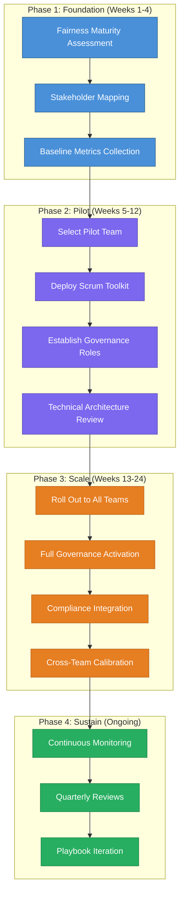
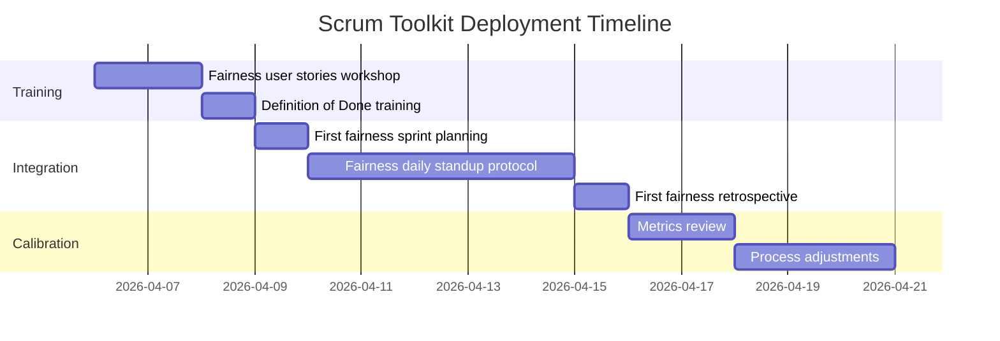
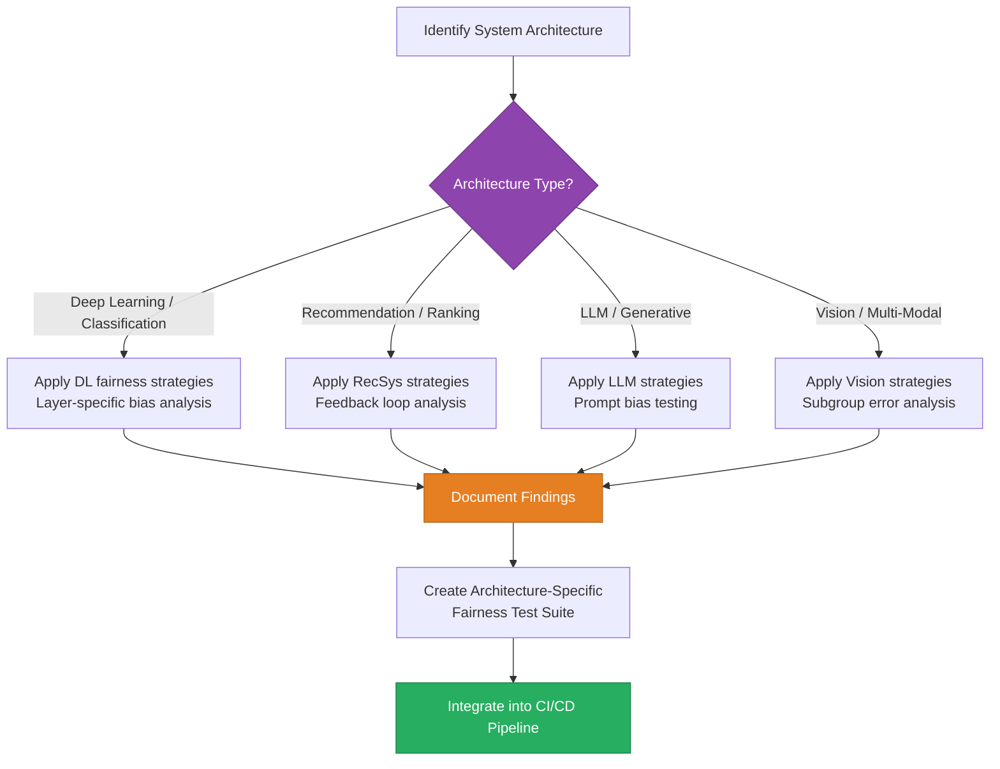
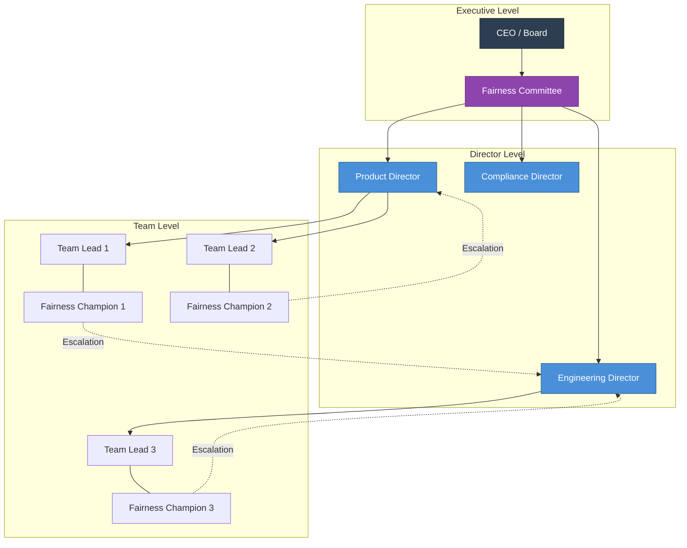
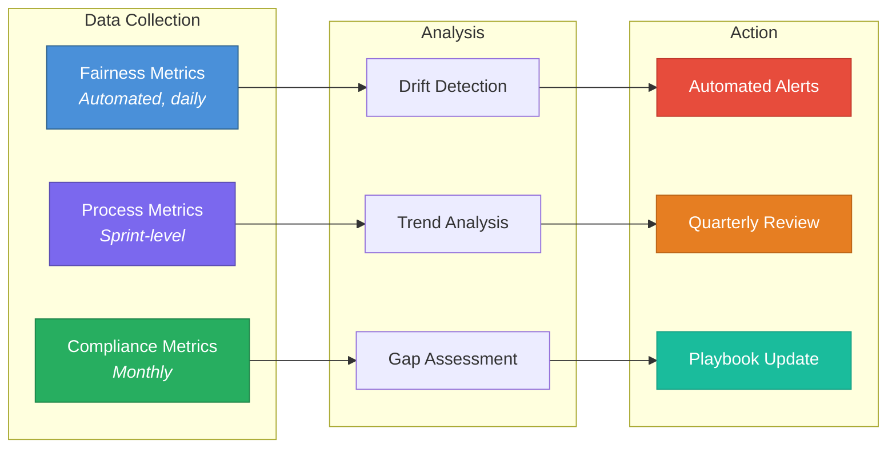
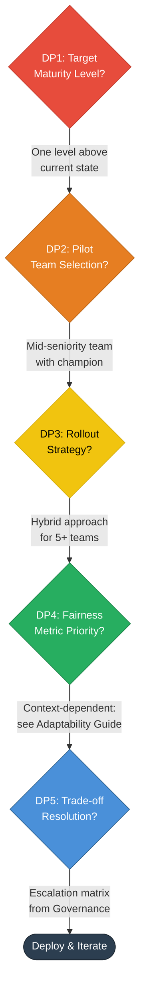

# Implementation Guide

[← Back to Playbook Overview](README.md) | [Next: Integration Framework →](02_integration_framework.md)

---

## 1. Purpose

This guide provides a structured, phased approach to deploying the Fairness Implementation Playbook within an organization. It covers the deployment methodology, key decision points, supporting evidence for each recommendation, and risk mitigation strategies.

---

## 2. Deployment Methodology

The playbook follows a **four-phase deployment model** designed to scale fairness from pilot teams to full organizational adoption.



---

## 3. Phase 1: Foundation (Weeks 1–4)

### 3.1 Fairness Maturity Assessment

Before deploying any toolkit, organizations must understand their current state. The maturity assessment evaluates five dimensions:

| Dimension | Level 1: Ad Hoc | Level 2: Emerging | Level 3: Defined | Level 4: Managed | Level 5: Optimizing |
|-----------|-----------------|-------------------|-------------------|-------------------|---------------------|
| **Process** | No formal fairness processes | Some fairness checks in code review | Fairness integrated in sprint ceremonies | Metrics-driven fairness management | Continuous optimization based on outcomes |
| **Governance** | No ownership | Informal champion | Defined roles (RACI) | Fairness committee with authority | Organization-wide accountability culture |
| **Technical** | No fairness tooling | Basic bias checks | Architecture-specific interventions | Automated fairness pipelines | Self-healing fairness systems |
| **Compliance** | Unaware of requirements | Awareness without action | Documentation framework | Active compliance program | Proactive regulatory engagement |
| **Culture** | Fairness not discussed | Individual awareness | Team-level commitment | Cross-functional alignment | Fairness as core value |

**Decision Point 1:** *What is our target maturity level?*

- **Evidence:** Industry experience consistently shows that organizations attempting to jump more than two maturity levels simultaneously face disproportionately higher failure rates — process adoption collapses under the weight of simultaneous change (cf. AI accountability gap research by Raji et al., 2020).
- **Recommendation:** Target one level above current state per deployment cycle. Most organizations should aim for Level 3 as an initial target.

### 3.2 Stakeholder Mapping

Identify and categorize stakeholders using the influence-impact matrix:

```mermaid
quadrantChart
    title Stakeholder Mapping Matrix
    x-axis Low Influence --> High Influence
    y-axis Low Impact --> High Impact
    quadrant-1 Key Players (Engage Closely)
    quadrant-2 Keep Informed
    quadrant-3 Monitor
    quadrant-4 Keep Satisfied
    Engineering Directors: [0.8, 0.9]
    Product Managers: [0.7, 0.8]
    Data Scientists: [0.5, 0.85]
    Legal / Compliance: [0.75, 0.7]
    Executive Leadership: [0.9, 0.6]
    HR / Domain Experts: [0.4, 0.65]
    End Users (Candidates): [0.2, 0.9]
    External Auditors: [0.3, 0.5]
```

### 3.3 Baseline Metrics Collection

Collect baseline data across three categories before any intervention:

| Category | Metrics | Collection Method |
|----------|---------|-------------------|
| **Fairness Metrics** | Demographic parity, equalized odds, predictive parity across protected groups | Automated pipeline analysis |
| **Process Metrics** | % of sprints with fairness user stories, fairness-related blockers per sprint | Scrum artifact review |
| **Compliance Metrics** | Documentation completeness, audit trail coverage, regulatory gap count | Compliance checklist audit |

---

## 4. Phase 2: Pilot (Weeks 5–12)

### 4.1 Pilot Team Selection Criteria

Select one team that meets the following criteria:

- **Willingness:** Team demonstrates genuine interest in fairness work (not just compliance)
- **Visibility:** Team works on a product area with measurable fairness outcomes
- **Complexity:** Team deals with at least one advanced architecture (LLM, recommendation system, or vision model)
- **Autonomy:** Team has enough independence to adjust their sprint processes

**Decision Point 2:** *Which team should pilot?*

- **Risk:** Choosing a team that is too junior or too resistant leads to poor adoption signals that can undermine the broader rollout.
- **Mitigation:** Select a mid-seniority team with a champion (senior engineer or tech lead who actively advocates for fairness).

### 4.2 Scrum Toolkit Deployment

Deploy the Fair AI Scrum Toolkit with the following sequence:



**Key Activities:**

1. **Workshop:** Train the team on writing fairness user stories with measurable acceptance criteria
2. **Definition of Done Update:** Add fairness validation gates to the team's existing DoD
3. **Ceremony Integration:** Introduce fairness checkpoints in sprint planning, daily standups, and retrospectives
4. **Calibration:** After the first full fairness sprint, review what worked and adjust

### 4.3 Governance Roles Activation

Using the Organizational Integration Toolkit, establish the following roles within the pilot:

| Role | Responsibility | Accountability |
|------|---------------|----------------|
| **Fairness Champion** | Day-to-day fairness advocacy within the team | Reports fairness blockers in standups |
| **Fairness Reviewer** | Reviews PRs and sprint artifacts for fairness compliance | Signs off on fairness acceptance criteria |
| **Escalation Owner** | Receives unresolved fairness trade-offs | Makes binding decisions within defined authority |

### 4.4 Technical Architecture Review

Using the Advanced Architecture Cookbook, conduct a review of the pilot team's AI systems:



---

## 5. Phase 3: Scale (Weeks 13–24)

### 5.1 Organizational Rollout Strategy

**Decision Point 3:** *Parallel vs. sequential rollout?*

| Approach | When to Use | Risk Level |
|----------|-------------|------------|
| **Sequential** (one team at a time) | Fewer than 5 teams; significant process variance between teams | Low — slower but controlled |
| **Parallel** (multiple teams simultaneously) | Standardized development processes; strong pilot results | Medium — faster but requires more coordination |
| **Hybrid** (parallel within departments, sequential across) | Large organizations with distinct business units | Medium — balances speed and control |

- **Evidence:** The hybrid approach is recommended for organizations like EquiHire with 5+ teams. It leverages department-level similarities while respecting cross-department differences — an application of the sociotechnical fairness principle that context shapes what "fair" means in practice (cf. Selbst et al., 2019, *Fairness and Abstraction in Sociotechnical Systems*).

### 5.2 Full Governance Activation

Expand from pilot-level roles to the full governance structure:



### 5.3 Compliance Integration

Using the Regulatory Compliance Guide:

1. **Risk Classification:** Classify all AI systems using the EU AI Act risk taxonomy
2. **Documentation Audit:** Verify all systems have complete fairness documentation trails
3. **Contestability Mechanisms:** Ensure end-users have clear paths to challenge automated decisions (GDPR Article 22)
4. **Monitoring Setup:** Deploy automated compliance monitoring dashboards

### 5.4 Cross-Team Calibration

Conduct monthly cross-team calibration sessions to ensure consistency:

- **Fairness metric standards:** Are all teams measuring the same metrics with the same thresholds?
- **Trade-off alignment:** Are teams making consistent trade-off decisions when fairness and performance conflict?
- **Knowledge sharing:** What fairness interventions has each team discovered?

---

## 6. Phase 4: Sustain (Ongoing)

### 6.1 Continuous Monitoring Framework



### 6.2 Quarterly Review Protocol

Each quarter, the Fairness Committee conducts a structured review:

| Review Area | Key Questions | Data Sources |
|-------------|--------------|--------------|
| **Effectiveness** | Are fairness metrics improving? Are disparities decreasing? | Automated dashboards, audit reports |
| **Adoption** | Are all teams consistently using the playbook? | Sprint artifacts, ceremony attendance |
| **Compliance** | Are we meeting all regulatory requirements? Any new regulations? | Compliance gap analysis, legal updates |
| **Culture** | Is fairness becoming embedded in how we work? | Team surveys, retrospective themes |

---

## 7. Key Decision Points Summary



| Decision Point | Risk if Poorly Decided | Mitigation |
|----------------|----------------------|------------|
| **DP1:** Maturity target | Over-ambition leads to burnout; under-ambition wastes opportunity | Assess honestly, validate with external benchmark |
| **DP2:** Pilot selection | Bad pilot signals → rollout resistance | Use selection criteria matrix; require champion |
| **DP3:** Rollout strategy | Too fast → inconsistency; too slow → loss of momentum | Match to org size and process maturity |
| **DP4:** Metric priority | Wrong metric → optimizing for the wrong fairness dimension | Align with domain context and regulatory requirements |
| **DP5:** Trade-off resolution | Unresolved trade-offs → fairness paralysis | Clear escalation path with decision authority |

---

## 8. Risk Registry

| Risk | Likelihood | Impact | Mitigation Strategy |
|------|-----------|--------|---------------------|
| **Fairness fatigue** — teams disengage due to perceived overhead | High | High | Integrate into existing ceremonies; demonstrate business value early |
| **Metric gaming** — teams optimize metrics without genuine fairness improvement | Medium | High | Combine quantitative metrics with qualitative reviews; rotate auditors |
| **Governance overhead** — processes slow development velocity | Medium | Medium | Start lean; add governance only where evidence supports it |
| **Regulatory change** — new regulations invalidate current compliance approach | Medium | High | Design compliance layer for extensibility; quarterly regulatory scanning |
| **Technical debt** — fairness interventions create unmaintainable code | Low | Medium | Treat fairness code with same engineering standards; include in refactoring cycles |
| **Stakeholder turnover** — key fairness champions leave the organization | Medium | High | Document institutional knowledge; distribute fairness ownership broadly |

---

[← Back to Playbook Overview](README.md) | [Next: Integration Framework →](02_integration_framework.md)
