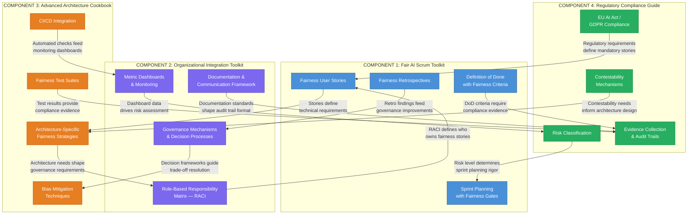
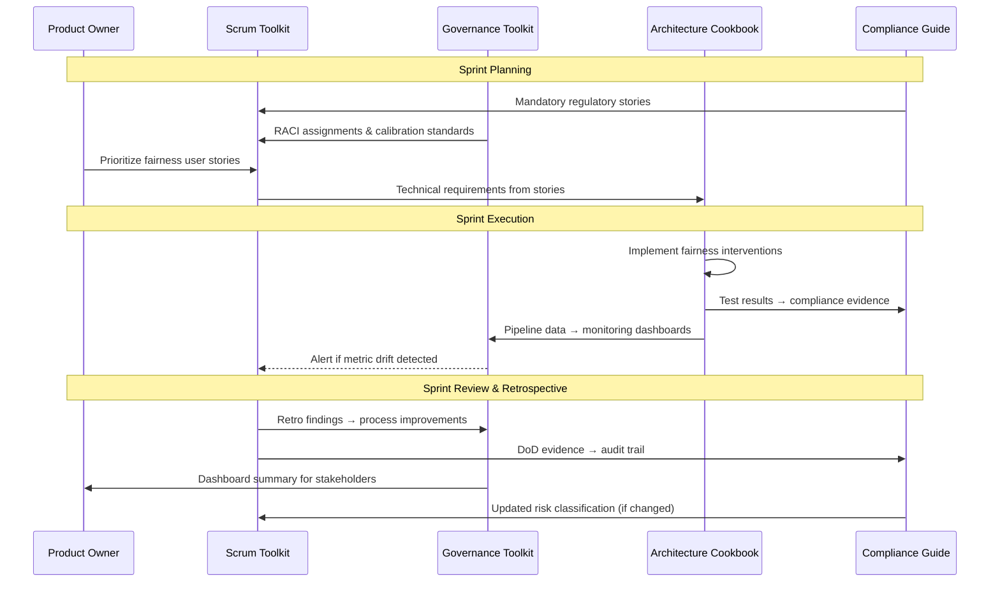
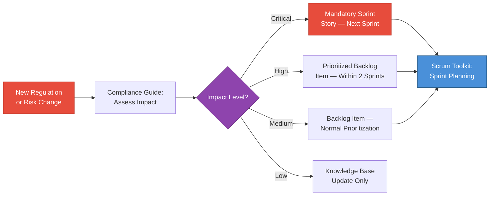
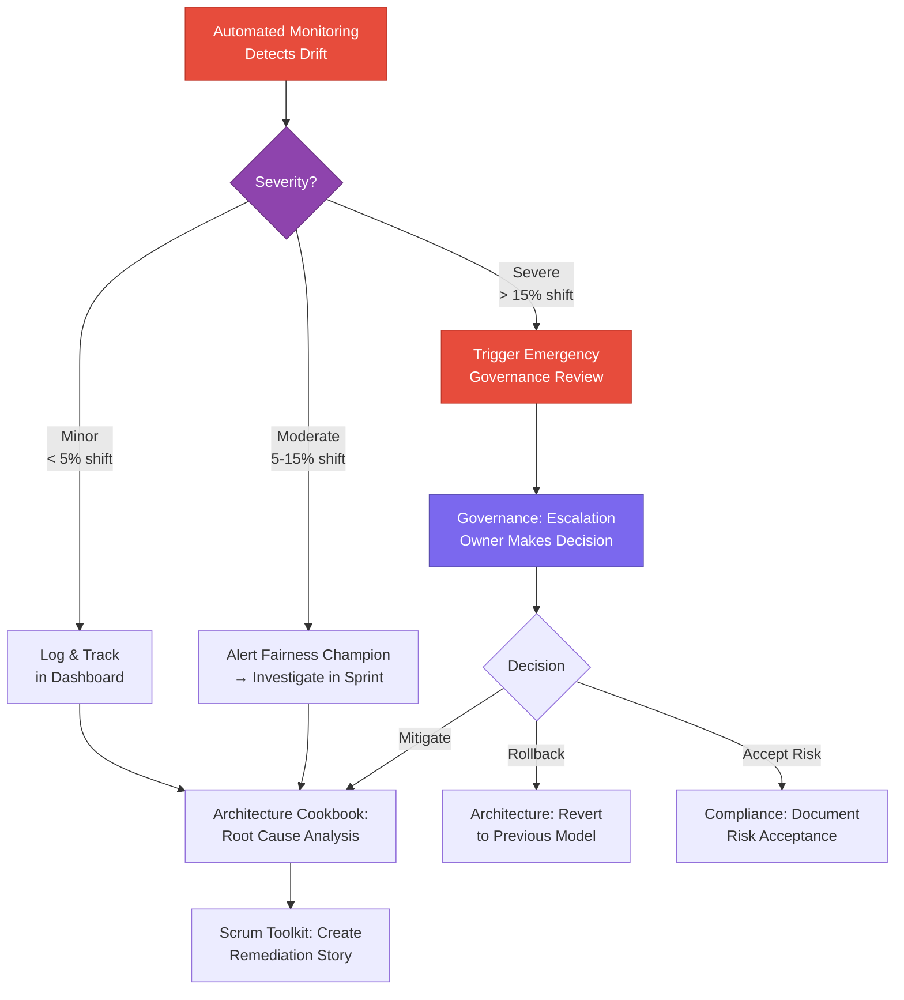
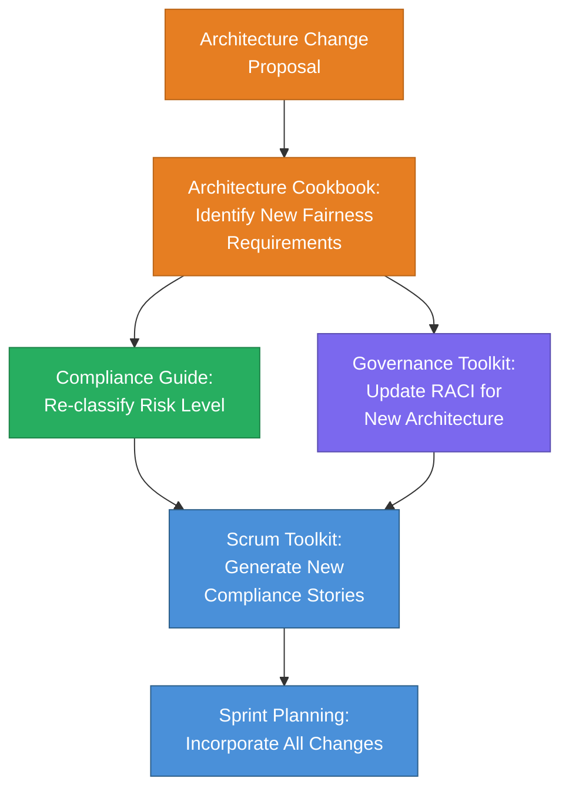
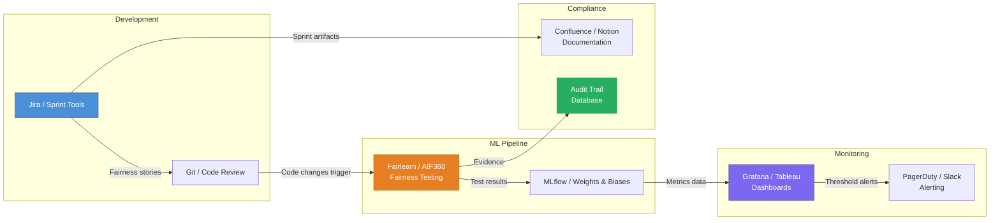

# Integration Framework

[← Implementation Guide](01_implementation_guide.md) | [Back to Overview](README.md) | [Next: Case Study →](03_case_study.md)

---

## 1. Purpose

This document defines how the four core components of the Fairness Implementation Playbook connect, communicate, and reinforce each other. Rather than operating as independent toolkits, they form an integrated system where **outputs from each component feed into others** as inputs.

---

## 2. Component Integration Architecture

---

## 3. Information Flow Matrix

The following matrix specifies exactly **what data flows between components**, **when**, and **who is responsible** for the handoff.

### 3.1 Scrum Toolkit → Other Components

| Output from Scrum | Flows To | Input As | Frequency | Responsible Role |
|--------------------|----------|----------|-----------|-----------------|
| Fairness user stories with acceptance criteria | Architecture Cookbook | Technical requirements for fairness interventions | Per sprint | Product Owner + Fairness Champion |
| Definition of Done fairness checkpoints | Compliance Guide | Required compliance evidence list | Per sprint | Scrum Master |
| Retrospective findings on fairness blockers | Governance Toolkit | Process improvement inputs | Per sprint | Fairness Champion |
| Sprint velocity on fairness tasks | Governance Toolkit | Resource allocation data for dashboards | Per sprint | Scrum Master |

### 3.2 Governance Toolkit → Other Components

| Output from Governance | Flows To | Input As | Frequency | Responsible Role |
|-------------------------|----------|----------|-----------|-----------------|
| RACI matrix updates | Scrum Toolkit | Fairness story ownership assignments | Quarterly | Engineering Director |
| Escalation decisions on trade-offs | Architecture Cookbook | Binding constraints for technical implementations | As needed | Escalation Owner |
| Dashboard alerts (metric drift) | Compliance Guide | Trigger for compliance review | Real-time | Monitoring System |
| Cross-team calibration standards | Scrum Toolkit | Sprint planning guidelines | Monthly | Fairness Committee |

### 3.3 Architecture Cookbook → Other Components

| Output from Architecture | Flows To | Input As | Frequency | Responsible Role |
|---------------------------|----------|----------|-----------|-----------------|
| Fairness test suite results | Compliance Guide | Quantitative compliance evidence | Per CI/CD run | ML Engineer |
| Architecture review findings | Governance Toolkit | Governance requirements per system type | Per new system | Tech Lead |
| Bias mitigation effectiveness data | Scrum Toolkit | Informs fairness story prioritization | Per sprint | Data Scientist |
| Automated fairness pipeline outputs | Governance Toolkit | Dashboard data feeds | Daily | DevOps / MLOps |

### 3.4 Compliance Guide → Other Components

| Output from Compliance | Flows To | Input As | Frequency | Responsible Role |
|-------------------------|----------|----------|-----------|-----------------|
| Risk classification per system | Scrum Toolkit | Sprint planning rigor level | Per system change | Compliance Officer |
| Mandatory regulatory requirements | Scrum Toolkit | Non-negotiable fairness user stories | Quarterly / on regulatory change | Legal Team |
| Contestability mechanism specifications | Architecture Cookbook | Architectural design constraints | Per system | Compliance Officer + Tech Lead |
| Audit findings and gaps | Governance Toolkit | Governance improvement priorities | Quarterly | External Auditor |

---

## 4. Integrated Workflow: Sprint Lifecycle

The following diagram shows how all four components interact during a single sprint:

---

## 5. Integration Patterns

### 5.1 Pattern: Regulatory-Driven Story Generation

When new regulatory requirements emerge or risk classifications change, this triggers automatic generation of fairness user stories.

### 5.2 Pattern: Fairness Metric Escalation

When automated monitoring detects fairness metric degradation, the system escalates through a defined path.

### 5.3 Pattern: Architecture Change Impact Assessment

When a team proposes a significant architecture change (e.g., migrating from a classification model to an LLM), the change triggers a cross-component impact assessment.

---

## 6. Integration Touchpoints Calendar

| Cadence | Activity | Components Involved | Output |
|---------|----------|---------------------|--------|
| **Daily** | Automated fairness pipeline runs | Architecture → Governance | Dashboard data |
| **Per Sprint** | Sprint planning with fairness stories | All four components | Sprint backlog |
| **Per Sprint** | Sprint retrospective with fairness review | Scrum → Governance | Process improvements |
| **Monthly** | Cross-team fairness calibration | Governance → Scrum | Updated standards |
| **Quarterly** | Regulatory scanning & risk re-classification | Compliance → All | Updated requirements |
| **Quarterly** | Governance review & RACI update | Governance → All | Updated roles |
| **Bi-annually** | Full playbook effectiveness review | All four components | Playbook iteration |

---

## 7. Integration Anti-Patterns

Avoid these common failure modes when integrating the four components:

| Anti-Pattern | Description | Consequence | Prevention |
|--------------|-------------|-------------|------------|
| **Siloed Compliance** | Compliance team operates independently from engineering | Compliance evidence doesn't reflect actual system behavior | Embed compliance checks in CI/CD (Architecture → Compliance flow) |
| **Governance Without Data** | Fairness committee makes decisions without dashboard data | Decisions based on intuition, not evidence | Ensure Architecture → Governance data pipeline is operational before governance activation |
| **Story Without Architecture** | Fairness user stories written without technical feasibility review | Stories that can't be implemented within sprint constraints | Always route stories through Architecture Cookbook for feasibility check |
| **Metric-Only Fairness** | Teams focus exclusively on quantitative fairness metrics | Metric gaming; miss qualitative fairness issues | Combine automated metrics with qualitative retrospective reviews |

---

## 8. Tooling Integration

For organizations using modern MLOps stacks, the following tooling integrations support the framework:

---

[← Implementation Guide](01_implementation_guide.md) | [Back to Overview](README.md) | [Next: Case Study →](03_case_study.md)
