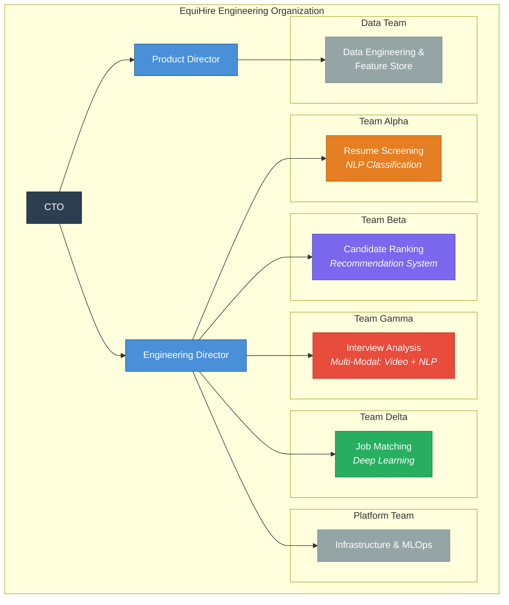
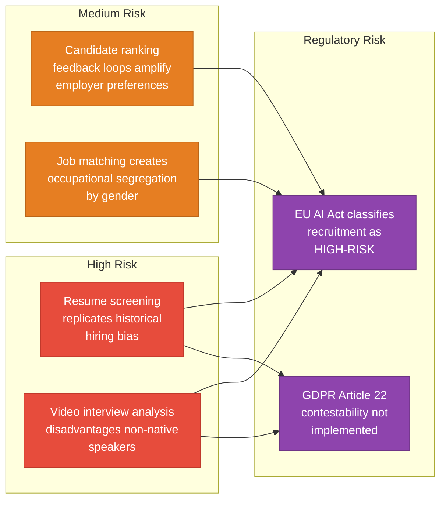
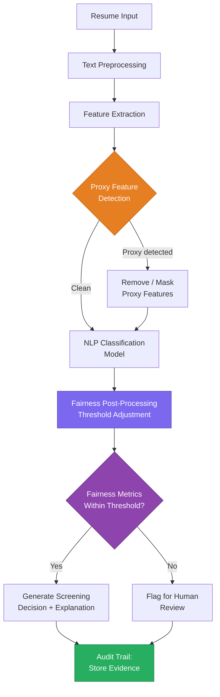
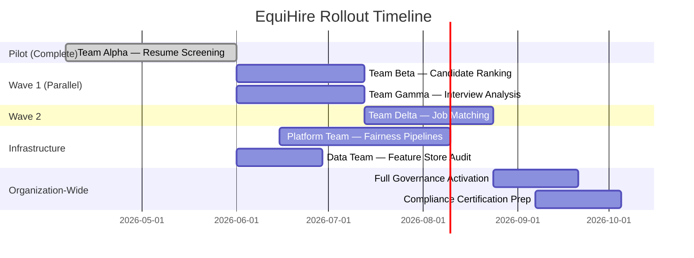
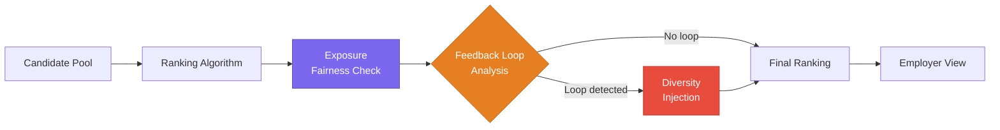
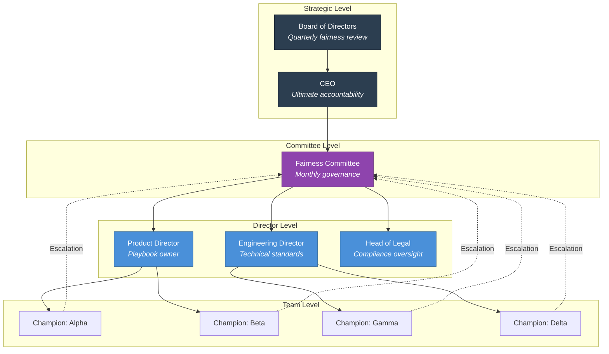

# Case Study: EquiHire — Fairness Implementation in a Multi-Team AI Recruitment Platform

[← Integration Framework](02_integration_framework.md) | [Back to Overview](README.md) | [Next: Validation Framework →](04_validation_framework.md)

---

## 1. Executive Summary

This case study demonstrates the end-to-end application of the Fairness Implementation Playbook to **EquiHire**, a fast-growing recruitment startup operating in the European Union. EquiHire's platform uses multiple AI systems — resume screening, candidate ranking, interview analysis, and job matching — each with distinct fairness challenges.

The case study follows EquiHire's journey from fragmented, ad-hoc fairness practices to a systematic, organization-wide implementation over a 24-week deployment cycle.

---

## 2. Company Profile

| Attribute | Details |
|-----------|---------|
| **Company** | EquiHire — Fair recruitment platform |
| **Market** | EU-based, serving employers across multiple member states |
| **Size** | ~120 employees, 6 engineering teams |
| **AI Systems** | 4 production models (resume screening, candidate ranking, video interview analysis, job-candidate matching) |
| **Regulatory Context** | EU AI Act (recruitment classified as high-risk), GDPR Article 22 |
| **Fairness Maturity at Start** | Level 2: Emerging (some fairness checks, no formal governance) |

### Team Structure

---

## 3. Initial Assessment: The Problem

### 3.1 Fairness Maturity Baseline

Using the maturity assessment from the [Implementation Guide](01_implementation_guide.md), EquiHire's initial state was:

| Dimension | Level | Evidence |
|-----------|-------|----------|
| **Process** | 2 — Emerging | Some teams ran bias checks during code review, but no standardized process |
| **Governance** | 1 — Ad Hoc | No defined fairness roles; the CTO personally reviewed "concerning" models |
| **Technical** | 2 — Emerging | Team Alpha used basic demographic parity checks; other teams had no fairness tooling |
| **Compliance** | 2 — Emerging | Legal team aware of EU AI Act requirements but no systematic documentation |
| **Culture** | 2 — Emerging | Engineers cared about fairness individually but lacked organizational support |

**Overall: Level 2 (Emerging)** → Target: **Level 3 (Defined)** within 6 months.

### 3.2 Identified Risks

---

## 4. Phase 1: Foundation (Weeks 1–4)

### 4.1 Stakeholder Alignment

The Product Director (the playbook deployer) conducted stakeholder workshops with:
- **CTO** — Secured executive sponsorship and budget for fairness infrastructure
- **Engineering Director** — Agreed on pilot team selection criteria and velocity impact tolerance (up to 15% initial velocity reduction accepted)
- **Legal Team** — Mapped EU AI Act Article 6 requirements to EquiHire's four AI systems
- **HR / Domain Experts** — Identified protected attributes relevant to recruitment: gender, age, ethnicity, disability status, nationality

### 4.2 Baseline Metrics

The Data Team collected baseline fairness metrics across all four systems:

| System | Primary Metric | Baseline Value | Target Value | Protected Groups |
|--------|---------------|----------------|--------------|-----------------|
| **Resume Screening** | Demographic Parity Difference | 0.18 (failing) | < 0.05 | Gender, Ethnicity |
| **Candidate Ranking** | Equal Opportunity Difference | 0.12 (failing) | < 0.08 | Gender, Age |
| **Interview Analysis** | Predictive Parity Ratio | 0.74 (failing) | > 0.90 | Nationality, Disability |
| **Job Matching** | Disparate Impact Ratio | 0.72 (failing) | > 0.80 | Gender |

> **Key Finding:** All four systems failed at least one fairness threshold under the standards EquiHire needed to meet for EU AI Act compliance. The resume screening system showed the largest demographic parity gap (0.18), indicating that candidates from underrepresented ethnic groups were 18 percentage points less likely to pass the screen.

---

## 5. Phase 2: Pilot (Weeks 5–12)

### 5.1 Pilot Team Selection

**Team Alpha (Resume Screening)** was selected as the pilot based on the criteria from the [Implementation Guide](01_implementation_guide.md):

| Criterion | Assessment |
|-----------|-----------|
| **Willingness** | Team lead had previously raised fairness concerns in retros |
| **Visibility** | Resume screening is the first candidate touchpoint — high impact, high visibility |
| **Complexity** | NLP-based classification model — covered by Architecture Cookbook |
| **Autonomy** | Independent sprint cadence, minimal cross-team dependencies |
| **Champion** | Senior ML Engineer volunteered as Fairness Champion |

### 5.2 Scrum Toolkit Deployment (Weeks 5–8)

#### Fairness User Stories Created

Team Alpha wrote the following fairness user stories for their first fairness sprint:

**Story 1:**
> *As a job candidate from any demographic background, I want the resume screening system to evaluate my qualifications with equal accuracy regardless of my name, gender, or ethnicity, so that I have a fair chance of advancing in the hiring process.*
>
> **Acceptance Criteria:**
> - Demographic parity difference < 0.10 across gender and ethnicity groups *(progressive target — the organization-wide threshold of < 0.05 is the final goal; this relaxed target allows the team to iterate within the first sprint)*
> - False negative rate difference < 0.05 between demographic groups
> - No proxy features (name, address, university prestige) used directly in scoring

**Story 2:**
> *As EquiHire's compliance team, I want every resume screening decision to include an explainability report, so that we can demonstrate GDPR Article 22 compliance if a candidate contests an automated decision.*
>
> **Acceptance Criteria:**
> - Each screening decision includes top-5 feature contributions
> - Explainability report is stored in audit trail database
> - Candidate-facing explanation available within 48 hours of request

#### Updated Definition of Done

Team Alpha added the following fairness criteria to their Definition of Done:

- [ ] Fairness test suite passes (all metrics within defined thresholds)
- [ ] Bias impact assessment completed for any model changes
- [ ] Explainability report generates successfully for sample decisions
- [ ] Compliance evidence exported to audit trail
- [ ] Fairness Champion has reviewed and approved

### 5.3 Governance Roles Activation (Weeks 7–8)

| Role | Person | Responsibility |
|------|--------|---------------|
| **Fairness Champion** | Senior ML Engineer (Team Alpha) | Raises fairness issues in standups; reviews fairness stories |
| **Fairness Reviewer** | Data Scientist (Team Alpha) | Reviews PRs for fairness impact; validates test results |
| **Escalation Owner** | Engineering Director | Resolves trade-offs between model performance and fairness |

**First Escalation (Week 8):** Team Alpha discovered that removing proxy features (university name) reduced resume screening accuracy by 7%. The Fairness Champion escalated to the Engineering Director per the governance protocol. Decision: *"Accept the accuracy trade-off. Our brand is built on fairness — a 7% accuracy reduction is acceptable if it eliminates a systematic disadvantage for candidates from less prestigious universities."*

This decision was documented in the governance framework, became a binding precedent for all teams, and illustrates a critical pattern: **fairness trade-offs must be made by people with organizational authority, not left to individual engineers**.

### 5.4 Architecture Review & Technical Intervention (Weeks 9–12)

Using the Architecture Cookbook, Team Alpha implemented the following for their NLP classification model:

**Interventions Applied:**

| Stage | Intervention | Type | Impact |
|-------|-------------|------|--------|
| **Pre-processing** | Proxy feature detection and masking (names, university names, addresses) | Input debiasing | Removed 3 high-correlation proxy features |
| **In-processing** | Adversarial debiasing during fine-tuning (penalizes demographic predictability) | Regularization | Reduced demographic parity gap from 0.18 to 0.08 |
| **Post-processing** | Group-specific threshold adjustment | Threshold calibration | Further reduced gap to 0.04 |
| **Monitoring** | Automated daily fairness metric computation | Continuous | Drift detection with 5% alert threshold |

### 5.5 Pilot Results

After 8 weeks of pilot deployment:

| Metric | Before Pilot | After Pilot | Target | Status |
|--------|-------------|-------------|--------|--------|
| **Demographic Parity Diff** | 0.18 | 0.04 | < 0.05 | **PASS** |
| **False Negative Rate Diff** | 0.11 | 0.03 | < 0.05 | **PASS** |
| **Model Accuracy** | 89.2% | 82.5% | > 80% | **PASS** |
| **Sprint Velocity Impact** | — | -12% | ≤ 15% reduction | **PASS** |
| **Compliance Documentation** | 30% complete | 94% complete | > 90% | **PASS** |

---

## 6. Phase 3: Scale (Weeks 13–24)

### 6.1 Rollout Strategy

Based on the pilot's success, EquiHire adopted a **hybrid rollout** — parallel within the ML teams, sequential between ML and platform/data teams:

### 6.2 Team-Specific Adaptations

Each team required distinct approaches from the Architecture Cookbook:

#### Team Beta: Candidate Ranking (Recommendation System)

**Key Challenge:** The ranking system exhibited feedback loops — employers clicked on candidates similar to their previous hires, which reinforced demographic patterns. The team implemented:
- **Exposure fairness:** Ensured all demographic groups received proportional visibility in top-10 rankings
- **Feedback loop dampening:** Reduced the weight of historical click data by 40% for candidates from underrepresented groups
- **Diversity injection:** Introduced a diversity bonus in the ranking score (configurable per employer)

#### Team Gamma: Interview Analysis (Multi-Modal)

**Key Challenge:** Video interview analysis disadvantaged non-native English speakers and candidates with certain disabilities. The multi-modal system (video + audio + transcript) amplified biases across modalities.

**Interventions:**
- **Modality-specific fairness testing:** Separate bias analysis for video, audio, and text components
- **Accent normalization:** Removed accent-correlated features from the audio pipeline
- **Disability accommodation flags:** Introduced a pre-interview accommodation system that adjusted scoring baselines
- **Subgroup analysis:** Tested intersectional fairness (e.g., non-native speakers with visible disabilities)

#### Team Delta: Job Matching (Deep Learning)

**Key Challenge:** Job matching perpetuated occupational segregation — the system recommended nursing roles more often to women and engineering roles more often to men, reflecting historical training data.

**Interventions:**
- **Representation learning:** Applied adversarial training to remove gender signal from job embeddings
- **Counterfactual evaluation:** For each match, computed "what if the candidate's gender were different?" — flagged matches with > 10% score change
- **Historical bias correction:** Down-weighted training examples from industries with documented occupational segregation

### 6.3 Full Governance Structure

### 6.4 Compliance Integration

With all four AI systems classified as **high-risk** under the EU AI Act:

| Requirement | Implementation | Evidence |
|-------------|---------------|----------|
| **Risk Management System** (Art. 9) | Automated risk classification pipeline; quarterly risk reviews | Risk assessment reports stored in compliance database |
| **Data Governance** (Art. 10) | Feature store audit; proxy feature detection; training data bias analysis | Data governance reports per system |
| **Technical Documentation** (Art. 11) | Architecture decision records; fairness intervention logs; model cards | Confluence-based documentation hub |
| **Record-Keeping** (Art. 12) | Automated audit trail for all AI decisions | PostgreSQL audit database with 5-year retention |
| **Transparency** (Art. 13) | Candidate-facing explanations for screening, ranking, and matching decisions | Explanation API serving SHAP-based reports |
| **Human Oversight** (Art. 14) | Human-in-the-loop for decisions flagged by fairness post-processing | Escalation queue with SLA (48h review) |
| **Accuracy & Robustness** (Art. 15) | Continuous monitoring with drift detection; automated rollback | Monitoring dashboard with alerting |

---

## 7. Results After 24 Weeks

### 7.1 Fairness Metrics — All Systems

| System | Metric | Before | After | Target | Status |
|--------|--------|--------|-------|--------|--------|
| **Resume Screening** | Demographic Parity Diff | 0.18 | 0.04 | < 0.05 | **PASS** |
| **Candidate Ranking** | Equal Opportunity Diff | 0.12 | 0.06 | < 0.08 | **PASS** |
| **Interview Analysis** | Predictive Parity Ratio | 0.74 | 0.91 | > 0.90 | **PASS** |
| **Job Matching** | Disparate Impact Ratio | 0.72 | 0.84 | > 0.80 | **PASS** |

### 7.2 Organizational Metrics

| Metric | Before | After |
|--------|--------|-------|
| **Fairness maturity level** | Level 2 (Emerging) | Level 3 (Defined) |
| **% of sprints with fairness stories** | 15% | 92% |
| **Compliance documentation completeness** | 30% | 96% |
| **Mean time to detect fairness drift** | Not measured | 4.2 hours |
| **Fairness-related incidents (production)** | 3 per quarter | 0 in last quarter |
| **Average sprint velocity impact** | — | -8% (stabilized from initial -12%) |

### 7.3 Business Impact

| Outcome | Details |
|---------|---------|
| **Regulatory readiness** | EquiHire is positioned to demonstrate EU AI Act compliance upon enforcement |
| **Client trust** | Two enterprise clients cited fairness practices as a deciding factor in contract renewals |
| **Candidate experience** | Candidate satisfaction scores increased 14% after transparency improvements |
| **Brand differentiation** | EquiHire's public fairness report generated media coverage and industry recognition |
| **Reduced liability** | Zero candidate complaints escalated to regulatory bodies in the deployment period |

---

## 8. Lessons Learned

### What Worked

1. **Starting with the highest-risk system** (resume screening) created urgency and generated compelling results that motivated other teams
2. **Executive sponsorship** was essential — the CTO's early commitment to accepting accuracy trade-offs set the organizational tone
3. **The Fairness Champion role** was the most impactful governance intervention — having a dedicated advocate in each team transformed daily practices
4. **Automated fairness pipelines** reduced the per-sprint overhead from ~15% to ~8% velocity impact as teams matured

### What Was Challenging

1. **Intersectional fairness** was harder than expected — optimizing for gender parity sometimes worsened outcomes for specific ethnic subgroups within gender categories
2. **Team Gamma's multi-modal system** required the most technical effort; standard fairness tools don't support multi-modal evaluation well
3. **Calibration across teams** took longer than planned — each team initially interpreted fairness thresholds differently
4. **Velocity impact communication** required careful framing — "we're 12% slower" sounds alarming without context about what was gained

### What We Would Do Differently

1. **Invest in shared fairness infrastructure earlier** — the Platform Team's fairness pipeline work should have started in Wave 1, not as a separate stream
2. **Include domain experts sooner** — HR recruiters had crucial context about where bias manifests in hiring that engineers missed initially
3. **Establish cross-team calibration standards before rollout** — not during it

---

## 9. Cross-Component Integration in Practice

The four components operated at different cadences but reinforced each other continuously:

| Cadence | What Happened | Components |
|---------|--------------|------------|
| **Daily** | Fairness pipeline ran automated tests; results fed monitoring dashboards | Architecture Cookbook → Governance Toolkit |
| **Per Sprint** | Fairness stories planned, executed, and reviewed; retro findings drove process improvements | Scrum Toolkit ↔ Governance Toolkit |
| **Monthly** | Cross-team calibration ensured consistent metric thresholds and trade-off standards | Governance Toolkit → Scrum Toolkit |
| **Quarterly** | Compliance review consumed evidence from all systems; risk classifications updated | Compliance Guide ← All Components |

For a complete view of information flows between components, including detailed data handoff matrices and integration patterns, see the [Integration Framework](02_integration_framework.md).

---

[← Integration Framework](02_integration_framework.md) | [Back to Overview](README.md) | [Next: Validation Framework →](04_validation_framework.md)
