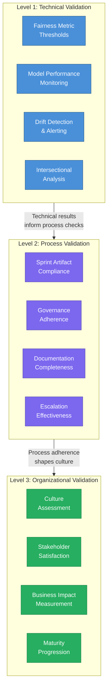
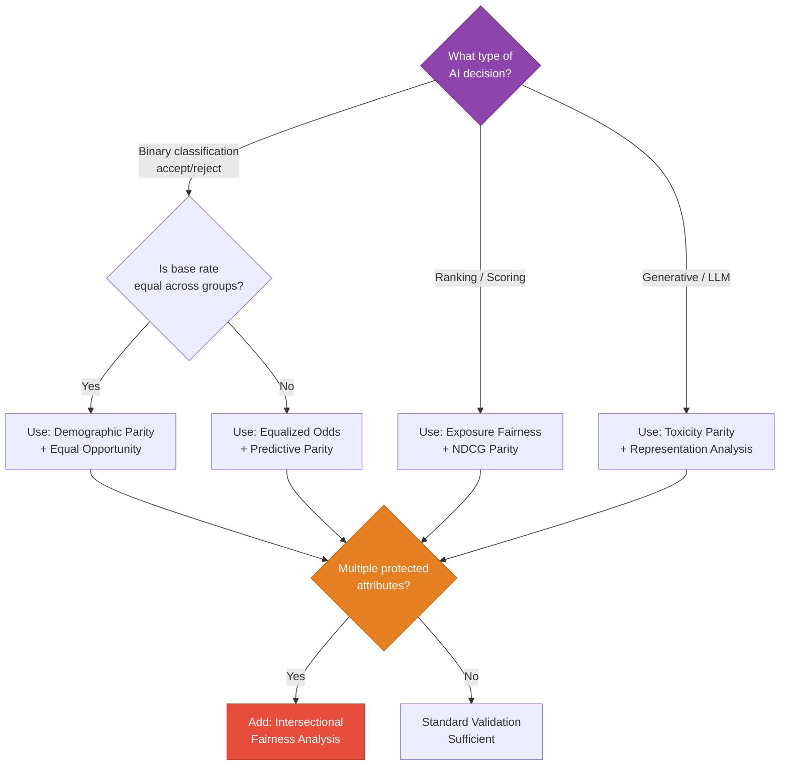
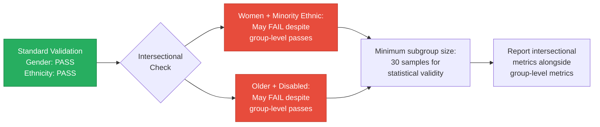
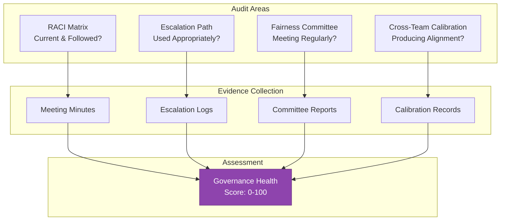
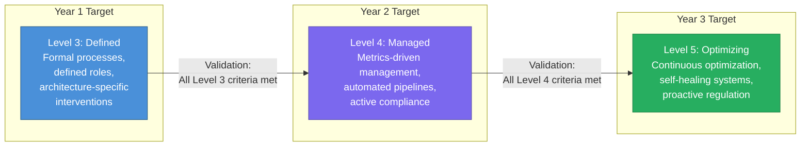
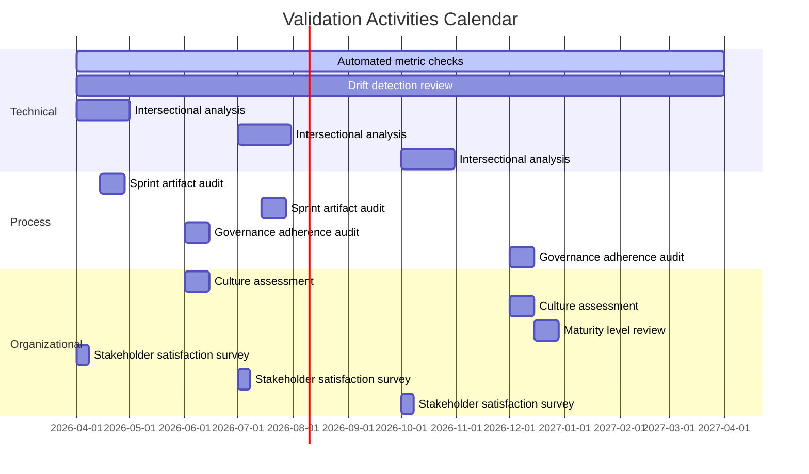

# Validation Framework

[← Case Study](03_case_study.md) | [Back to Overview](README.md) | [Next: Adaptability Guidelines →](05_adaptability_guidelines.md)

---

## 1. Purpose

This framework provides implementing teams with structured methods to **verify the effectiveness** of their Fairness Implementation Playbook deployment. It answers the fundamental question: *"How do we know our fairness implementation is actually working?"*

Validation operates at three levels: **technical** (are the metrics improving?), **process** (are teams following the playbook?), and **organizational** (is the culture shifting?).

---

## 2. Validation Architecture



Each level builds on the one below: reliable technical metrics are a prerequisite for meaningful process audits, and consistent processes are a prerequisite for genuine cultural change.

---

## 3. Level 1: Technical Validation

### 3.1 Fairness Metric Thresholds

Define pass/fail thresholds for each fairness metric based on the system's risk classification and regulatory context.

| Risk Level | Metric | Threshold | Validation Frequency |
|------------|--------|-----------|---------------------|
| **High-Risk** (EU AI Act) | Demographic Parity Difference | < 0.05 | Daily (automated) |
| **High-Risk** | Equalized Odds Difference | < 0.05 | Daily (automated) |
| **High-Risk** | Predictive Parity Ratio | > 0.90 | Daily (automated) |
| **Medium-Risk** | Demographic Parity Difference | < 0.10 | Weekly (automated) |
| **Medium-Risk** | Disparate Impact Ratio | > 0.80 | Weekly (automated) |
| **Low-Risk** | Disparate Impact Ratio | > 0.80 | Monthly (manual review) |

### 3.2 Metric Selection Guide

Not all fairness metrics are appropriate for all systems. Use this decision tree:



### 3.3 Drift Detection Protocol

Fairness metrics can degrade over time due to distribution shifts, concept drift, or feedback loops. Implement the following monitoring:

| Drift Type | Detection Method | Alert Threshold | Response |
|------------|-----------------|-----------------|----------|
| **Sudden drift** | Statistical process control (CUSUM) | > 2 standard deviations from baseline | Immediate investigation |
| **Gradual drift** | Moving average comparison (30-day window) | > 5% degradation from baseline | Sprint-level investigation |
| **Seasonal patterns** | Year-over-year comparison | Deviation from expected seasonal pattern | Quarterly review |
| **Feedback loop amplification** | Feedback loop coefficient tracking | Coefficient > 1.2 (amplifying) | Architecture review |

### 3.4 Intersectional Validation

Standard group-level metrics can mask disparities at intersections. Validate fairness at intersectional subgroups:



**Rule:** If any intersectional subgroup with n ≥ 30 fails the fairness threshold, the system fails overall validation — even if all individual protected group metrics pass.

---

## 4. Level 2: Process Validation

### 4.1 Sprint Artifact Compliance Checklist

For each sprint, verify the following artifacts exist and meet quality standards:

| Artifact | Quality Criteria | Validated By | Frequency |
|----------|-----------------|--------------|-----------|
| **Fairness user stories** | Contain measurable acceptance criteria; linked to a protected group | Fairness Champion | Per sprint planning |
| **Definition of Done** | Includes fairness test pass, bias impact assessment, compliance evidence | Scrum Master | Per sprint |
| **Retrospective notes** | Include fairness-specific discussion items and action items | Team Lead | Per sprint |
| **Architecture decision records** | Document fairness trade-offs with rationale | Tech Lead | Per architecture change |
| **Compliance evidence** | Exported to audit trail; links to test results | Compliance Officer | Per sprint |

### 4.2 Governance Adherence Audit

Quarterly audit of governance mechanisms:



**Governance Health Score Interpretation:**

| Score | Level | Action |
|-------|-------|--------|
| 80–100 | Healthy | Continue current practices; document as best practice |
| 60–79 | Adequate | Identify specific gaps; address in next quarter |
| 40–59 | At Risk | Conduct governance reset workshop; re-establish commitments |
| 0–39 | Critical | Escalate to executive level; consider external governance review |

### 4.3 Documentation Completeness Matrix

| Document Type | Required Fields | Acceptable Gaps | Validation Method |
|--------------|-----------------|-----------------|-------------------|
| **Model Card** | Purpose, training data, fairness metrics, limitations, intended use | None for high-risk systems | Automated template validation |
| **Fairness Impact Assessment** | Protected groups, metric baselines, intervention history, residual risk | Residual risk can be qualitative | Peer review by Fairness Reviewer |
| **Audit Trail Entry** | Decision ID, timestamp, input features, output, explanation, fairness flags | None | Automated schema validation |
| **Escalation Record** | Issue description, stakeholders consulted, decision, rationale, follow-up | Follow-up can be TBD at time of decision | Governance audit |

---

## 5. Level 3: Organizational Validation

### 5.1 Fairness Culture Assessment

Conduct a bi-annual organizational survey measuring five cultural dimensions:

| Dimension | Sample Questions | Target Score |
|-----------|-----------------|--------------|
| **Awareness** | "I understand the fairness risks in the AI systems my team builds" | > 4.0 / 5.0 |
| **Agency** | "I feel empowered to raise fairness concerns without negative consequences" | > 4.0 / 5.0 |
| **Accountability** | "I know who is responsible for fairness decisions in my area" | > 4.5 / 5.0 |
| **Integration** | "Fairness is part of our regular workflow, not a separate activity" | > 3.5 / 5.0 |
| **Improvement** | "Our fairness practices have measurably improved in the last 6 months" | > 3.5 / 5.0 |

### 5.2 Stakeholder Satisfaction Tracking

Track satisfaction from three stakeholder groups:

| Stakeholder | Method | Key Indicators |
|-------------|--------|---------------|
| **Internal teams** | Quarterly pulse survey | Fairness process burden perception; value perception |
| **Clients / Employers** | NPS + fairness-specific questions | Trust in AI decisions; willingness to recommend |
| **End users / Candidates** | Post-interaction survey | Perceived fairness; satisfaction with explanations |

### 5.3 Business Impact Validation

Map fairness implementation to measurable business outcomes:

| Business Metric | Expected Impact | Measurement |
|----------------|-----------------|-------------|
| **Client retention** | Higher retention due to trust in fair AI | Compare cohorts: before vs. after fairness deployment |
| **Candidate satisfaction** | Higher satisfaction from transparent, fair processes | Survey scores pre/post implementation |
| **Regulatory fines** | Avoidance of non-compliance penalties | Compliance gap count; incident reports |
| **Brand perception** | Stronger brand among fairness-conscious clients | Media mentions; RFP win rate on fairness criteria |
| **Engineering velocity** | Initial decrease, then recovery as fairness becomes routine | Sprint velocity tracking over time |

### 5.4 Maturity Progression Tracking

Use the maturity model from the [Implementation Guide](01_implementation_guide.md) to track annual progression:



---

## 6. Validation Cadence Summary



---

## 7. Validation Anti-Patterns

| Anti-Pattern | Why It Fails | Correct Approach |
|--------------|-------------|------------------|
| **Validating only at deployment** | Fairness degrades over time; one-time validation gives false confidence | Continuous monitoring with automated alerts |
| **Using only aggregate metrics** | Hides intersectional disparities | Always include intersectional analysis |
| **Treating validation as pass/fail** | Misses nuance; can create a false sense of security | Use validation as a diagnostic tool with severity levels |
| **Validating metrics without context** | A metric can "pass" while causing real harm if the threshold is wrong | Regularly review whether thresholds are appropriate |
| **Skipping process validation** | Good metrics today without good processes won't last | Validate the process that produces the metrics, not just the metrics |
| **Ignoring qualitative signals** | Surveys and user complaints reveal issues metrics miss | Combine quantitative metrics with qualitative feedback |

---

## 8. Validation Reporting Template

Each validation cycle produces a structured report:

### Report Structure

```
1. Executive Summary
   - Overall fairness health status (Green / Yellow / Red)
   - Key changes since last report
   - Critical items requiring attention

2. Technical Validation Results
   - Metric dashboard snapshot
   - Drift detection findings
   - Intersectional analysis results
   - Systems failing thresholds (if any)

3. Process Validation Results
   - Sprint artifact compliance rate
   - Governance health score
   - Documentation completeness rate
   - Escalation log summary

4. Organizational Validation Results
   - Culture assessment scores
   - Stakeholder satisfaction trends
   - Business impact indicators
   - Maturity level assessment

5. Recommendations
   - Immediate actions (if critical issues)
   - Quarterly improvement targets
   - Playbook updates needed
```

---

[← Case Study](03_case_study.md) | [Back to Overview](README.md) | [Next: Adaptability Guidelines →](05_adaptability_guidelines.md)
