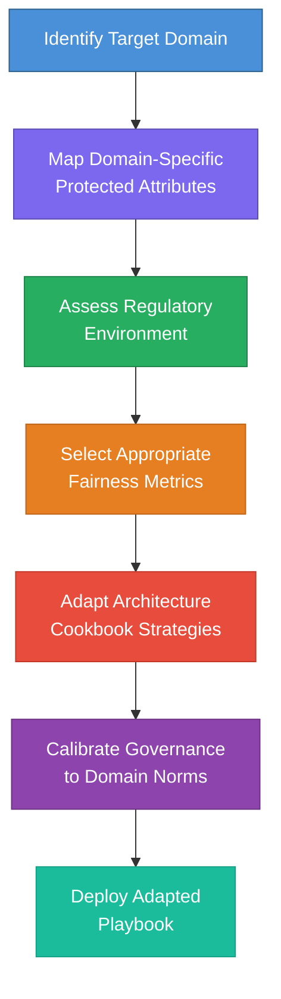
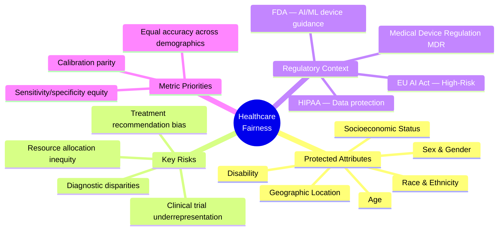
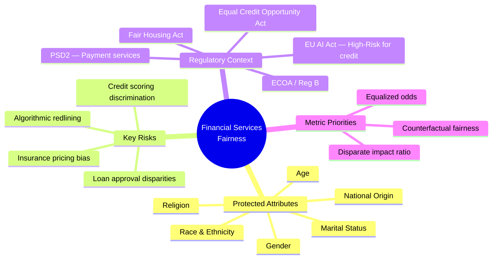
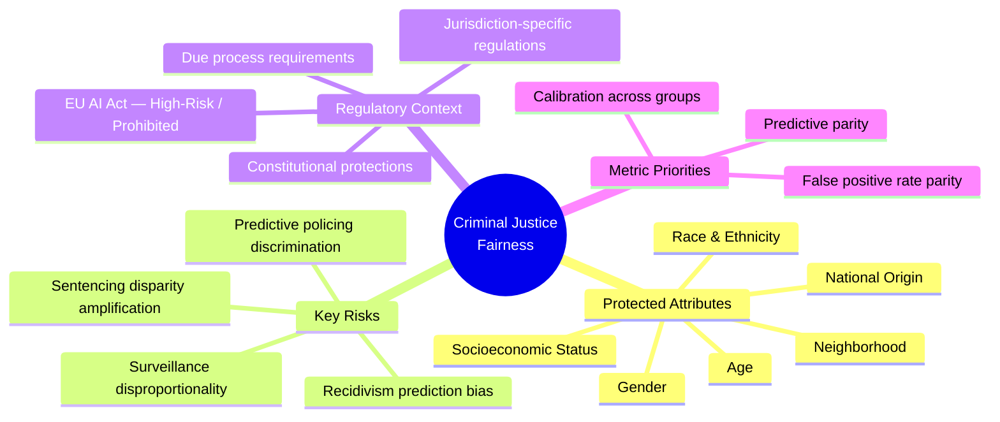
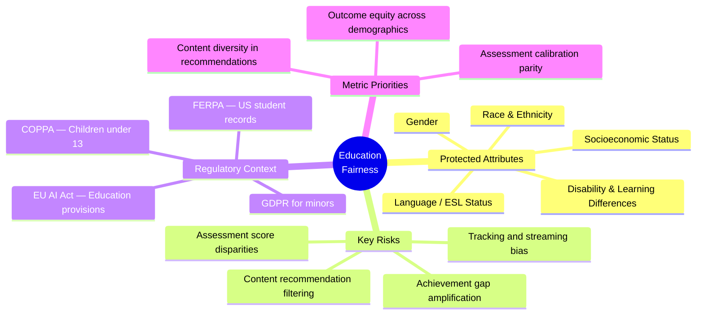
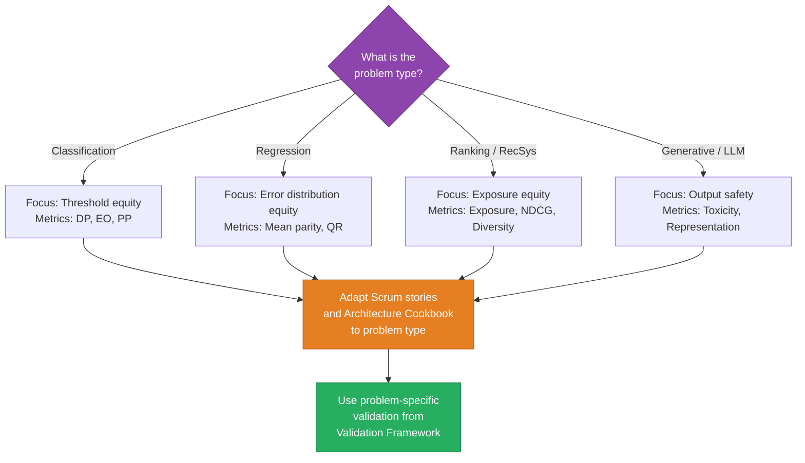

# Adaptability Guidelines

[← Validation Framework](04_validation_framework.md) | [Back to Overview](README.md) | [Next: Future Iterations →](06_future_iterations.md)

---

## 1. Purpose

While this playbook was developed in the context of AI-powered recruitment (EquiHire), its methodology is designed to be **domain-agnostic**. This document provides structured guidance for adapting the playbook to different industries, regulatory environments, and problem types.

---

## 2. Domain Adaptation Framework

---

## 3. Domain-Specific Adaptation Guides

### 3.1 Healthcare

| Playbook Component | Healthcare Adaptation |
|--------------------|----------------------|
| **Scrum Toolkit** | Add clinical validation user stories; include domain experts (clinicians) in sprint reviews; fairness acceptance criteria must reference clinical outcome equity |
| **Governance Toolkit** | Require clinical ethics board review for high-risk systems; include patient advocacy representatives in the Fairness Committee; align with hospital IRB processes |
| **Architecture Cookbook** | Prioritize calibration parity (predictions must be equally reliable across groups); address dataset imbalance from underrepresented patient populations; implement subgroup analysis for rare conditions |
| **Compliance Guide** | Map to FDA AI/ML guidance and EU Medical Device Regulation; stricter evidence requirements than recruitment; clinical trial-grade documentation for diagnostic systems |

**Critical Adaptation:** Healthcare fairness must account for **legitimate clinical differences** (e.g., disease prevalence varies by demographic group). The challenge is distinguishing legitimate clinical variation from bias — a distinction that doesn't arise in recruitment.

### 3.2 Financial Services

| Playbook Component | Financial Services Adaptation |
|--------------------|-------------------------------|
| **Scrum Toolkit** | Include adverse action notice stories (legally required explanations for credit denials); fairness DoD must include disparate impact testing |
| **Governance Toolkit** | Establish Model Risk Management (MRM) integration; align fairness governance with existing three-lines-of-defense model; include compliance officer in every fairness trade-off decision |
| **Architecture Cookbook** | Focus on counterfactual fairness (would the decision change if the applicant's race were different?); address proxy variable detection with particular attention to geographic and educational features; implement adverse action reason code generation |
| **Compliance Guide** | Map to ECOA, Fair Housing Act, and EU AI Act simultaneously; maintain model inventory with fairness documentation per regulatory expectation; prepare for regulatory examination (stress testing fairness under adversarial conditions) |

**Critical Adaptation:** Financial services has the most **mature regulatory landscape** for AI fairness. Organizations likely have existing model risk management frameworks — the playbook should integrate with, not replace, these structures.

### 3.3 Criminal Justice

| Playbook Component | Criminal Justice Adaptation |
|--------------------|----------------------------|
| **Scrum Toolkit** | Include due process user stories (every individual affected must have a path to contest); acceptance criteria must address false positive rate equity specifically |
| **Governance Toolkit** | Include civil liberties representatives; establish independent external oversight board; mandate public transparency reports |
| **Architecture Cookbook** | Prioritize false positive rate parity (the cost of a false positive — wrongful intervention — is asymmetrically high); implement the Chouldechova impossibility awareness: when base rates differ, it is mathematically impossible to simultaneously equalize calibration, false positive rates, and false negative rates — document which metric is prioritized and why |
| **Compliance Guide** | Highest scrutiny; many jurisdictions prohibit certain uses entirely; ensure compliance with constitutional protections; prepare for legal challenges and public audits |

**Critical Adaptation:** Criminal justice AI has the **highest stakes for individual liberty**. The playbook must incorporate heightened scrutiny, mandatory human oversight, and public accountability mechanisms that exceed what is needed in other domains.

### 3.4 Education

| Playbook Component | Education Adaptation |
|--------------------|---------------------|
| **Scrum Toolkit** | Include student outcome equity stories; acceptance criteria address achievement gap prevention |
| **Governance Toolkit** | Include educators and parent representatives; align with school district governance; comply with student data privacy (FERPA, GDPR for minors) |
| **Architecture Cookbook** | Address adaptive learning system feedback loops (students receiving less challenging content never demonstrate readiness for advancement); implement equity-aware content recommendation |
| **Compliance Guide** | Map to GDPR for minors (heightened consent requirements), EU AI Act education provisions, and where applicable FERPA/COPPA (US); data minimization is critical given vulnerable population |

**Critical Adaptation:** Education AI affects minors and shapes long-term life outcomes. Feedback loops are particularly dangerous: a system that gives a student less challenging material ensures that student never demonstrates readiness for advancement — creating a self-fulfilling prophecy of underachievement.

---

## 4. Problem Type Adaptation

The playbook must also adapt to different ML problem types, as fairness manifests differently in each:

### 4.1 Classification Problems

| Aspect | Binary Classification | Multi-Class Classification |
|--------|----------------------|---------------------------|
| **Primary Metrics** | Demographic parity, equalized odds, predictive parity | Per-class fairness metrics; confusion matrix equity across groups |
| **Key Challenge** | Threshold selection affects group outcomes differently | Misclassification patterns may cluster in specific group-class combinations |
| **Architecture Focus** | Post-processing threshold adjustment; in-processing regularization | Class-weighted fairness constraints; hierarchical fairness when classes have structure |
| **Validation** | Standard binary fairness test suite | Per-class and intersectional subgroup testing |

### 4.2 Regression Problems

| Aspect | Regression |
|--------|-----------|
| **Primary Metrics** | Mean prediction parity; error rate parity across groups; conditional use accuracy equality |
| **Key Challenge** | Continuous outputs make threshold-based fairness inapplicable; must define fairness over distributions |
| **Architecture Focus** | Residual analysis by demographic group; quantile regression for distributional fairness |
| **Validation** | Distribution comparison tests (KS test, Wasserstein distance) across groups |

### 4.3 Ranking & Recommendation

| Aspect | Ranking / Recommendation |
|--------|--------------------------|
| **Primary Metrics** | Exposure fairness; NDCG parity; diversity in top-k; feedback loop coefficient |
| **Key Challenge** | Position bias compounds demographic bias; feedback loops amplify preferences |
| **Architecture Focus** | Re-ranking for exposure equity; diversity constraints; feedback loop dampening |
| **Validation** | Temporal analysis of recommendation patterns; A/B testing for feedback loop effects |

### 4.4 Generative AI (LLMs)

| Aspect | Generative AI |
|--------|--------------|
| **Primary Metrics** | Toxicity parity; representation analysis; stereotype reinforcement rate; refusal rate parity |
| **Key Challenge** | Bias is embedded in language; outputs are open-ended and harder to evaluate systematically |
| **Architecture Focus** | Prompt-level bias testing; output filtering; fine-tuning with fairness constraints; red-teaming |
| **Validation** | Human evaluation panels; automated toxicity scanning; representation benchmarks |

---

## 5. Organizational Size Adaptation

| Org Size | Scrum Adaptation | Governance Adaptation | Compliance Adaptation |
|----------|-----------------|----------------------|----------------------|
| **Startup (< 50)** | Integrate fairness into existing ceremonies; single Fairness Champion across teams | Lightweight governance: CTO + 1 fairness lead; use decision log instead of committee | Focus on highest-risk system only; prioritize EU AI Act compliance for fundraising credibility |
| **Mid-size (50–500)** | Full Scrum Toolkit deployment per team; dedicated Fairness Champions | Fairness Committee with cross-functional representation; quarterly governance reviews | Comprehensive compliance program; dedicated compliance officer |
| **Enterprise (500+)** | Scaled Agile (SAFe) integration; fairness as a portfolio-level concern | Multi-level governance: business unit committees → central fairness board; external advisory | Full regulatory program with internal audit; prepare for external regulatory examination |

---

## 6. Cross-Domain Adaptation Checklist

Before deploying the playbook in a new domain, complete this checklist:

- [ ] **Protected attributes identified** — Which demographic groups face the highest risk in this domain?
- [ ] **Regulatory landscape mapped** — Which regulations apply? What is classified as high-risk?
- [ ] **Fairness metrics selected** — Which metrics are most appropriate for the problem type and domain?
- [ ] **Domain experts engaged** — Have you included people who understand the real-world impact of AI decisions in this domain?
- [ ] **Legitimate differentiation identified** — Are there cases where differential treatment is legally or ethically justified? (e.g., clinical variation in healthcare)
- [ ] **Stakeholder harm model defined** — Who is harmed by unfair AI in this domain, and how?
- [ ] **Architecture cookbook adapted** — Have you mapped domain-specific AI architectures to the cookbook strategies?
- [ ] **Governance aligned with industry norms** — Does the governance structure integrate with existing industry frameworks (e.g., MRM in finance, IRB in healthcare)?
- [ ] **Compliance requirements documented** — Are all regulatory obligations mapped to development tasks?
- [ ] **Validation thresholds calibrated** — Are fairness thresholds appropriate for the domain's risk level?

---

## 7. Domain Comparison Matrix

| Domain | Regulatory Strictness | Primary Fairness Challenge | Unique Complexity | Playbook Adaptation Effort |
|--------|----------------------|---------------------------|-------------------|---------------------------|
| **Criminal Justice** | Highest — constitutional protections, potential prohibitions | False positive rate equity | Chouldechova impossibility: cannot equalize all metrics simultaneously when base rates differ | Major — requires external oversight, public transparency, heightened human oversight |
| **Healthcare** | High — FDA, MDR, EU AI Act | Calibration parity across demographics | Must distinguish legitimate clinical variation from bias | Major — requires clinical ethics integration, IRB alignment |
| **Financial Services** | High — ECOA, Fair Housing, EU AI Act | Proxy variable detection | Most mature existing regulatory framework; playbook must integrate with, not replace, existing MRM | Moderate — governance structures already exist; adapt rather than build |
| **Recruitment** | High — EU AI Act (high-risk), GDPR Art. 22 | Historical bias in training data | Feedback loops between employer behavior and candidate pool | Baseline — playbook developed in this context |
| **Education** | Medium — GDPR for minors, EU AI Act | Achievement gap amplification | Self-fulfilling prophecy feedback loops; long-term impact on life outcomes | Moderate — heightened sensitivity for minors |
| **Marketing** | Low — general consumer protection | Personalization vs. filter bubbles | Lower individual stakes but large-scale aggregate effects | Minor — lighter governance appropriate |

---

[← Validation Framework](04_validation_framework.md) | [Back to Overview](README.md) | [Next: Future Iterations →](06_future_iterations.md)
