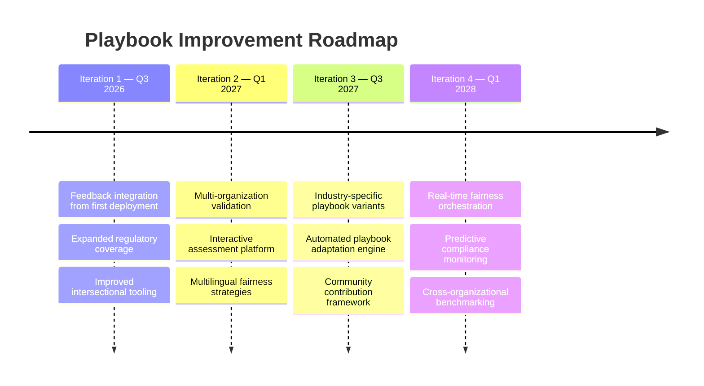
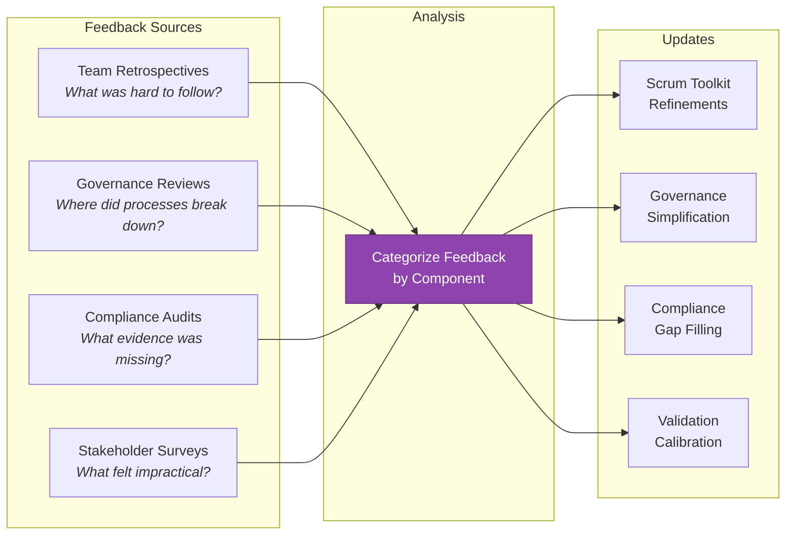
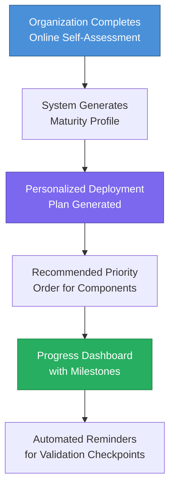
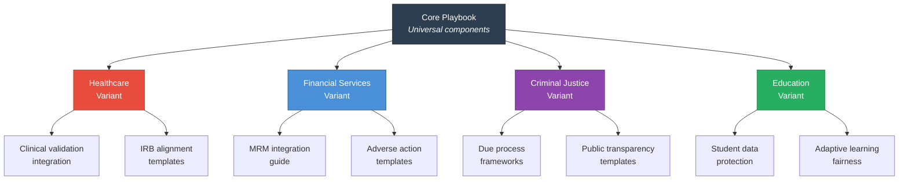
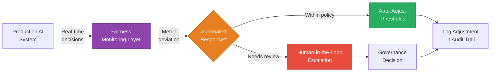

# Future Iterations

[← Adaptability Guidelines](05_adaptability_guidelines.md) | [Back to Overview](README.md)

---

## 1. Purpose

No playbook is complete at first release. This document outlines a structured roadmap for improving the Fairness Implementation Playbook through future iterations, based on identified gaps, emerging research, and evolving regulatory landscapes.

---

## 2. Current Limitations

Before proposing improvements, it is important to acknowledge the current playbook's limitations:

| Limitation | Impact | Root Cause |
|-----------|--------|-----------|
| **Single-company development context** | May not generalize to all organizational structures | Developed primarily through the EquiHire case study |
| **EU-centric regulatory focus** | Organizations outside the EU need additional compliance mapping | Regulatory Compliance Guide focused primarily on EU AI Act and GDPR |
| **Limited intersectional tooling** | Intersectional analysis relies on statistical methods with sample size constraints | Current fairness libraries have limited intersectional support |
| **Static playbook format** | Cannot adapt in real-time to organizational feedback | Document-based rather than interactive platform |
| **English-language bias in LLM fairness** | Architecture Cookbook LLM strategies are primarily validated for English | Multilingual fairness research is still emerging |
| **Quantitative metric emphasis** | May underweight qualitative fairness dimensions (dignity, respect, procedural justice) | Quantitative metrics are easier to automate and track |

---

## 3. Improvement Roadmap

---

## 4. Iteration 1: Consolidation (Q3 2026)

### 4.1 Feedback Integration

After the first full deployment cycle, collect structured feedback:

**Specific improvements planned:**

- **Scrum Toolkit:** Develop a library of pre-written fairness user story templates categorized by domain and system type, reducing the barrier for teams new to fairness stories
- **Governance Toolkit:** Simplify the RACI matrix for organizations with fewer than 5 teams — current governance may be overly complex for smaller organizations
- **Compliance Guide:** Expand beyond EU to include US federal frameworks (ECOA, Fair Housing Act, ADA), UK Equality Act, and emerging regulatory frameworks in Canada, Australia, and Singapore

### 4.2 Intersectional Fairness Tooling

Current limitation: intersectional analysis requires minimum subgroup sizes that many organizations cannot achieve.

**Planned improvement:**
- Integrate Bayesian approaches for small-sample intersectional estimation (Foulds et al., 2020)
- Develop guidance for when intersectional analysis is statistically meaningful vs. when proxy approaches are needed
- Create intersectional fairness test templates compatible with Fairlearn and AIF360

### 4.3 Regulatory Expansion

| Region | Framework | Priority | Status |
|--------|-----------|----------|--------|
| EU | AI Act + GDPR | Already covered | Maintain |
| US | ECOA, Fair Housing, ADA, EEOC guidance | High | Iteration 1 |
| UK | Equality Act + AI regulation (forthcoming) | High | Iteration 1 |
| Canada | AIDA (Artificial Intelligence and Data Act) | Medium | Iteration 2 |
| Singapore | AI Governance Framework | Medium | Iteration 2 |
| Australia | AI Ethics Framework | Low | Iteration 3 |

---

## 5. Iteration 2: Expansion (Q1 2027)

### 5.1 Multi-Organization Validation

The playbook was developed within a single company context. To validate generalizability:

- **Partner with 3–5 organizations** across different industries to deploy the adapted playbook
- **Collect structured deployment data:** time-to-deploy, fairness metric improvements, process adherence rates, organizational resistance points
- **Identify universal vs. context-specific elements** — which parts of the playbook work everywhere, and which require significant adaptation?

### 5.2 Interactive Assessment Platform

Transform the static maturity assessment into an **interactive self-assessment tool**:

### 5.3 Multilingual Fairness Strategies

Extend the Architecture Cookbook's LLM section to address:

- **Multilingual bias:** How bias manifests differently across languages (e.g., gendered languages like Spanish/French vs. English)
- **Cross-cultural fairness:** Fairness definitions that vary by cultural context
- **Translation-introduced bias:** How machine translation can introduce or amplify biases

---

## 6. Iteration 3: Specialization (Q3 2027)

### 6.1 Industry-Specific Playbook Variants

Based on the [Adaptability Guidelines](05_adaptability_guidelines.md), develop dedicated variants:

### 6.2 Automated Playbook Adaptation Engine

Develop tooling that **automatically adapts** playbook recommendations based on:
- Organization profile (size, industry, geography)
- AI system inventory (architectures, risk levels)
- Regulatory requirements (jurisdiction mapping)
- Current maturity level (from self-assessment)

### 6.3 Community Contribution Framework

Establish a structured process for organizations to contribute improvements:

| Contribution Type | Review Process | Integration Timeline |
|-------------------|---------------|---------------------|
| **Bug fixes** (errors in templates, broken workflows) | Single reviewer | Next patch release |
| **Case studies** (deployment experience reports) | Domain expert review | Next minor release |
| **New domain adaptations** | Domain expert + playbook maintainer review | Next major release |
| **Core methodology changes** | Fairness Committee review + pilot validation | Iteration planning |

---

## 7. Iteration 4: Automation (Q1 2028)

### 7.1 Real-Time Fairness Orchestration

Move from periodic validation to **continuous fairness orchestration**:

### 7.2 Predictive Compliance Monitoring

Instead of reacting to regulatory changes, **anticipate them**:

- Monitor regulatory proposals across jurisdictions
- Assess impact on current compliance posture before regulations take effect
- Pre-generate compliance stories for upcoming regulatory requirements
- Maintain a regulatory horizon dashboard (6–18 month outlook)

### 7.3 Cross-Organizational Benchmarking

Enable anonymous, privacy-preserving comparison of fairness metrics across organizations:

- **Industry benchmarks:** How does our fairness implementation compare to peers?
- **Best practice sharing:** What approaches are working for organizations at similar maturity levels?
- **Collective improvement:** Identify systemic fairness challenges that require industry-wide solutions

---

## 8. Research Agenda

The following academic and applied research areas would most benefit future iterations:

| Research Area | Current Gap | Potential Impact on Playbook |
|--------------|-------------|------------------------------|
| **Causal fairness** | Current metrics are observational; causal approaches could better identify root causes of unfairness | Replace correlational metrics with causal fairness tests in the Validation Framework |
| **Fairness under distribution shift** | Limited understanding of how fairness guarantees transfer when deployment distributions differ from training | Improve drift detection in continuous monitoring; develop robustness guarantees |
| **Multi-stakeholder fairness** | Current framework optimizes for candidate fairness; employers and platform also have fairness needs | Expand framework to balance fairness across multiple stakeholder groups |
| **Participatory fairness definition** | Fairness metrics are chosen by developers, not affected communities | Incorporate participatory design methods in the Foundation phase |
| **Long-term fairness dynamics** | Most metrics evaluate point-in-time fairness; long-term effects of fair AI on society are underexplored | Add longitudinal outcome tracking to the Validation Framework |

---

## 9. Version Control & Release Strategy

| Version | Content | Release Cadence |
|---------|---------|----------------|
| **Patch** (e.g., 1.0.1) | Typo fixes, template corrections, broken link fixes | As needed |
| **Minor** (e.g., 1.1.0) | New case studies, expanded domain coverage, improved templates | Quarterly |
| **Major** (e.g., 2.0.0) | Methodology changes, new components, significant restructuring | Annually |

Each major release includes:
- Changelog documenting all changes
- Migration guide for organizations using previous versions
- Validation that existing deployments are compatible or need updates

---

## 10. Conclusion

This playbook is a **living document**. The roadmap above ensures it evolves alongside three forces: emerging fairness research (causal methods, participatory design), regulatory expansion (beyond the EU), and operational learning from each deployment cycle.

The measure of success is not a perfect playbook, but an organization that gets measurably fairer with each iteration — and can prove it.

---

[← Adaptability Guidelines](05_adaptability_guidelines.md) | [Back to Overview](README.md)
