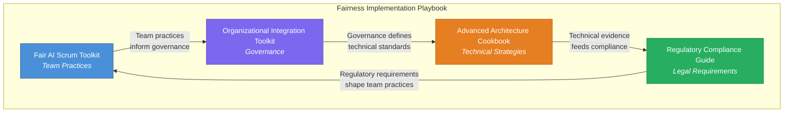
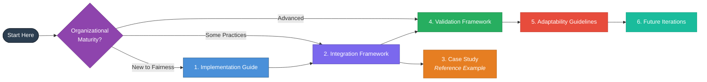
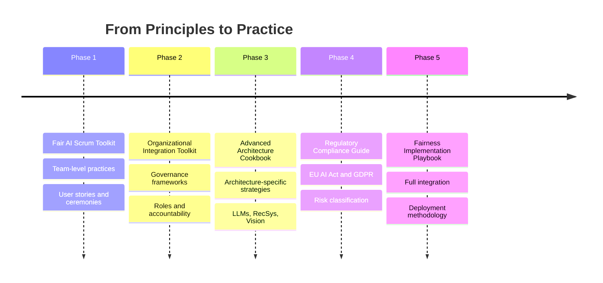

# Fairness Implementation Playbook

## Executive Overview

This playbook provides a comprehensive, end-to-end methodology for deploying fairness systematically across AI systems and organizations. It integrates four foundational components — developed iteratively over the past months — into a unified, actionable framework designed for director-level stakeholders and cross-functional teams.

> **Target Audience:** Director-level managers and above at EquiHire, applicable to any organization deploying AI systems in regulated environments.

---

## The Challenge

Organizations building AI systems face a critical gap: **fairness principles exist in isolation from daily engineering practices**. Teams may understand what fairness means conceptually, but lack structured processes to embed it across development lifecycles, governance structures, technical architectures, and regulatory requirements.

The result is fragmented, inconsistent fairness implementation that creates compliance risk, reputational exposure, and — most importantly — real harm to the people affected by AI decisions.

## The Solution

This playbook bridges that gap by integrating four previously independent toolkits into a **cohesive deployment methodology**:

## Playbook Components

| # | Component | Description | Link |
|---|-----------|-------------|------|
| 1 | **Implementation Guide** | Step-by-step deployment methodology with decision points and risk mitigation | [View Guide](01_implementation_guide.md) |
| 2 | **Integration Framework** | Workflows connecting all four toolkits with clear data flows | [View Framework](02_integration_framework.md) |
| 3 | **Case Study: EquiHire** | End-to-end application on a multi-team AI recruitment platform | [View Case Study](03_case_study.md) |
| 4 | **Validation Framework** | Metrics, audits, and verification processes for implementation effectiveness | [View Validation](04_validation_framework.md) |
| 5 | **Adaptability Guidelines** | Cross-domain adaptation for healthcare, finance, and other sectors | [View Guidelines](05_adaptability_guidelines.md) |
| 6 | **Future Iterations** | Roadmap for continuous improvement of the playbook itself | [View Roadmap](06_future_iterations.md) |

---

## How to Use This Playbook

### Quick Start by Role

| Role | Start With | Then Read |
|------|-----------|-----------|
| **Engineering Director** | [Implementation Guide](01_implementation_guide.md) | [Integration Framework](02_integration_framework.md) |
| **Product Director** | [Case Study](03_case_study.md) | [Implementation Guide](01_implementation_guide.md) |
| **Compliance / Legal** | [Validation Framework](04_validation_framework.md) | [Adaptability Guidelines](05_adaptability_guidelines.md) |
| **VP / C-Suite** | This README | [Case Study](03_case_study.md) |

---

## Key Principles

1. **Fairness is a process, not a checkbox.** It must be embedded in every phase of the AI lifecycle.
2. **Accountability requires structure.** Clear roles, governance, and escalation paths prevent fairness from being "everyone's job and no one's responsibility."
3. **Technical and organizational interventions are inseparable.** The best algorithm means nothing without governance to enforce it.
4. **Compliance is the floor, not the ceiling.** Regulatory requirements represent minimum standards — organizations should aim higher.
5. **Continuous iteration over perfection.** Fairness implementation improves through systematic learning, not one-time deployment.

---

## Development Journey

The playbook was built incrementally, each phase adding a critical layer:

---

## Ownership

This playbook is maintained by the Product Directorate at EquiHire. The Fairness Committee reviews updates quarterly. For contribution guidelines and governance processes, see the [Integration Framework](02_integration_framework.md) and the [Future Iterations](06_future_iterations.md) roadmap.

---

*Fairness Implementation Playbook v1.0*
*EquiHire | Fair Recruitment, Systematically*
