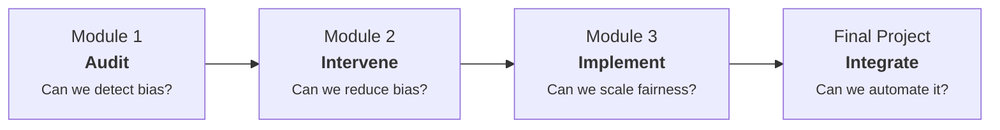

# AI Ethics — Practical Fairness for Data Scientists

This repository contains the projects developed during the **AI Ethics Specialization** at Turing College. Each project corresponds to one of the program's modules and addresses distinct ethical challenges associated with the design, development, and deployment of artificial intelligence systems.

## Objective

The primary goal is to **translate abstract ethical principles into actionable, measurable practices** for machine learning systems. Across the modules, this specialization builds a progression from conceptual auditing to production-ready fairness tooling:

- **Module 1**: How to *detect and measure* bias in AI systems.
- **Module 2**: How to *intervene* at the data and model level to reduce bias.
- **Module 3**: How to *implement* fairness at scale within an organization.
- **Final Project**: How to *integrate* all of the above into a single, automated, reproducible pipeline.

## Repository Structure

```
AI-Ethics/
├── Module_1/          Fairness Audit Framework
├── Module_2/          Fairness Intervention Playbook
├── Module_3/          Fairness Implementation Playbook
└── Final_Project/     Fairness Pipeline Development Toolkit
```

### Module 1 — Fairness Audit Framework

A comprehensive playbook for systematically evaluating AI systems for bias and fairness issues. Includes a glossary of fairness concepts, an executive summary for stakeholders, a technical audit report, and an implementation guide.

### Module 2 — Fairness Intervention Playbook

Integrates four fairness intervention approaches — causal analysis, pre-processing, in-processing, and post-processing — into a unified workflow. Covers integration strategies, case studies, validation frameworks, intersectional fairness, and adaptability guidelines.

### Module 3 — Fairness Implementation Playbook

An end-to-end methodology for deploying fairness systematically across AI systems and organizations. Designed for director-level stakeholders and cross-functional teams, it covers implementation, integration, case studies, validation, adaptability, and future iterations.

### Final Project — Fairness Pipeline Development Toolkit

The capstone deliverable: a **configuration-driven, automated fairness pipeline** that integrates the measurement, data engineering, and model training modules from the previous three modules into a single orchestrated system.

Key components:
- **`config.yml`** — Declarative configuration defining the entire fairness workflow
- **`run_pipeline.py`** — Three-step orchestrator: Baseline Measurement, Transform & Train, Final Validation (PASS/FAIL)
- **`demo.ipynb`** — Interactive demonstration notebook
- **MLflow integration** — Full experiment traceability (metrics, model artifacts, configuration)
- **35 automated tests** — Unit, functional, and end-to-end integration tests

For full documentation, see [Final_Project/README.md](Final_Project/README.md).

## Specialization Progression



## Tech Stack

| Technology | Used in | Purpose |
|-----------|---------|---------|
| Python | Final Project | Core implementation language |
| scikit-learn | Final Project | ML models, pipelines, calibration |
| Fairlearn | Final Project | Constrained fairness optimization |
| PyTorch | Final Project | Neural network fairness regularization |
| MLflow | Final Project | Experiment tracking and artifact management |
| Markdown + Mermaid | All modules | Documentation and architecture diagrams |

## About

**Program**: AI Ethics Specialization — Turing College
**Focus**: Practical fairness for data scientists — bridging the gap between ethical principles and production ML systems.
